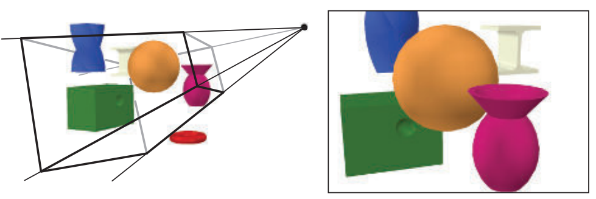
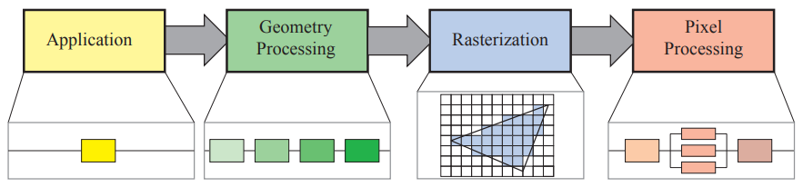
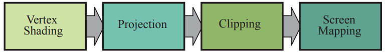
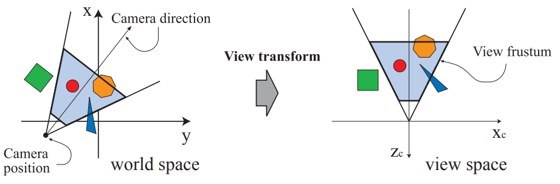
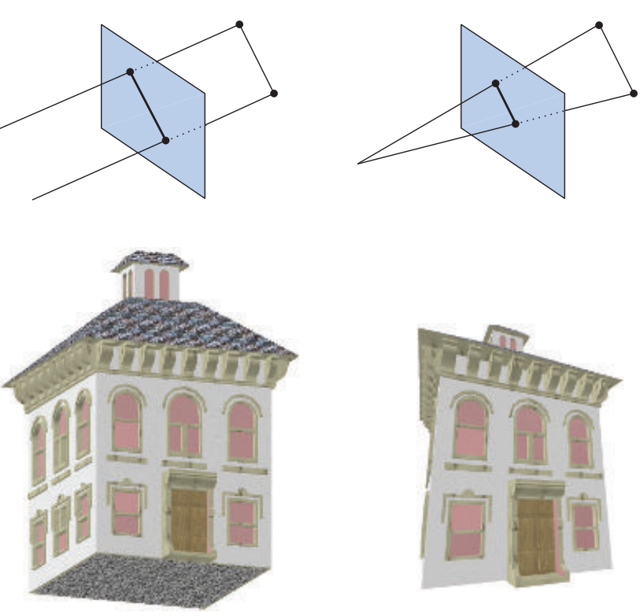
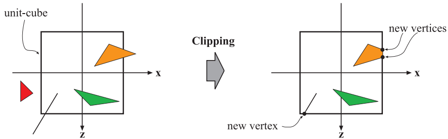

# 实时渲染

?> 使用ChatGPT翻译并简单校对，以及MathPix输入$\LaTeX$公式的RTR第4版(2018)：**Real Time Rendering 4th edition** [http://www.realtimerendering.com](http://www.realtimerendering.com)

# 目录 

!> [跳转至正文](#前言)

略

# 前言

“过去八年里，情况并没有改变太多。” 这是我们进入第四版时的想法。“更新这本书有多难呢？” 一年半后，再加上三位专家的招募，我们完成了任务。也许我们可以再花一年时间进行编辑和阐述，在那个时候会有更多的文章和演示文稿需要整合。作为一个数据点，我们制作了一个超过170页长、每页约20个参考文献和相关注释的谷歌文档。我们引用的一些参考资料在其他书中可能需要单独成章节来介绍。例如关于影子的章节，在某些其他书籍中已经被完整地讲解了。虽然给我们带来了更多工作量，但对从业者而言这样丰富的信息是好消息。 我们通常会指向这些主要来源，因为它们提供比适当篇幅内能包含更详细的信息。

本书涉及创建合成图像算法以便观众能够与虚拟环境交互所需快速处理速度问题。 我们重点关注三维渲染，并在有限程度上探讨用户交互机制方面内容 。建模、动画等诸多领域对实现实时应用程序至关重要，但这些主题超出了本书的范围。

**我们希望您在阅读本书之前具备一定的计算机图形学基础知识以及计算机科学和编程方面的知识。** 我们也**专注于算法而非API**。其他相关主题已有许多文献可供参考。如果某个章节让您感到困惑，请跳过或查看参考资料。我们相信，我们能够为您提供最有价值的服务是让您意识到自己还不知道什么——一个基本概念核心、对他人发现该领域内容的认识以及如何进一步学习（如果需要）。

我们尽可能地引用相关资料，并在大多数章节末尾提供进一步阅读和资源摘要。在之前的版本中，我们几乎引用了所有包含相关信息的内容。然而，现在这个领域已经远远超出了详尽（且令人疲惫）列举给定技术的所有可能变化形式的范围，因此我们更像是一本指南书而非百科全书。我们认为只描述少量代表性方案、使用更新、更广泛概述替换原始来源以及依赖于读者从所引用参考文献中获取更多信息会更好地服务于您。

这些大部分来源都只需点击鼠标即可获得；请访问realtimerendering.com查看参考书目链接列表。即使您对某个主题只有浅显兴趣，请花点时间查看相关参考文献，至少可以欣赏到其中呈现的一些精美图像。我们网站还提供资源链接、教程、演示程序、代码样例、软件库、勘误表等等。

撰写本书时，我们真正的目标和指导思想很简单：编写一本当初自己刚开始学习时就希望拥有并能够统筹全局但又包含细节和引用的书籍。我们希望您在阅读本书时，能够从中获得实际收益。

# 1 引言

实时渲染是快速在计算机上生成图像的过程。它是计算机图形学中最具交互性的领域。一幅图像出现在屏幕上，观众会做出反应，这种反馈影响着下一个生成的内容。这种反应和渲染的循环以足够快的速度进行，以至于观众看不到单独的图像，而是沉浸在一个动态过程中。

显示帧率以每秒帧数（FPS）或赫兹（Hz）来衡量。每秒一帧时，几乎没有交互感；用户痛苦地等待每个新图像到来。当帧率达到6 FPS左右时，开始有了交互感。视频游戏旨在达到30、60、72或更高FPS；在这些速度下，用户关注行动和反应。

电影放映机以24 FPS显示画面，并使用闪烁系统将每个画面显示两到四次以避免闪烁。刷新率与显示频率分开表示，并用赫兹（Hz）表示。闪烁三次的快门具有72 Hz 的刷新率. LCD 显示器也将刷新频率与显示频率分开. 

在屏幕上观看 24 FPS 的图像可能还可以接受, 但更高的刷新频率对于最小化响应时间非常重要。只有15 毫秒的时间延迟就足以减慢和干扰交互[1849]。例如，虚拟现实头戴式显示器通常需要90 FPS 以最小化延迟。

实时渲染不仅仅是交互性。如果速度是唯一的标准，那么任何快速响应用户命令并在屏幕上绘制任何内容的应用程序都可以符合要求。实时渲染通常意味着生成三维图像。

与三维空间的交互性和某种连接感足以成为实时渲染的充分条件，但第三个元素已经成为其定义的一部分：图形加速硬件。许多人认为1996年3Dfx Voodoo 1卡片的推出是消费级三维图形真正开始发展 [408] 的时间点。随着这个市场的快速进步，现在每台计算机、平板电脑和手机都内置了一个图形处理器。由硬件加速可能产生的实时渲染结果中有一些优秀示例如图1.1和1.2所示。

图1.1《极限竞速7》的一张截图。（图片由Turn 10 Studios, Microsoft提供。）

图1.2 《巫师3》中的博克莱城（CD PROJEKT R，The Witcher R是CD PROJEKT Capital Group的注册商标。Witcher游戏 c CD PROJEKT S.A.由CD PROJEKT S.A.开发。版权所有，基于Andrzej Sapkowski的散文创作而成。其他所有版权和商标均为其各自所有者所拥有。）

图形硬件的进步推动了交互式计算机图形领域的研究爆发。我们将重点提供增加速度和改善图像质量的方法，同时描述加速算法和图形API的特性和限制。由于无法深入涵盖每个主题，因此我们的目标是呈现关键概念和术语，解释该领域中最强大且实用的算法，并提供有关更多信息的最佳指引。我们希望通过为您提供理解这一领域工具而付出时间和精力是值得的。

## 1.1 内容概要

以下是各章节的简要概述。

- **第二章，图形渲染管线**。实时渲染的核心是将场景描述转换为可见物体的一系列步骤。
- **第三章，图形处理单元**。现代GPU使用固定功能和可编程单元来实现渲染管线的各个阶段。
- **第四章，变换**。变换是操作对象位置、方向、大小和形状以及相机位置和视角的基本工具。
- **第五章，着色基础知识**。讨论了材料和光源定义及其在实现所需表面外观（无论真实还是风格化）方面的应用，并介绍了其他与外观相关主题，如通过抗锯齿、透明度和伽马校正提供更高质量图像等方法。
- **第六章，纹理映射**。快速访问并在表面上显示图像是实时渲染中最强大的工具之一。这个过程称为纹理映射，并有多种应用方法。
- **第七章，阴影效果**。添加阴影可以增加场景逼真度和理解性，并介绍了计算阴影常用算法。
- 第八章，光与颜色。在进行基于物理模型渲染之前，我们需要先了解如何量化光和颜色。在完成物理渲染过程后，我们需要将结果转换为显示值，并考虑屏幕和观看环境的属性。本章涵盖了这两个主题。
- **第九章，基于物理模型着色**。从基础开始建立对基于物理模型着色模型的理解。该章节从底层物理现象开始介绍各种渲染材料的模型，并以混合材料和滤波方法来避免锯齿并保持表面外观。
- **第10章，局部照明**。探讨了描绘更为复杂的光源的算法。表面着色考虑到物理对象发出光线时具有特定形状。
- **第11章，全局照明**。模拟光线与场景之间多次交互的算法进一步增加了图像的逼真度。我们讨论环境和方向遮挡以及在漫反射和镜面表面上呈现全局照明效果的方法，以及一些有前途的统一方法。
- **第12章，图像空间效果**。图形硬件擅长快速进行图像处理。首先讨论图像过滤和重新投影技术，然后我们调查几种流行的后期处理效果：镜头眩光、动态模糊和景深。
- **第13章，超越多边形**。三角形并不总是描述对象最快或最真实的方式。基于使用图像、点云、体素和其他样本集合的替代表示各自具有优势。
- **第14章，体积渲染和半透明渲染**。重点是体积材料表示及其与光源之间相互作用的理论与实践。模拟现象范围从大规模大气效应到薄发丝内的光线散射。
- **第15章，非真实感渲染**。试图使场景看起来逼真只是一种渲染方式。其他风格，如卡通着色和水彩效果也被调查。线条和文本生成技术也被讨论。
- **第16章，多边形技术**。几何数据来自各种来源，并且有时需要修改才能快速有效地呈现出来。介绍了多边形数据表示和压缩的许多方面。
- **第17章，曲线和曲面**。更复杂的表面表示提供了优势，例如能够在质量和呈现速度之间进行权衡、更紧凑的表示以及平滑的表面生成。
- **第18章，管道优化**。一旦应用程序运行并使用高效算法，则可以使用各种优化技术使其运行得更快。找到瓶颈并决定如何处理它是这里的主题。还讨论了多处理。
- **第19章，加速算法**。在你让它动起来后，请尽快让它动起来快些吧！涵盖了各种剔除和细节级别呈现形式。
- **第20章，高效着色**. 场景中大量灯光会显著降低性能. 在知道片段可见之前完全着色表面片段是浪费周期的另一个来源。我们探讨了各种方法来解决这些和其他形式的低效率问题。
- **第21章，虚拟现实和增强现实**。这些领域有特定的挑战和技术，可以以快速且一致的速度高效地生成逼真图像。
- **第22章，相交测试方法**. 相交测试对于渲染、用户交互和碰撞检测非常重要。在此提供了广泛而深入的覆盖范围，涵盖了常见几何相交测试最有效算法。
- **第23章，图形硬件.** 这里关注诸如色彩深度、帧缓冲区和基本架构类型等组件。还提供了代表性GPU案例研究。
- **第24章, 未来展望.** 猜猜看（我们也在猜）。

由于空间限制，我们已经将有关**碰撞检测**的章节免费提供在realtimerendering.com上下载，并附带线性代数和三角学的附录。

## 1.2 符号和定义
首先，我们将解释本书中使用的数学符号。有关本节以及整个书籍中使用的许多术语的更详细说明，请获取我们在realtimerendering.com上提供的线性代数附录。

### 1.2.1 数学符号

表1.1总结了我们将使用的大部分数学符号。这里会对其中一些概念进行详细描述。

请注意，表格中有一些例外规则，主要是使用文献中已经非常成熟的符号来表示阴影方程，例如用$L$表示辐射亮度、$E$表示辐照度和$σ_s$表示散射系数。

角度和标量取自实数$\mathbb{R}$。向量和点由粗体小写字母表示，并且可以访问其组件。
$$
\mathbf{v}=\left(\begin{array}{l}
v_x \\
v_y \\
v_z
\end{array}\right)
$$
也就是说，我们使用列向量格式来表示，这在计算机图形学领域中很常见。在文本的某些地方，我们使用$\left(v_x, v_y, v_z\right)$代替正式更正确的$\left(\begin{array}{lll}v_x & v_y & v_z\end{array}\right)^T$，因为前者更易于阅读。

$$
\begin{array}{|l|l|l|}
\hline \text { 类型 } & \text { 标记 } & \text { 例子 } \\
\hline \text { 角 angle } & \text { 小写希腊字母 lowercase Greek } & \alpha_i, \phi, \rho, \eta, \gamma_{242}, \theta \\
\hline \text { 标量 scalar } & \text { 小写意大利字符 lowercase italic } & a, b, t, u_k, v, w_{i j} \\
\hline \text { 向量或点 vector or point } & \text { 小写粗体 lowercase bold } & \mathbf{a}, \mathbf{u}, \mathbf{v}_s \mathbf{h}(\rho), \mathbf{h}_z \\
\hline \text { 矩阵 matrix } & \text { 大写粗体 capital bold } & \mathbf{T}(\mathbf{t}), \mathbf{X}, \mathbf{R}_x(\rho) \\
\hline \text { 平面 plane } & \begin{array}{l}
\pi: \text { a vector and } \\
\text { a scalar }
\end{array} & \begin{array}{l}
\pi \cdot \mathbf{x}+d=0, \\
\pi_1: \mathbf{n}_1 \cdot \mathbf{x}+d_1=0
\end{array} \\
\hline \text { 三角形 triangle } & \triangle 3 \text { points } & \triangle \mathbf{v}_0 \mathbf{v}_1 \mathbf{v}_2, \triangle \mathbf{c b a} \\
\hline \text { 线段 line segment } & \text { two points } & \mathbf{u v}, \mathbf{a}_i \mathbf{b}_j \\
\hline \text { 几何实体 geometric entity } & \text { capital italic } & A_{O B B}, T, B_{A A B B} \\
\hline
\end{array}
$$
表1.1 本书中使用的符号总结。

**使用齐次表示法**，一个坐标由四个值$\mathbf{v}=\left(\begin{array}{llll}v_x & v_y & v_z & v_w\end{array}\right)^T$表示，其中**向量**为$\mathbf{v}=\left(\begin{array}{llll}v_x & v_y & v_z & 0\end{array}\right)^T$，点为$\mathbf{v}=\left(\begin{array}{llll}v_x & v_y & v_z & 1\end{array}\right)^T$。有时我们只使用三元素向量和点，但我们尽量避免任何关于使用哪种类型的歧义。对于矩阵操作来说，具有相同符号的向量和点非常优越。更多信息请参见变换章节第4章。在某些算法中，使用数字索引而不是$x、y和z$会更方便，例如$\mathbf{v}=\left(\begin{array}{lll}v_0 & v_1 & v_2\end{array}\right)^T$。所有这些向量和点的规则也适用于二元素向量；在这种情况下，我们只需跳过三元素向量的最后一个分量即可。

矩阵需要更详细地解释一下。将要使用的常见大小为$2 \times 2,3 \times 3$, and $4 \times 4$. 我们将回顾访问$3\times 3$矩阵$\mathbf{M}$ 的方式，并且可以简单地扩展此过程到其他大小上去。$\mathbf{M}$ 的（标量）元素用$m_{i j},$表示, 其中$ 0 \leq(i, j) \leq 2$， $i$ 代表行数 ,$j$ 代表列数, 如公式1.1所示：
$$
\mathbf{M}=\left(\begin{array}{lll}
m_{00} & m_{01} & m_{02} \\
m_{10} & m_{11} & m_{12} \\	
m_{20} & m_{21} & m_{22}
\end{array}\right) \qquad \qquad (1.1)
$$
在$3×3$矩阵中，使用方程式1.2所示的以下符号来从矩阵M中分离向量：$\mathbf{m}_{, j}$代表第$j$ 列向量，$\mathbf{m}_i$代表第$i$ 行向量（以列向量形式表示）。与向量和点一样，如果更方便的话，也可以用$x、y、z甚至w$来索引列向量：
$$
\mathbf{M}=\left(\begin{array}{lll}
\mathbf{m}_{, 0} & \mathbf{m}_{, 1} & \mathbf{m}_{, 2}
\end{array}\right)=\left(\begin{array}{lll}
\mathbf{m}_x & \mathbf{m}_y & \mathbf{m}_z
\end{array}\right)=\left(\begin{array}{c}
\mathbf{m}_0^T \\
\mathbf{m}_{1,}^T \\
\mathbf{m}_{2,}^T
\end{array}\right) . \qquad\qquad (1.2)
$$
一个平面被表示为π：$\pi: \mathbf{n} \cdot \mathbf{x}+d=0$，其中包含了它的数学公式、平面法向量$\mathbf{n}$和标量$d$。法向量是描述平面朝向的矢量。更一般地说（例如对于曲面），法向量描述了表面上特定点的方向。对于一个平面来说，同样的法线适用于所有点。$\pi$是表示平面的常见数学符号。该平面将空间分成正半空间（其中$\mathbf{n} \cdot \mathbf{x}+d>0$）和负半空间（其中$\mathbf{n} \cdot \mathbf{x}+d<0$）。

所有其他点都在该平面上。三角形可以由三个点$\mathbf{v}_0, \mathbf{v}_1$, and $\mathbf{v}_2$定义，并用$\triangle \mathbf{v}_0 \mathbf{v}_1 \mathbf{v}_2$表示。
$$
\begin{array}{|r|c|l|}
\hline & \text { 运算符 } & \text { 描述 } \\
\hline 1: & \cdot & \text { 点乘 dot product } \\
\hline 2: & \times & \text { 叉乘 cross product } \\
\hline 3: & \mathbf{v}^T & \text { 转置 transpose of the vector } \mathbf{v} \\
\hline 4: & \perp & \text { 一元垂直点积 the unary, perp dot product operator } \\
\hline 5: & |\cdot| & \text { 行列式 determinant of a matrix } \\
\hline 6: & |\cdot| & \text { 绝对值 absolute value of a scalar } \\
\hline 7: & \|\cdot\| & \text { 模 length (or norm) of argument } \\
\hline 8: & x^{+} & \text {截断 clamping } x \text { to } 0 \\
\hline 9: & x^{\mp} & \text { 截断 clamping } x \text { between } 0 \text { and } 1 \\
\hline 10: & n ! & \text { 阶乘 factorial } \\
\hline 11: & \left(\begin{array}{l}
n \\
k
\end{array}\right) & \text { 二项式 binomial coefficients } \\
\hline
\end{array}
$$
表1.2展示了一些额外的数学运算符及其符号。点、叉积、行列式和长度运算符在我们可下载的线性代数附录中有详细解释，网址为realtimerendering.com。转置运算符将列向量变成行向量，反之亦然。因此，一个列向量可以以文本块的压缩形式写成$\mathbf{v}=\left(\begin{array}{lll}v_x & v_y & v_z\end{array}\right)^T$。

第4个运算符是《Graphics Gems IV》[735]中介绍的二维向量上的一元操作符。让这个操作符作用于一个向量$\mathbf{v}=\left(\begin{array}{ll}v_x & v_y\end{array}\right)^T$会得到一个垂直于$\mathbf{v}$ 的向量，即$\mathbf{v}^{\perp}=\left(\begin{array}{ll}-v_y & v_x\end{array}\right)^T$。我们使用$|a|$表示标量$a$ 的绝对值，而$|\mathbf{A}|$表示矩阵$\mathbf{A}$ 的行列式。有时候我们也使用 $|\mathbf{A}|=\left|\begin{array}{lll}\mathbf{a} & \mathbf{b} & \mathbf{c}\end{array}\right|=\operatorname{det}(\mathbf{a}, \mathbf{b}, \mathbf{c})$，其中 $\mathbf{a}, \mathbf{b}$, and $\mathbf{c}$ 是矩阵 $\mathbf{A}$ 的列向量。

第8和9个运算符是夹紧（clamping）运算符，在着色计算中常被使用。第8个运算符将负值夹紧到0：
$$
x^{+}= \begin{cases}x, & \text { if } x>0 \\ 0, & \text { otherwise }\end{cases} \qquad\qquad(1.3)
$$
运算符9将值限制在0和1之间：
$$
x^{\mp}= \begin{cases}1, & \text { if } x \geq 1 \\ x, & \text { if } 0<x<1 \\ 0, & \text { otherwise }\end{cases} \qquad\qquad(1.4)
$$
第十个运算符阶乘的定义如下，注意$0 !=1$：
$$
n !=n(n-1)(n-2) \cdots 3 \cdot 2 \cdot 1 \qquad\qquad(1.5)
$$
第十一个运算符，二项式因子，定义如公式1.6所示：
$$
\left(\begin{array}{l}
n \\
k
\end{array}\right)=\frac{n !}{k !(n-k) !} \qquad\qquad (1.6)
$$
进一步地，我们称公共平面$
x=0, y=0, \text { and } z=0
$为坐标平面或轴对齐平面。

轴$
\mathbf{e}_x=\left(\begin{array}{lll}
1 & 0 & 0
\end{array}\right)^T, \mathbf{e}_y=\left(\begin{array}{lll}
0 & 1 & 0
\end{array}\right)^T
$$和$$
\mathbf{e}_z=\left(\begin{array}{lll}
0 & 0 & 1
\end{array}\right)^T
$被称为主轴或主方向，并分别称为$x$轴、$y$轴和$z$轴。这组坐标系通常被称为标准基底。除非另有说明，我们将使用正交基（由相互垂直的单位向量组成）。
$$
\begin{array}{|c|c|l|}
\hline & \text { 函数 } & \text { 描述 } \\
\hline 1: & \operatorname{atan} 2(\mathrm{y}, \mathrm{x}) & \text { 反正切函数} \\
\hline 2: & \log (n) & \text { 自然对数函数 } \\
\hline
\end{array}
$$
表1.3 一些特殊数学函数的符号表示。

表示包括$a$和$b$以及它们之间所有数字的范围的符号是$[a, b]$。如果我们想要$a$和$b$之间的所有数字，但不包括$a$和$b$本身，则写作$(a, b)$。还可以进行这些符号的组合，例如$[a,b)$表示包括$a$但不包括$b$之间所有数字。

C-math函数$\operatorname{atan} 2(y, x)$在本文中经常使用，因此值得关注一下。它是数学函数$\operatorname{arctan} (x)$的扩展版本。它们之间的主要区别在于：$-\frac{\pi}{2}<\arctan (x)<\frac{\pi}{2}$，$0 \leq \operatorname{atan} 2(\mathrm{y}, \mathrm{x})<2 \pi$；而且当 $x=0$时，在计算$\arctan (y / x)$时会出现除零错误。而$\operatorname{atan} 2(y, x)$则增加了一个额外参数来避免这种情况。

在本卷中，“$\log (n)$”始终表示自然对数$\log _e(n)$，而不是以10为底的对数$\log _{10}(n)$。

**我们使用右手坐标系，因为这是计算机图形学中三维几何的标准系统。**

颜色由三元向量表示，例如(red, green, blue)，其中每个元素的范围都在$[0,1]$之间。

### 1.2.2 几何定义
几乎所有图形硬件使用的基本渲染原语（也称为绘制原语）是**点、线和三角形**。(我们所知道的唯一例外是Pixel-Planes [502]，它可以绘制球体，以及NVIDIA NV1芯片，它可以绘制椭球体。)

在本书中，我们将把一组几何实体称为模型或对象。场景是由多个模型组成的集合，包括要呈现的环境中的所有内容。场景还可以包括材料描述、照明和视图规格说明。

例如，汽车、建筑甚至一条线都可以作为对象。在实践中，一个对象通常由一组绘制原语组成，但这并不总是情况；一个对象可能具有更高级别的几何表示方法，如贝塞尔曲线或曲面或分割表面等。此外，对象可以由其他对象组成，例如汽车对象包括四个门对象、四个轮子对象等。

### 1.2.3 着色
本书中，我们使用从“着色（`shading`）”、“着色器（`shader`）”和相关词汇派生出来的术语，遵循了计算机图形学领域已经确立的用法。这些术语指代两个不同但相关的概念：计算机生成的视觉外观（例如，“着色模型 `shaing model`”，“着色方程 `shading equation`”，“卡通渲染 `toon shading`”）或渲染系统中可编程组件（例如，“顶点着色器 `vertex shader`”，“着色语言 `shading language`”）。在两种情况下，意思应该根据上下文清晰明了。

## 进一步阅读和资源
我们可以向您推荐最重要的资源是本书网站：realtimerendering.com。它包含与每章节相关联的最新信息和网站链接。实时渲染领域正在以实时速度发生变化。在本书中，我们试图关注基础概念和不太可能过时的技术。而在网站上，我们有机会呈现对今天软件开发人员有用的信息，并且能够保持其更新。

---

# 2. 图形渲染管线

> “A chain is no stronger than its weakest link.” —Anonymous

本章介绍实时图形的核心组件，即图形渲染管线，也称为“管线”。 管线的主要功能是在给定虚拟摄像机、三维对象、光源等条件下生成或渲染二维图像。 因此，渲染管道是实时渲染的基础工具。 使用该管道的过程如图2.1所示。 图像中物体的位置和形状由它们的几何特征、环境特性以及相机在该环境中的放置确定。 物体外观受材料属性、光源、纹理（应用于表面上的图像）和着色方程式影响。

**图2.1** 左侧图像中，虚拟相机位于金字塔尖端（四条线汇聚处）。**只有视锥体内的基元才会被渲染**。对于透视渲染的图像（如此处所示），视锥体是一个棱台（复数：棱台），即一个带有矩形底面的截头金字塔。右侧图像显示了**相机“看到”的内容**。请注意，左侧图像中的红色圆环不在右侧渲染结果中，因为它位于视锥体外部。此外，左侧图像中扭曲的蓝色棱柱被裁剪在了截头金字塔顶部平面上。

**我们将解释渲染管线的不同阶段，重点是功能而非实现**。应用这些阶段的相关细节将在后面的章节中介绍。

## 2.1 架构

在物理世界中，流水线概念以许多不同形式呈现，从工厂装配线到快餐厨房。它也适用于图形渲染。管道由几个阶段[715]组成，每个阶段执行更大任务的一部分。

**管道阶段并行执行，每个阶段依赖于前一个阶段的结果。理想情况下，将非流水线系统划分为n条流水线后可以使速度提高n倍。这种性能增加是使用流水线的主要原因。**例如，通过一系列人员迅速准备大量三明治——一个人准备面包、另一个添加肉类、另一个添加配料等等。每个人将结果传递给排队的下一个人，并立即开始制作下一份三明治。如果每个人需要20秒来完成自己的任务，则最大速率为20秒制作一份三明治（3分钟内可制作3份）。管道阶段并行执行，但它们会被停滞直到最慢的阶段完成其任务为止。例如说肉类添加步骤变得更复杂了, 需要30秒钟才能完成, 现在可以达到最佳速率是两分钟做两份三明治. 对于这种特定类型的管道来说，肉类阶段是瓶颈，因为它决定了整个生产的速度。在等待肉类阶段完成时，配料阶段被称为饥饿状态（顾客也一样）。

这种管道构造也可以在实时计算机图形的背景下找到。**将实时渲染管线粗略地分为四个主要阶段**——**应用程序、几何处理、光栅化和像素处理**，如图2.2所示。这个结构是渲染管线的核心引擎，被用于实时计算机图形应用程序中，因此在后续章节中讨论它是必不可少的基础。每个阶段通常都是一个独立的流水线，由多个子阶段组成。我们区分这里显示的功能级别和它们实现方式之间的结构。一个功能级别有一定任务要执行，但不指定该任务在流水线中如何执行。给定的实现可能会将两个功能级别合并为一个单元或使用可编程内核进行执行，同时将另一个更耗时的功能级别划分为几个硬件单元。

**图2.2** 渲染管线的基本构造，包括四个阶段：**应用程序、几何处理、光栅化和像素处理**。每个阶段都可以是一个管线，如在几何处理阶段下面所示；或者一个阶段可以被（部分）并行化，如在像素处理阶段下面所示。在这个插图中，应用程序阶段是一个单一的过程，但这个阶段也可以被分成多级管道或并行化。请注意，光栅化会找到原语内部的像素（例如三角形）。

渲染速度可以用每秒帧数（FPS）来表示，即每秒渲染的图像数量。它也可以使用赫兹（Hz）来表示，这只是1/秒的符号，即更新频率。通常还会直接声明生成一张图像所需的时间，以毫秒（ms）为单位。生成图像所需的时间通常因每个帧期间执行的计算复杂性而异。帧率用于表达特定帧或在某段使用时间内平均性能的速率。赫兹用于硬件设备上，例如显示器等固定速率设备。

正如其名称所示，**应用阶段由应用程序驱动，因此通常在运行于通用CPU上的软件中实现**。这些CPU通常包括多个核心，能够并行处理多个执行线程。这使得CPU能够高效地运行各种任务，这些任务是应用阶段的责任。传统上，在**CPU上执行的一些任务包括碰撞检测、全局加速算法、动画、物理模拟等等**，具体取决于应用程序类型。接下来的主要阶段是**几何处理阶段**，它**涉及变换、投影和所有其他类型的几何处理**。该阶段计算需要绘制什么、如何绘制以及在哪里绘制。**几何阶段通常在图形处理单元（GPU）上执行**，该GPU包含许多可编程核心以及固定操作硬件。**光栅化**阶段通常将三个顶点作为输入（形成一个三角形），并找到被认为位于该三角形内部的所有像素，并将其转发到下一个阶段。最后，**像素处理阶段**对每个像素执行一个程序以确定其颜色，并可以**执行深度测试**以查看它是否可见或不可见。它还可以执行每像素操作，例如将新计算出的颜色与先前颜色混合。光栅化和像素处理阶段也完全在GPU上进行处理。所有这些阶段及其内部管道将在接下来的四个章节中讨论。有关GPU如何处理这些阶段的更多详细信息，请参见第3章。

## 2.2 应用阶段
开发人员**可以完全控制**应用阶段的操作，因为它**通常在 CPU 上执行**。因此，开发人员可以完全确定实现方式，并随后进行修改以提高性能。这里的更改也可能会影响后续阶段的性能。例如，应**用程序阶段算法或设置可能会减少要呈现的三角形数量。**

尽管如此，在某些情况下 GPU 可以使用称为计算着色器的单独模式来执行一些应用工作。该模式将 GPU 视为高度并行的通用处理器，忽略其专门针对图形渲染而设计的特殊功能。

在应用阶段结束时，需要呈现的几何体被传递到几何处理阶段中。这些是呈现原语（即点、线和三角形），最终可能出现在屏幕上（或任何输出设备上）。这是应用阶段最重要的任务。

由于该阶段的软件实现，它没有像几何处理、光栅化和像素处理阶段那样被分成子阶段（由于CPU本身在更小的尺度上进行流水线处理，因此可以说应用阶段进一步细分为几个流水线阶段，但这在这里并不相关。）。然而，为了提高性能，该阶段通常在多个处理器核心上并行执行。在CPU设计中，这被称为超标量结构，因为它能够同时执行同一阶段的多个进程。第18.5节介绍了使用多个处理器核心的各种方法。

此阶段通常实现的一个过程是碰撞检测。在两个对象之间检测到碰撞后，可能会生成响应并发送回发生碰撞的对象以及力反馈设备。应用程序阶段还**负责来自其他来源（如键盘、鼠标或头戴式显示器）的输入处理**。根据此输入可以采取不同种类的操作。加速算法（例如特定剔除算法（第19章））也在此处实现，并且包括其余管道无法处理的任何其他内容。

## 2.3 几何处理

GPU上的几何处理阶段负责大部分三角形和顶点操作。该阶段进一步分为以下功能阶段：**顶点着色、投影、裁剪和屏幕映射**（图2.3）。

图2.3 几何处理阶段被划分为一系列功能阶段的管道。

### 2.3.1 顶点着色

顶点着色的两个主要任务是**计算顶点位置**和评估程序员**可能希望作为顶点输出数据的任何内容**，例如**法线和纹理坐标**。传统上，对象的大部分阴影是通过将光应用于每个顶点的位置和法线来计算，并仅在该顶点处存储结果颜色。然后在三角形中进行插值处理这些颜色。因此，这个可编程的顶点处理单元被命名为“vertex shader” [1049]。随着现代GPU的出现以及一些或所有阴影发生在像素级别，这个顶点着色阶段更加通用，并且根据程序员意图可能不会评估任何阴影方程式。现在，顶点着色器是一个更通用的单元，专门用于设置与每个顶点相关联的数据。例如，可以使用第4.4节和第4.5节中介绍的方法来动画化对象。

我们首先描述如何计算顶点位置，这是一组始终需要的坐标。在到达屏幕之前，**模型会被转换为几个不同的空间或坐标系。**最初，模型位于自己的**模型空间**中，这意味着它根本没有被转换过。每个模型都可以与一个模型变换相关联，以便定位和定向。可以将多个模型变换关联到单个模型上。这允许相同场景中的多个副本（称为实例）具有不同的位置、方向和大小，而无需复制基本几何体。

通过对模型变换进行操作来转化其顶点和法线坐标系。对象的坐标称为“ 模型坐标”，在应用了该“ 模型变换 ”后 ，该模型被称处于“世界坐标” 或 “**世界空间”**。世界空间是唯一的，在各自使用其相应的“ 模型变换 ”后 ，所有模式都存在于此相同空间。

如前所述，只有相机（或观察者）看到的模型才会被渲染。相机在世界空间中具有位置和方向，用于放置和瞄准相机。为了便于投影和裁剪，使用视图变换将相机和所有模型进行转换。视图变换的目的是将相机放置在原点并对准它，**使其朝向负z轴方向，并使y轴指向上方，x轴指向右侧**。我们使用-z轴约定；一些文本更喜欢沿着+z轴查看。两者之间的差异主要是语义上的，在它们之间进行转换很简单。应用程序编程接口（API）下应用视图变换后实际位置和方向取决于底层系统实现方式。因此划分出来的空间称为摄像头空间或常见地称作视图空间或眼睛空间 。 图2.4展示了视图变换如何影响相机和模型的示例 。 模型变换和视图变换都可以实现为4×4矩阵 ，这是第四章讨论 的主题 。 但是重要的是**要意识到顶点位置和法线可以按程序员喜好计算得出** 。

**图2.4** 左侧的插图显示了一个俯视图，展示了相机所在位置和方向，即用户想要的，在一个以+z轴为上方的世界中。视角变换重新定位世界，使得相机位于原点处，沿着其负z轴朝向前方，并将相机的+y轴设置为上方（如右侧所示）。这样做是为了使剪切和投影操作更简单、更快速。浅蓝色区域是视景体积。在此处，假设采用透视投影方式，因为视景体积是一个棱锥体截面。类似技术也适用于任何类型的投影。

接下来，我们描述了顶点着色的第二种输出类型。为了产生逼真的场景，渲染对象的形状和位置是不够的，还必须对它们的外观进行建模。这个描述包括每个物体的材质以及任何照射在物体上的光源效果。材料和灯光可以用各种方式进行建模，从简单颜色到复杂表示物理特性。

**确定光线对材质产生影响的操作称为着色。**它**涉及在对象上各个点计算着色方程式**。通常，在几何处理过程中会执行其中一些计算，并且其他计算可能在每像素处理期间执行。可以在每个顶点处存储各种材料数据，例如该点位置、法向量、颜色或任何需要评估着色方程式所需的数字信息。

然后将顶点着色结果（可以是颜色、向量、纹理坐标以及任何其他类型的阴影数据）发送到栅格化和像素处理阶段进行插值并用于计算表面阴影。

本书更深入地讨论GPU顶点着色器形式上的顶点着色，并且最具体地介绍了第3章和第5章内容。

**作为顶点着色的一部分**，**渲染系统执行投影和剪裁操作，将视图体转换为一个单位立方体，**其极端点位于$(-1，-1，-1)$和$(1, 1, 1)$。可以使用不同的范围来定义相同的体积，例如$0≤z≤1$。单位立方体称为规范化视图体积。首先进行投影，在GPU上由顶点着色器完成。有两种常用的投影方法，即**正交（也称平行）和透视投影**。见图2.5。事实上，“正交”只是平行投影中的一种类型。其他几种在建筑领域尤其有用，如斜角和轴测投影等。旧街机游戏Zaxxon就是以后者命名。

**图2.5** 左边是正交投影，右边是透视投影。

请注意，投影是以矩阵的形式表示的（第4.7节），因此有时可能会与其他几何变换连接在一起。

正交视图体积通常是一个矩形盒子，而正交投影将该视图体积转换为单位立方体。正交投影的主要特点是平行线在变换后仍保持平行。这种变换是平移和缩放的组合。

透视投影略微复杂。在这种类型的投影中，物体离相机越远，在投影后它就越小。此外，平行线可能会汇聚于地平线处。因此，透视变换模拟了我们感知物体大小的方式。从几何上讲，称为**锥台截面（frustum）**的视图体积具有矩形底部的截头锥形状。该截头锥被转化为单位立方体。**正交和透视变换都可以用4×4矩阵构造**（第4章），并且经过任一变换后，模型都被认为处于剪辑坐标系中。这实际上是齐次坐标，在第四章中进行了讨论，并且发生在除以w之前 。GPU 的顶点着色器必须始终输出这种类型的坐标才能使下一个功能阶段——剪辑工作正确。

尽管这些矩阵将一个体积转换为另一个体积，但它们被称为投影，因为在显示后，**z 坐标不会存储在生成的图像中，而是存储在 z 缓冲区中**（第2.5节）。通过这种方式，模型从三维投影到二维。

### 2.3.2 可选的顶点处理
每个管线都有刚才描述的顶点处理。一旦完成此处理，**GPU 上可以进行几个可选阶段**，按以下顺序：**曲面细分（tessellation）、几何着色和流输出**。它们的使用取决于硬件的能力（并非所有 GPU 都具备）和程序员的需求。它们彼此独立，在一般情况下不常用。第三章将对每个阶段进行更详细地介绍。

**第一个可选阶段是曲面细分**。想象你有一个弹跳球对象。如果您使用单组三角形来表示它，则可能会遇到质量或性能问题。您的球在 5 米外看起来很好，但近距离观察时，特别是沿轮廓线处，单独的三角形变得明显可见。如果您使用更多三角形制作球以提高质量，则当球远离屏幕且仅覆盖少数像素时，可能会浪费大量处理时间和内存资源。通过曲面细分技术可以生成带有适当数量三角形曲面。

我们已经谈论了一些三角形的知识，但在管线中到目前为止我们只处理了顶点。这些顶点可以用来表示点、线、三角形或其他对象。顶点可用于描述曲面，例如球体。这样的曲面可以由一组补丁指定，每个补丁都由一组顶点构成。曲面细分阶段本身包括一系列阶段——hull着色器、细分器和domain着色器——将这些补丁顶点转换为（通常）更大的顶点集合，然后用于生成新的三角形集合。场景相机可用于确定生成多少个三角形：当补丁靠近时生成许多三角形，远离时则很少。

下一个可选阶段是**几何着色器**。该着色器早于细分着色器，并因此更常见于GPU上。它类似于细分着色器，在接收各种基元并能够产生新的顶点方面表现出众。不同之处在于其创建范围有限，并且输出基元类型也受到限制。几何着色器有多种用途，**其中最流行之一是粒子生成**。想象模拟烟花爆炸过程中每个火球都可以用一个点表示，即单个顶点。**几何着色器可以将每个点转换为面向观察者的正方形**（由两个三角形组成），覆盖多个像素，从而提供更令人信服的基元以进行渲染。

最后一个可选阶段称为流输出（stream output)。这个阶段让我们将GPU用作几何引擎。在不将处理过的顶点发送到管道的其余部分以呈现到屏幕上的情况下，此时我们可以选择性地将这些顶点输出到数组中进行进一步处理。这些数据可以由CPU或GPU本身在稍后的传递中使用。该阶段通常用于粒子模拟，例如我们的烟花示例。

这三个阶段按照以下顺序执行 - 曲面细分、几何着色和流输出 - 每个都是可选的。无论使用哪种（如果有）选项，如果我们继续沿着管道走，就会得到具有齐次坐标并且需要检查摄像机是否查看它们的一组顶点。

### 2.3.3 裁剪
**只有完全或部分位于视景体内的基元需要传递到光栅化阶段**（以及随后的像素处理阶段），然后在屏幕上绘制它们。完全位于视景体内的基元将按原样传递到下一阶段。完全位于视景体外的基元不会进一步传递，因为它们不会被渲染。部分位于视景体内的是需要进行裁剪的基元。例如，具有一个顶点在视景体外和一个顶点在其中的线应该针对视景体进行裁剪，以便将其外部顶点替换为位于线和视景体交点处的新顶点。使用投影矩阵意味着变换后的基元针对单位立方体进行裁剪。在进行视图变换和投影之前进行剪裁的优点是使得剪裁问题保持一致；基元总是被剪裁至单位立方体。

图2.6展示了剪裁过程。除了视体积的六个剪裁平面外，用户还可以定义其他剪裁平面以可见地切断对象。在第818页上显示了这种类型的可视化图像，称为截面，如图19.1所示。

剪辑步骤使用由投影产生的4值齐次坐标执行剪辑。在透视空间中，数值通常不会线性插值三角形之间。需要第四个坐标以便在使用透视投影时正确地插值和修建数据。最后进行透视除法，将结果三角形的位置放置到三维归一化设备坐标中。正如前面提到的那样，此视体积范围从（-1、-1、-1）到（1、1、1）。几何阶段中的最后一步是从该空间转换为窗口坐标。

**图2.6** 投影变换后，只有单位立方体内的基元（对应于视锥体内的基元）需要继续处理。因此，位于单位立方体外部的基元被丢弃，完全位于其中的基元被保留。与单位立方体相交的基元被剪裁至该立方体，并生成新顶点和丢弃旧顶点。

### 2.3.4 屏幕映射

