# 实时渲染

?> 使用ChatGPT翻译并简单校对，以及MathPix输入$\LaTeX$公式的RTR第4版(2018)：**Real Time Rendering 4th edition** [http://www.realtimerendering.com](http://www.realtimerendering.com)

# 目录 

!> [跳转至正文](#前言)

略

# 前言

“过去八年里，情况并没有改变太多。” 这是我们进入第四版时的想法。“更新这本书有多难呢？” 一年半后，再加上三位专家的招募，我们完成了任务。也许我们可以再花一年时间进行编辑和阐述，在那个时候会有更多的文章和演示文稿需要整合。作为一个数据点，我们制作了一个超过170页长、每页约20个参考文献和相关注释的谷歌文档。我们引用的一些参考资料在其他书中可能需要单独成章节来介绍。例如关于影子的章节，在某些其他书籍中已经被完整地讲解了。虽然给我们带来了更多工作量，但对从业者而言这样丰富的信息是好消息。 我们通常会指向这些主要来源，因为它们提供比适当篇幅内能包含更详细的信息。

本书涉及创建合成图像算法以便观众能够与虚拟环境交互所需快速处理速度问题。 我们重点关注三维渲染，并在有限程度上探讨用户交互机制方面内容 。建模、动画等诸多领域对实现实时应用程序至关重要，但这些主题超出了本书的范围。

**我们希望您在阅读本书之前具备一定的计算机图形学基础知识以及计算机科学和编程方面的知识。** 我们也**专注于算法而非API**。其他相关主题已有许多文献可供参考。如果某个章节让您感到困惑，请跳过或查看参考资料。我们相信，我们能够为您提供最有价值的服务是让您意识到自己还不知道什么——一个基本概念核心、对他人发现该领域内容的认识以及如何进一步学习（如果需要）。

我们尽可能地引用相关资料，并在大多数章节末尾提供进一步阅读和资源摘要。在之前的版本中，我们几乎引用了所有包含相关信息的内容。然而，现在这个领域已经远远超出了详尽（且令人疲惫）列举给定技术的所有可能变化形式的范围，因此我们更像是一本指南书而非百科全书。我们认为只描述少量代表性方案、使用更新、更广泛概述替换原始来源以及依赖于读者从所引用参考文献中获取更多信息会更好地服务于您。

这些大部分来源都只需点击鼠标即可获得；请访问realtimerendering.com查看参考书目链接列表。即使您对某个主题只有浅显兴趣，请花点时间查看相关参考文献，至少可以欣赏到其中呈现的一些精美图像。我们网站还提供资源链接、教程、演示程序、代码样例、软件库、勘误表等等。

撰写本书时，我们真正的目标和指导思想很简单：编写一本当初自己刚开始学习时就希望拥有并能够统筹全局但又包含细节和引用的书籍。我们希望您在阅读本书时，能够从中获得实际收益。

# 1 引言

实时渲染是快速在计算机上生成图像的过程。它是计算机图形学中最具交互性的领域。一幅图像出现在屏幕上，观众会做出反应，这种反馈影响着下一个生成的内容。这种反应和渲染的循环以足够快的速度进行，以至于观众看不到单独的图像，而是沉浸在一个动态过程中。

显示帧率以每秒帧数（FPS）或赫兹（Hz）来衡量。每秒一帧时，几乎没有交互感；用户痛苦地等待每个新图像到来。当帧率达到6 FPS左右时，开始有了交互感。视频游戏旨在达到30、60、72或更高FPS；在这些速度下，用户关注行动和反应。

电影放映机以24 FPS显示画面，并使用闪烁系统将每个画面显示两到四次以避免闪烁。刷新率与显示频率分开表示，并用赫兹（Hz）表示。闪烁三次的快门具有72 Hz 的刷新率. LCD 显示器也将刷新频率与显示频率分开. 

在屏幕上观看 24 FPS 的图像可能还可以接受, 但更高的刷新频率对于最小化响应时间非常重要。只有15 毫秒的时间延迟就足以减慢和干扰交互[1849]。例如，虚拟现实头戴式显示器通常需要90 FPS 以最小化延迟。

实时渲染不仅仅是交互性。如果速度是唯一的标准，那么任何快速响应用户命令并在屏幕上绘制任何内容的应用程序都可以符合要求。实时渲染通常意味着生成三维图像。

与三维空间的交互性和某种连接感足以成为实时渲染的充分条件，但第三个元素已经成为其定义的一部分：图形加速硬件。许多人认为1996年3Dfx Voodoo 1卡片的推出是消费级三维图形真正开始发展 [408] 的时间点。随着这个市场的快速进步，现在每台计算机、平板电脑和手机都内置了一个图形处理器。由硬件加速可能产生的实时渲染结果中有一些优秀示例如图1.1和1.2所示。

图1.1《极限竞速7》的一张截图。（图片由Turn 10 Studios, Microsoft提供。）

图1.2 《巫师3》中的博克莱城（CD PROJEKT R，The Witcher R是CD PROJEKT Capital Group的注册商标。Witcher游戏 c CD PROJEKT S.A.由CD PROJEKT S.A.开发。版权所有，基于Andrzej Sapkowski的散文创作而成。其他所有版权和商标均为其各自所有者所拥有。）

图形硬件的进步推动了交互式计算机图形领域的研究爆发。我们将重点提供增加速度和改善图像质量的方法，同时描述加速算法和图形API的特性和限制。由于无法深入涵盖每个主题，因此我们的目标是呈现关键概念和术语，解释该领域中最强大且实用的算法，并提供有关更多信息的最佳指引。我们希望通过为您提供理解这一领域工具而付出时间和精力是值得的。

## 1.1 内容概要

以下是各章节的简要概述。

- **第二章，图形渲染管线**。实时渲染的核心是将场景描述转换为可见物体的一系列步骤。
- **第三章，图形处理单元**。现代GPU使用固定功能和可编程单元来实现渲染管线的各个阶段。
- **第四章，变换**。变换是操作对象位置、方向、大小和形状以及相机位置和视角的基本工具。
- **第五章，着色基础知识**。讨论了材料和光源定义及其在实现所需表面外观（无论真实还是风格化）方面的应用，并介绍了其他与外观相关主题，如通过抗锯齿、透明度和伽马校正提供更高质量图像等方法。
- **第六章，纹理映射**。快速访问并在表面上显示图像是实时渲染中最强大的工具之一。这个过程称为纹理映射，并有多种应用方法。
- **第七章，阴影效果**。添加阴影可以增加场景逼真度和理解性，并介绍了计算阴影常用算法。
- 第八章，光与颜色。在进行基于物理模型渲染之前，我们需要先了解如何量化光和颜色。在完成物理渲染过程后，我们需要将结果转换为显示值，并考虑屏幕和观看环境的属性。本章涵盖了这两个主题。
- **第九章，基于物理模型着色**。从基础开始建立对基于物理模型着色模型的理解。该章节从底层物理现象开始介绍各种渲染材料的模型，并以混合材料和滤波方法来避免锯齿并保持表面外观。
- **第10章，局部照明**。探讨了描绘更为复杂的光源的算法。表面着色考虑到物理对象发出光线时具有特定形状。
- **第11章，全局照明**。模拟光线与场景之间多次交互的算法进一步增加了图像的逼真度。我们讨论环境和方向遮挡以及在漫反射和镜面表面上呈现全局照明效果的方法，以及一些有前途的统一方法。
- **第12章，图像空间效果**。图形硬件擅长快速进行图像处理。首先讨论图像过滤和重新投影技术，然后我们调查几种流行的后期处理效果：镜头眩光、动态模糊和景深。
- **第13章，超越多边形**。三角形并不总是描述对象最快或最真实的方式。基于使用图像、点云、体素和其他样本集合的替代表示各自具有优势。
- **第14章，体积渲染和半透明渲染**。重点是体积材料表示及其与光源之间相互作用的理论与实践。模拟现象范围从大规模大气效应到薄发丝内的光线散射。
- **第15章，非真实感渲染**。试图使场景看起来逼真只是一种渲染方式。其他风格，如卡通着色和水彩效果也被调查。线条和文本生成技术也被讨论。
- **第16章，多边形技术**。几何数据来自各种来源，并且有时需要修改才能快速有效地呈现出来。介绍了多边形数据表示和压缩的许多方面。
- **第17章，曲线和曲面**。更复杂的表面表示提供了优势，例如能够在质量和呈现速度之间进行权衡、更紧凑的表示以及平滑的表面生成。
- **第18章，管道优化**。一旦应用程序运行并使用高效算法，则可以使用各种优化技术使其运行得更快。找到瓶颈并决定如何处理它是这里的主题。还讨论了多处理。
- **第19章，加速算法**。在你让它动起来后，请尽快让它动起来快些吧！涵盖了各种剔除和细节级别呈现形式。
- **第20章，高效着色**. 场景中大量灯光会显著降低性能. 在知道片段可见之前完全着色表面片段是浪费周期的另一个来源。我们探讨了各种方法来解决这些和其他形式的低效率问题。
- **第21章，虚拟现实和增强现实**。这些领域有特定的挑战和技术，可以以快速且一致的速度高效地生成逼真图像。
- **第22章，相交测试方法**. 相交测试对于渲染、用户交互和碰撞检测非常重要。在此提供了广泛而深入的覆盖范围，涵盖了常见几何相交测试最有效算法。
- **第23章，图形硬件.** 这里关注诸如色彩深度、帧缓冲区和基本架构类型等组件。还提供了代表性GPU案例研究。
- **第24章, 未来展望.** 猜猜看（我们也在猜）。

由于空间限制，我们已经将有关**碰撞检测**的章节免费提供在realtimerendering.com上下载，并附带线性代数和三角学的附录。

## 1.2 符号和定义
首先，我们将解释本书中使用的数学符号。有关本节以及整个书籍中使用的许多术语的更详细说明，请获取我们在realtimerendering.com上提供的线性代数附录。

### 1.2.1 数学符号

表1.1总结了我们将使用的大部分数学符号。这里会对其中一些概念进行详细描述。

请注意，表格中有一些例外规则，主要是使用文献中已经非常成熟的符号来表示阴影方程，例如用$L$表示辐射亮度、$E$表示辐照度和$σ_s$表示散射系数。

角度和标量取自实数$\mathbb{R}$。向量和点由粗体小写字母表示，并且可以访问其组件。
$$
\mathbf{v}=\left(\begin{array}{l}
v_x \\
v_y \\
v_z
\end{array}\right)
$$
也就是说，我们使用列向量格式来表示，这在计算机图形学领域中很常见。在文本的某些地方，我们使用$\left(v_x, v_y, v_z\right)$代替正式更正确的$\left(\begin{array}{lll}v_x & v_y & v_z\end{array}\right)^T$，因为前者更易于阅读。

$$
\begin{array}{|l|l|l|}
\hline \text { 类型 } & \text { 标记 } & \text { 例子 } \\
\hline \text { 角 angle } & \text { 小写希腊字母 lowercase Greek } & \alpha_i, \phi, \rho, \eta, \gamma_{242}, \theta \\
\hline \text { 标量 scalar } & \text { 小写意大利字符 lowercase italic } & a, b, t, u_k, v, w_{i j} \\
\hline \text { 向量或点 vector or point } & \text { 小写粗体 lowercase bold } & \mathbf{a}, \mathbf{u}, \mathbf{v}_s \mathbf{h}(\rho), \mathbf{h}_z \\
\hline \text { 矩阵 matrix } & \text { 大写粗体 capital bold } & \mathbf{T}(\mathbf{t}), \mathbf{X}, \mathbf{R}_x(\rho) \\
\hline \text { 平面 plane } & \begin{array}{l}
\pi: \text { a vector and } \\
\text { a scalar }
\end{array} & \begin{array}{l}
\pi \cdot \mathbf{x}+d=0, \\
\pi_1: \mathbf{n}_1 \cdot \mathbf{x}+d_1=0
\end{array} \\
\hline \text { 三角形 triangle } & \triangle 3 \text { points } & \triangle \mathbf{v}_0 \mathbf{v}_1 \mathbf{v}_2, \triangle \mathbf{c b a} \\
\hline \text { 线段 line segment } & \text { two points } & \mathbf{u v}, \mathbf{a}_i \mathbf{b}_j \\
\hline \text { 几何实体 geometric entity } & \text { capital italic } & A_{O B B}, T, B_{A A B B} \\
\hline
\end{array}
$$
表1.1 本书中使用的符号总结。

**使用齐次表示法**，一个坐标由四个值$\mathbf{v}=\left(\begin{array}{llll}v_x & v_y & v_z & v_w\end{array}\right)^T$表示，其中**向量**为$\mathbf{v}=\left(\begin{array}{llll}v_x & v_y & v_z & 0\end{array}\right)^T$，点为$\mathbf{v}=\left(\begin{array}{llll}v_x & v_y & v_z & 1\end{array}\right)^T$。有时我们只使用三元素向量和点，但我们尽量避免任何关于使用哪种类型的歧义。对于矩阵操作来说，具有相同符号的向量和点非常优越。更多信息请参见变换章节第4章。在某些算法中，使用数字索引而不是$x、y和z$会更方便，例如$\mathbf{v}=\left(\begin{array}{lll}v_0 & v_1 & v_2\end{array}\right)^T$。所有这些向量和点的规则也适用于二元素向量；在这种情况下，我们只需跳过三元素向量的最后一个分量即可。

矩阵需要更详细地解释一下。将要使用的常见大小为$2 \times 2,3 \times 3$, and $4 \times 4$. 我们将回顾访问$3\times 3$矩阵$\mathbf{M}$ 的方式，并且可以简单地扩展此过程到其他大小上去。$\mathbf{M}$ 的（标量）元素用$m_{i j},$表示, 其中$ 0 \leq(i, j) \leq 2$， $i$ 代表行数 ,$j$ 代表列数, 如公式1.1所示：
$$
\mathbf{M}=\left(\begin{array}{lll}
m_{00} & m_{01} & m_{02} \\
m_{10} & m_{11} & m_{12} \\	
m_{20} & m_{21} & m_{22}
\end{array}\right) \qquad \qquad (1.1)
$$
在$3×3$矩阵中，使用方程式1.2所示的以下符号来从矩阵M中分离向量：$\mathbf{m}_{, j}$代表第$j$ 列向量，$\mathbf{m}_i$代表第$i$ 行向量（以列向量形式表示）。与向量和点一样，如果更方便的话，也可以用$x、y、z甚至w$来索引列向量：
$$
\mathbf{M}=\left(\begin{array}{lll}
\mathbf{m}_{, 0} & \mathbf{m}_{, 1} & \mathbf{m}_{, 2}
\end{array}\right)=\left(\begin{array}{lll}
\mathbf{m}_x & \mathbf{m}_y & \mathbf{m}_z
\end{array}\right)=\left(\begin{array}{c}
\mathbf{m}_0^T \\
\mathbf{m}_{1,}^T \\
\mathbf{m}_{2,}^T
\end{array}\right) . \qquad\qquad (1.2)
$$
一个平面被表示为π：$\pi: \mathbf{n} \cdot \mathbf{x}+d=0$，其中包含了它的数学公式、平面法向量$\mathbf{n}$和标量$d$。法向量是描述平面朝向的矢量。更一般地说（例如对于曲面），法向量描述了表面上特定点的方向。对于一个平面来说，同样的法线适用于所有点。$\pi$是表示平面的常见数学符号。该平面将空间分成正半空间（其中$\mathbf{n} \cdot \mathbf{x}+d>0$）和负半空间（其中$\mathbf{n} \cdot \mathbf{x}+d<0$）。

所有其他点都在该平面上。三角形可以由三个点$\mathbf{v}_0, \mathbf{v}_1$, and $\mathbf{v}_2$定义，并用$\triangle \mathbf{v}_0 \mathbf{v}_1 \mathbf{v}_2$表示。
$$
\begin{array}{|r|c|l|}
\hline & \text { 运算符 } & \text { 描述 } \\
\hline 1: & \cdot & \text { 点乘 dot product } \\
\hline 2: & \times & \text { 叉乘 cross product } \\
\hline 3: & \mathbf{v}^T & \text { 转置 transpose of the vector } \mathbf{v} \\
\hline 4: & \perp & \text { 一元垂直点积 the unary, perp dot product operator } \\
\hline 5: & |\cdot| & \text { 行列式 determinant of a matrix } \\
\hline 6: & |\cdot| & \text { 绝对值 absolute value of a scalar } \\
\hline 7: & \|\cdot\| & \text { 模 length (or norm) of argument } \\
\hline 8: & x^{+} & \text {截断 clamping } x \text { to } 0 \\
\hline 9: & x^{\mp} & \text { 截断 clamping } x \text { between } 0 \text { and } 1 \\
\hline 10: & n ! & \text { 阶乘 factorial } \\
\hline 11: & \left(\begin{array}{l}
n \\
k
\end{array}\right) & \text { 二项式 binomial coefficients } \\
\hline
\end{array}
$$
表1.2展示了一些额外的数学运算符及其符号。点、叉积、行列式和长度运算符在我们可下载的线性代数附录中有详细解释，网址为realtimerendering.com。转置运算符将列向量变成行向量，反之亦然。因此，一个列向量可以以文本块的压缩形式写成$\mathbf{v}=\left(\begin{array}{lll}v_x & v_y & v_z\end{array}\right)^T$。

第4个运算符是《Graphics Gems IV》[735]中介绍的二维向量上的一元操作符。让这个操作符作用于一个向量$\mathbf{v}=\left(\begin{array}{ll}v_x & v_y\end{array}\right)^T$会得到一个垂直于$\mathbf{v}$ 的向量，即$\mathbf{v}^{\perp}=\left(\begin{array}{ll}-v_y & v_x\end{array}\right)^T$。我们使用$|a|$表示标量$a$ 的绝对值，而$|\mathbf{A}|$表示矩阵$\mathbf{A}$ 的行列式。有时候我们也使用 $|\mathbf{A}|=\left|\begin{array}{lll}\mathbf{a} & \mathbf{b} & \mathbf{c}\end{array}\right|=\operatorname{det}(\mathbf{a}, \mathbf{b}, \mathbf{c})$，其中 $\mathbf{a}, \mathbf{b}$, and $\mathbf{c}$ 是矩阵 $\mathbf{A}$ 的列向量。

第8和9个运算符是夹紧（clamping）运算符，在着色计算中常被使用。第8个运算符将负值夹紧到0：
$$
x^{+}= \begin{cases}x, & \text { if } x>0 \\ 0, & \text { otherwise }\end{cases} \qquad\qquad(1.3)
$$
运算符9将值限制在0和1之间：
$$
x^{\mp}= \begin{cases}1, & \text { if } x \geq 1 \\ x, & \text { if } 0<x<1 \\ 0, & \text { otherwise }\end{cases} \qquad\qquad(1.4)
$$
第十个运算符阶乘的定义如下，注意$0 !=1$：
$$
n !=n(n-1)(n-2) \cdots 3 \cdot 2 \cdot 1 \qquad\qquad(1.5)
$$
第十一个运算符，二项式因子，定义如公式1.6所示：
$$
\left(\begin{array}{l}
n \\
k
\end{array}\right)=\frac{n !}{k !(n-k) !} \qquad\qquad (1.6)
$$
进一步地，我们称公共平面$
x=0, y=0, \text { and } z=0
$为坐标平面或轴对齐平面。

轴$
\mathbf{e}_x=\left(\begin{array}{lll}
1 & 0 & 0
\end{array}\right)^T, \mathbf{e}_y=\left(\begin{array}{lll}
0 & 1 & 0
\end{array}\right)^T
$$和$$
\mathbf{e}_z=\left(\begin{array}{lll}
0 & 0 & 1
\end{array}\right)^T
$被称为主轴或主方向，并分别称为$x$轴、$y$轴和$z$轴。这组坐标系通常被称为标准基底。除非另有说明，我们将使用正交基（由相互垂直的单位向量组成）。
$$
\begin{array}{|c|c|l|}
\hline & \text { 函数 } & \text { 描述 } \\
\hline 1: & \operatorname{atan} 2(\mathrm{y}, \mathrm{x}) & \text { 反正切函数} \\
\hline 2: & \log (n) & \text { 自然对数函数 } \\
\hline
\end{array}
$$
表1.3 一些特殊数学函数的符号表示。

表示包括$a$和$b$以及它们之间所有数字的范围的符号是$[a, b]$。如果我们想要$a$和$b$之间的所有数字，但不包括$a$和$b$本身，则写作$(a, b)$。还可以进行这些符号的组合，例如$[a,b)$表示包括$a$但不包括$b$之间所有数字。

C-math函数$\operatorname{atan} 2(y, x)$在本文中经常使用，因此值得关注一下。它是数学函数$\operatorname{arctan} (x)$的扩展版本。它们之间的主要区别在于：$-\frac{\pi}{2}<\arctan (x)<\frac{\pi}{2}$，$0 \leq \operatorname{atan} 2(\mathrm{y}, \mathrm{x})<2 \pi$；而且当 $x=0$时，在计算$\arctan (y / x)$时会出现除零错误。而$\operatorname{atan} 2(y, x)$则增加了一个额外参数来避免这种情况。

在本卷中，“$\log (n)$”始终表示自然对数$\log _e(n)$，而不是以10为底的对数$\log _{10}(n)$。

**我们使用右手坐标系，因为这是计算机图形学中三维几何的标准系统。**

颜色由三元向量表示，例如(red, green, blue)，其中每个元素的范围都在$[0,1]$之间。

### 1.2.2 几何定义
几乎所有图形硬件使用的基本渲染原语（也称为绘制原语）是**点、线和三角形**。(我们所知道的唯一例外是Pixel-Planes [502]，它可以绘制球体，以及NVIDIA NV1芯片，它可以绘制椭球体。)

在本书中，我们将把一组几何实体称为模型或对象。场景是由多个模型组成的集合，包括要呈现的环境中的所有内容。场景还可以包括材料描述、照明和视图规格说明。

例如，汽车、建筑甚至一条线都可以作为对象。在实践中，一个对象通常由一组绘制原语组成，但这并不总是情况；一个对象可能具有更高级别的几何表示方法，如贝塞尔曲线或曲面或分割表面等。此外，对象可以由其他对象组成，例如汽车对象包括四个门对象、四个轮子对象等。

### 1.2.3 着色
本书中，我们使用从“着色（`shading`）”、“着色器（`shader`）”和相关词汇派生出来的术语，遵循了计算机图形学领域已经确立的用法。这些术语指代两个不同但相关的概念：计算机生成的视觉外观（例如，“着色模型 `shaing model`”，“着色方程 `shading equation`”，“卡通渲染 `toon shading`”）或渲染系统中可编程组件（例如，“顶点着色器 `vertex shader`”，“着色语言 `shading language`”）。在两种情况下，意思应该根据上下文清晰明了。

## 进一步阅读和资源
我们可以向您推荐最重要的资源是本书网站：realtimerendering.com。它包含与每章节相关联的最新信息和网站链接。实时渲染领域正在以实时速度发生变化。在本书中，我们试图关注基础概念和不太可能过时的技术。而在网站上，我们有机会呈现对今天软件开发人员有用的信息，并且能够保持其更新。

---

# 2. 图形渲染管线

> “A chain is no stronger than its weakest link.” —Anonymous

本章介绍实时图形的核心组件，即图形渲染管线，也称为“管线”。 管线的主要功能是在给定虚拟摄像机、三维对象、光源等条件下生成或渲染二维图像。 因此，渲染管道是实时渲染的基础工具。 使用该管道的过程如图2.1所示。 图像中物体的位置和形状由它们的几何特征、环境特性以及相机在该环境中的放置确定。 物体外观受材料属性、光源、纹理（应用于表面上的图像）和着色方程式影响。

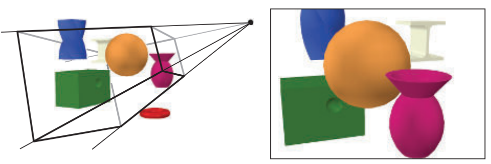

**图2.1** 左侧图像中，虚拟相机位于金字塔尖端（四条线汇聚处）。**只有视锥体内的基元才会被渲染**。对于透视渲染的图像（如此处所示），视锥体是一个棱台（复数：棱台），即一个带有矩形底面的截头金字塔。右侧图像显示了**相机“看到”的内容**。请注意，左侧图像中的红色圆环不在右侧渲染结果中，因为它位于视锥体外部。此外，左侧图像中扭曲的蓝色棱柱被裁剪在了截头金字塔顶部平面上。

**我们将解释渲染管线的不同阶段，重点是功能而非实现**。应用这些阶段的相关细节将在后面的章节中介绍。

## 2.1 架构

在物理世界中，流水线概念以许多不同形式呈现，从工厂装配线到快餐厨房。它也适用于图形渲染。管道由几个阶段[715]组成，每个阶段执行更大任务的一部分。

**管道阶段并行执行，每个阶段依赖于前一个阶段的结果。理想情况下，将非流水线系统划分为n条流水线后可以使速度提高n倍。这种性能增加是使用流水线的主要原因。**例如，通过一系列人员迅速准备大量三明治——一个人准备面包、另一个添加肉类、另一个添加配料等等。每个人将结果传递给排队的下一个人，并立即开始制作下一份三明治。如果每个人需要20秒来完成自己的任务，则最大速率为20秒制作一份三明治（3分钟内可制作3份）。管道阶段并行执行，但它们会被停滞直到最慢的阶段完成其任务为止。例如说肉类添加步骤变得更复杂了, 需要30秒钟才能完成, 现在可以达到最佳速率是两分钟做两份三明治. 对于这种特定类型的管道来说，肉类阶段是瓶颈，因为它决定了整个生产的速度。在等待肉类阶段完成时，配料阶段被称为饥饿状态（顾客也一样）。

这种管道构造也可以在实时计算机图形的背景下找到。**将实时渲染管线粗略地分为四个主要阶段**——**应用程序、几何处理、光栅化和像素处理**，如图2.2所示。这个结构是渲染管线的核心引擎，被用于实时计算机图形应用程序中，因此在后续章节中讨论它是必不可少的基础。每个阶段通常都是一个独立的流水线，由多个子阶段组成。我们区分这里显示的功能级别和它们实现方式之间的结构。一个功能级别有一定任务要执行，但不指定该任务在流水线中如何执行。给定的实现可能会将两个功能级别合并为一个单元或使用可编程内核进行执行，同时将另一个更耗时的功能级别划分为几个硬件单元。

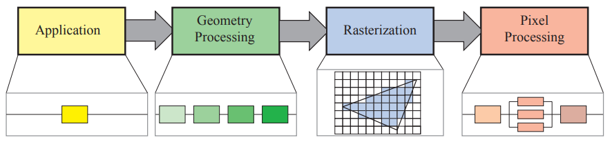

**图2.2** 渲染管线的基本构造，包括四个阶段：**应用程序、几何处理、光栅化和像素处理**。每个阶段都可以是一个管线，如在几何处理阶段下面所示；或者一个阶段可以被（部分）并行化，如在像素处理阶段下面所示。在这个插图中，应用程序阶段是一个单一的过程，但这个阶段也可以被分成多级管道或并行化。请注意，光栅化会找到原语内部的像素（例如三角形）。

渲染速度可以用每秒帧数（FPS）来表示，即每秒渲染的图像数量。它也可以使用赫兹（Hz）来表示，这只是1/秒的符号，即更新频率。通常还会直接声明生成一张图像所需的时间，以毫秒（ms）为单位。生成图像所需的时间通常因每个帧期间执行的计算复杂性而异。帧率用于表达特定帧或在某段使用时间内平均性能的速率。赫兹用于硬件设备上，例如显示器等固定速率设备。

正如其名称所示，**应用阶段由应用程序驱动，因此通常在运行于通用CPU上的软件中实现**。这些CPU通常包括多个核心，能够并行处理多个执行线程。这使得CPU能够高效地运行各种任务，这些任务是应用阶段的责任。传统上，在**CPU上执行的一些任务包括碰撞检测、全局加速算法、动画、物理模拟等等**，具体取决于应用程序类型。接下来的主要阶段是**几何处理阶段**，它**涉及变换、投影和所有其他类型的几何处理**。该阶段计算需要绘制什么、如何绘制以及在哪里绘制。**几何阶段通常在图形处理单元（GPU）上执行**，该GPU包含许多可编程核心以及固定操作硬件。**光栅化**阶段通常将三个顶点作为输入（形成一个三角形），并找到被认为位于该三角形内部的所有像素，并将其转发到下一个阶段。最后，**像素处理阶段**对每个像素执行一个程序以确定其颜色，并可以**执行深度测试**以查看它是否可见或不可见。它还可以执行每像素操作，例如将新计算出的颜色与先前颜色混合。光栅化和像素处理阶段也完全在GPU上进行处理。所有这些阶段及其内部管道将在接下来的四个章节中讨论。有关GPU如何处理这些阶段的更多详细信息，请参见第3章。

## 2.2 应用阶段
开发人员**可以完全控制**应用阶段的操作，因为它**通常在 CPU 上执行**。因此，开发人员可以完全确定实现方式，并随后进行修改以提高性能。这里的更改也可能会影响后续阶段的性能。例如，应**用程序阶段算法或设置可能会减少要呈现的三角形数量。**

尽管如此，在某些情况下 GPU 可以使用称为计算着色器的单独模式来执行一些应用工作。该模式将 GPU 视为高度并行的通用处理器，忽略其专门针对图形渲染而设计的特殊功能。

在应用阶段结束时，需要呈现的几何体被传递到几何处理阶段中。这些是呈现原语（即点、线和三角形），最终可能出现在屏幕上（或任何输出设备上）。这是应用阶段最重要的任务。

由于该阶段的软件实现，它没有像几何处理、光栅化和像素处理阶段那样被分成子阶段（由于CPU本身在更小的尺度上进行流水线处理，因此可以说应用阶段进一步细分为几个流水线阶段，但这在这里并不相关。）。然而，为了提高性能，该阶段通常在多个处理器核心上并行执行。在CPU设计中，这被称为超标量结构，因为它能够同时执行同一阶段的多个进程。第18.5节介绍了使用多个处理器核心的各种方法。

此阶段通常实现的一个过程是碰撞检测。在两个对象之间检测到碰撞后，可能会生成响应并发送回发生碰撞的对象以及力反馈设备。应用程序阶段还**负责来自其他来源（如键盘、鼠标或头戴式显示器）的输入处理**。根据此输入可以采取不同种类的操作。加速算法（例如特定剔除算法（第19章））也在此处实现，并且包括其余管道无法处理的任何其他内容。

## 2.3 几何处理

GPU上的几何处理阶段负责大部分三角形和顶点操作。该阶段进一步分为以下功能阶段：**顶点着色、投影、裁剪和屏幕映射**（图2.3）。

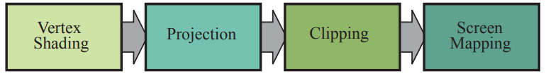

图2.3 几何处理阶段被划分为一系列功能阶段的管道。

### 2.3.1 顶点着色

顶点着色的两个主要任务是**计算顶点位置**和评估程序员**可能希望作为顶点输出数据的任何内容**，例如**法线和纹理坐标**。传统上，对象的大部分阴影是通过将光应用于每个顶点的位置和法线来计算，并仅在该顶点处存储结果颜色。然后在三角形中进行插值处理这些颜色。因此，这个可编程的顶点处理单元被命名为“vertex shader” [1049]。随着现代GPU的出现以及一些或所有阴影发生在像素级别，这个顶点着色阶段更加通用，并且根据程序员意图可能不会评估任何阴影方程式。现在，顶点着色器是一个更通用的单元，专门用于设置与每个顶点相关联的数据。例如，可以使用第4.4节和第4.5节中介绍的方法来动画化对象。

我们首先描述如何计算顶点位置，这是一组始终需要的坐标。在到达屏幕之前，**模型会被转换为几个不同的空间或坐标系。**最初，模型位于自己的**模型空间**中，这意味着它根本没有被转换过。每个模型都可以与一个模型变换相关联，以便定位和定向。可以将多个模型变换关联到单个模型上。这允许相同场景中的多个副本（称为实例）具有不同的位置、方向和大小，而无需复制基本几何体。

通过对模型变换进行操作来转化其顶点和法线坐标系。对象的坐标称为“ 模型坐标”，在应用了该“ 模型变换 ”后 ，该模型被称处于“世界坐标” 或 “**世界空间”**。世界空间是唯一的，在各自使用其相应的“ 模型变换 ”后 ，所有模式都存在于此相同空间。

如前所述，只有相机（或观察者）看到的模型才会被渲染。相机在世界空间中具有位置和方向，用于放置和瞄准相机。为了便于投影和裁剪，使用视图变换将相机和所有模型进行转换。视图变换的目的是将相机放置在原点并对准它，**使其朝向负z轴方向，并使y轴指向上方，x轴指向右侧**。我们使用-z轴约定；一些文本更喜欢沿着+z轴查看。两者之间的差异主要是语义上的，在它们之间进行转换很简单。应用程序编程接口（API）下应用视图变换后实际位置和方向取决于底层系统实现方式。因此划分出来的空间称为摄像头空间或常见地称作视图空间或眼睛空间 。 图2.4展示了视图变换如何影响相机和模型的示例 。 模型变换和视图变换都可以实现为4×4矩阵 ，这是第四章讨论 的主题 。 但是重要的是**要意识到顶点位置和法线可以按程序员喜好计算得出** 。

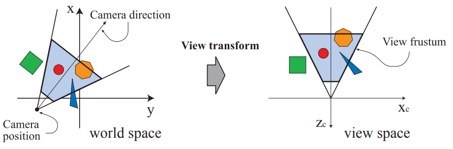

**图2.4** 左侧的插图显示了一个俯视图，展示了相机所在位置和方向，即用户想要的，在一个以+z轴为上方的世界中。视角变换重新定位世界，使得相机位于原点处，沿着其负z轴朝向前方，并将相机的+y轴设置为上方（如右侧所示）。这样做是为了使剪切和投影操作更简单、更快速。浅蓝色区域是视景体积。在此处，假设采用透视投影方式，因为视景体积是一个棱锥体截面。类似技术也适用于任何类型的投影。

接下来，我们描述了顶点着色的第二种输出类型。为了产生逼真的场景，渲染对象的形状和位置是不够的，还必须对它们的外观进行建模。这个描述包括每个物体的材质以及任何照射在物体上的光源效果。材料和灯光可以用各种方式进行建模，从简单颜色到复杂表示物理特性。

**确定光线对材质产生影响的操作称为着色。**它**涉及在对象上各个点计算着色方程式**。通常，在几何处理过程中会执行其中一些计算，并且其他计算可能在每像素处理期间执行。可以在每个顶点处存储各种材料数据，例如该点位置、法向量、颜色或任何需要评估着色方程式所需的数字信息。

然后将顶点着色结果（可以是颜色、向量、纹理坐标以及任何其他类型的阴影数据）发送到栅格化和像素处理阶段进行插值并用于计算表面阴影。

本书更深入地讨论GPU顶点着色器形式上的顶点着色，并且最具体地介绍了第3章和第5章内容。

**作为顶点着色的一部分**，**渲染系统执行投影和剪裁操作，将视图体转换为一个单位立方体，**其极端点位于$(-1，-1，-1)$和$(1, 1, 1)$。可以使用不同的范围来定义相同的体积，例如$0≤z≤1$。单位立方体称为规范化视图体积。首先进行投影，在GPU上由顶点着色器完成。有两种常用的投影方法，即**正交（也称平行）和透视投影**。见图2.5。事实上，“正交”只是平行投影中的一种类型。其他几种在建筑领域尤其有用，如斜角和轴测投影等。旧街机游戏Zaxxon就是以后者命名。

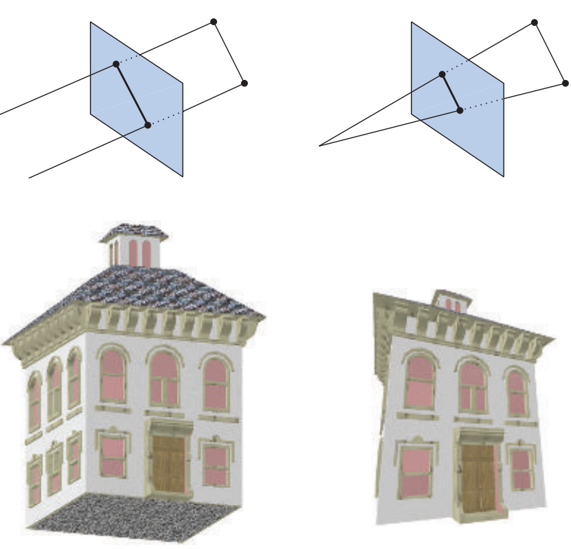

**图2.5** 左边是正交投影，右边是透视投影。

请注意，投影是以矩阵的形式表示的（第4.7节），因此有时可能会与其他几何变换连接在一起。

正交视图体积通常是一个矩形盒子，而正交投影将该视图体积转换为单位立方体。正交投影的主要特点是平行线在变换后仍保持平行。这种变换是平移和缩放的组合。

透视投影略微复杂。在这种类型的投影中，物体离相机越远，在投影后它就越小。此外，平行线可能会汇聚于地平线处。因此，透视变换模拟了我们感知物体大小的方式。从几何上讲，称为**锥台截面（frustum）**的视图体积具有矩形底部的截头锥形状。该截头锥被转化为单位立方体。**正交和透视变换都可以用4×4矩阵构造**（第4章），并且经过任一变换后，模型都被认为处于剪辑坐标系中。这实际上是齐次坐标，在第四章中进行了讨论，并且发生在除以w之前 。GPU 的顶点着色器必须始终输出这种类型的坐标才能使下一个功能阶段——剪辑工作正确。

尽管这些矩阵将一个体积转换为另一个体积，但它们被称为投影，因为在显示后，**z 坐标不会存储在生成的图像中，而是存储在 z 缓冲区中**（第2.5节）。通过这种方式，模型从三维投影到二维。

### 2.3.2 可选的顶点处理
每个管线都有刚才描述的顶点处理。一旦完成此处理，**GPU 上可以进行几个可选阶段**，按以下顺序：**曲面细分（tessellation）、几何着色和流输出**。它们的使用取决于硬件的能力（并非所有 GPU 都具备）和程序员的需求。它们彼此独立，在一般情况下不常用。第三章将对每个阶段进行更详细地介绍。

**第一个可选阶段是曲面细分**。想象你有一个弹跳球对象。如果您使用单组三角形来表示它，则可能会遇到质量或性能问题。您的球在 5 米外看起来很好，但近距离观察时，特别是沿轮廓线处，单独的三角形变得明显可见。如果您使用更多三角形制作球以提高质量，则当球远离屏幕且仅覆盖少数像素时，可能会浪费大量处理时间和内存资源。通过曲面细分技术可以生成带有适当数量三角形曲面。

我们已经谈论了一些三角形的知识，但在管线中到目前为止我们只处理了顶点。这些顶点可以用来表示点、线、三角形或其他对象。顶点可用于描述曲面，例如球体。这样的曲面可以由一组补丁指定，每个补丁都由一组顶点构成。曲面细分阶段本身包括一系列阶段——hull着色器、细分器和domain着色器——将这些补丁顶点转换为（通常）更大的顶点集合，然后用于生成新的三角形集合。场景相机可用于确定生成多少个三角形：当补丁靠近时生成许多三角形，远离时则很少。

下一个可选阶段是**几何着色器**。该着色器早于细分着色器，并因此更常见于GPU上。它类似于细分着色器，在接收各种基元并能够产生新的顶点方面表现出众。不同之处在于其创建范围有限，并且输出基元类型也受到限制。几何着色器有多种用途，**其中最流行之一是粒子生成**。想象模拟烟花爆炸过程中每个火球都可以用一个点表示，即单个顶点。**几何着色器可以将每个点转换为面向观察者的正方形**（由两个三角形组成），覆盖多个像素，从而提供更令人信服的基元以进行渲染。

最后一个可选阶段称为流输出（stream output)。这个阶段让我们将GPU用作几何引擎。在不将处理过的顶点发送到管道的其余部分以呈现到屏幕上的情况下，此时我们可以选择性地将这些顶点输出到数组中进行进一步处理。这些数据可以由CPU或GPU本身在稍后的传递中使用。该阶段通常用于粒子模拟，例如我们的烟花示例。

这三个阶段按照以下顺序执行 - 曲面细分、几何着色和流输出 - 每个都是可选的。无论使用哪种（如果有）选项，如果我们继续沿着管道走，就会得到具有齐次坐标并且需要检查摄像机是否查看它们的一组顶点。

### 2.3.3 裁剪
**只有完全或部分位于视景体内的基元需要传递到光栅化阶段**（以及随后的像素处理阶段），然后在屏幕上绘制它们。完全位于视景体内的基元将按原样传递到下一阶段。完全位于视景体外的基元不会进一步传递，因为它们不会被渲染。部分位于视景体内的是需要进行裁剪的基元。例如，具有一个顶点在视景体外和一个顶点在其中的线应该针对视景体进行裁剪，以便将其外部顶点替换为位于线和视景体交点处的新顶点。使用投影矩阵意味着变换后的基元针对单位立方体进行裁剪。在进行视图变换和投影之前进行剪裁的优点是使得剪裁问题保持一致；基元总是被剪裁至单位立方体。

图2.6展示了剪裁过程。除了视体积的六个剪裁平面外，用户还可以定义其他剪裁平面以可见地切断对象。在第818页上显示了这种类型的可视化图像，称为截面，如图19.1所示。

剪辑步骤使用由投影产生的4值齐次坐标执行剪辑。在透视空间中，数值通常不会线性插值三角形之间。需要第四个坐标以便在使用透视投影时正确地插值和修建数据。最后进行透视除法，将结果三角形的位置放置到三维归一化设备坐标中。正如前面提到的那样，此视体积范围从（-1、-1、-1）到（1、1、1）。几何阶段中的最后一步是从该空间转换为窗口坐标。

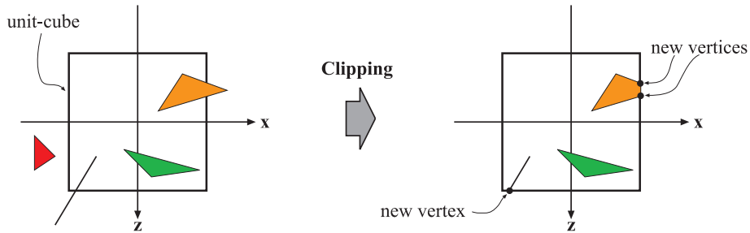

**图2.6** 投影变换后，只有单位立方体内的基元（对应于视锥体内的基元）需要继续处理。因此，位于单位立方体外部的基元被丢弃，完全位于其中的基元被保留。与单位立方体相交的基元被剪裁至该立方体，并生成新顶点和丢弃旧顶点。

### 2.3.4 屏幕映射

只有视图体积内的（裁剪后的）基元才会传递到屏幕映射阶段，当进入此阶段时，坐标仍然是三维的。每个基元的x和y坐标被转换为形成屏幕坐标。屏幕坐标连同z坐标也称为窗口坐标。假设场景应该渲染到一个最小角落位于(x1, y1)、最大角落位于(x2, y2) 的窗口中，其中 x1 < x2 且 y1 < y2。那么屏幕映射就是一个平移操作后跟着一个缩放操作。新的x和y 坐标被称为屏幕坐标。z 坐标([−1,+1]用于OpenGL 和 [0, 1]用于DirectX)也被映射到[z1,z2]上，默认值为 z1=0 和 z2= 1. 然而这些可以通过API进行更改。带有重新映射过z值得窗口坐标将传递给光栅化器阶段。 屏幕映射过程如图 2.7 所示。

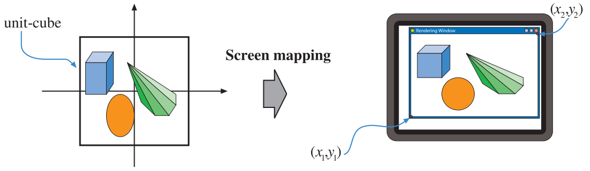

**图2.7** 在投影变换后，基元位于单位立方体中，屏幕映射过程负责找到屏幕上的坐标。

接下来，我们将描述整数和浮点值如何与像素（和纹理坐标）相关联。给定一个水平的像素数组并使用笛卡尔坐标系，最左侧像素的左边缘在浮点坐标中为0.0。OpenGL一直使用这种方案，DirectX 10及其后继版本也是如此。该像素的中心位于0.5处。因此，一系列像素[0,9]覆盖了从[0.0,10.0)的跨度范围内。转换非常简单。
$$
\begin{aligned}
d & =\text { floor }(\mathrm{c}) \qquad (2.1)\\
c & =d+0.5,\qquad (2.2)
\end{aligned}
$$
其中d是像素的离散（整数）索引，c是像素内连续（浮点数）的值。

虽然所有的API都有从左到右增加的像素位置值，但OpenGL和DirectX之间在顶部和底部边缘的零点位置上存在一些不一致。**OpenGL始终支持笛卡尔坐标系，将左下角视为最低值元素，**而DirectX有时会根据上下文定义左上角作为该元素。每种方法都有其逻辑，并且它们之间存在差异时不存在正确答案。例如，**在OpenGL中，（0, 0）位于图像的左下角，而在DirectX中则位于图像的左上角**。当从一个API转移到另一个API时，考虑到这种差异非常重要。

## 2.4 光栅化

在几何处理中，给定变换和投影后的顶点及其相关着色数据，下一阶段的目标是找到所有位于正在渲染的基元（例如三角形）内部的像素元素。我们称这个过程为光栅化，**并将其分成两个功能子阶段：三角形设置（也称原语组装）和三角形遍历。**如图2.8所示。请注意，它们也可以处理点和线，但由于三角形最常见，因此子阶段名称中都带有“triangle”。因此，光栅化（也称扫描转换）是从屏幕空间中二维顶点（每个顶点具有z值[深度值]以及与每个顶点关联的各种着色信息）转换为屏幕上像素的过程。光栅化还可以被视为几何处理和像素处理之间同步点，在这里从三个顶点形成了三角形，并最终发送到像素处理。

三角形是否被认为与像素重叠取决于您如何设置GPU的管道。例如，您可以使用点采样来确定“内部性”。最简单的情况是在每个像素中心使用单个点采样，因此如果该中心点位于三角形内，则相应的像素也被认为在三角形内。您还可以使用超级采样或多重采样抗锯齿技术（第5.4.2节）对每个像素进行多次采样。另一种方法是使用保守光栅化，在这种定义下，如果至少有一部分像素与三角形重叠，则将该像素视为“在”三角形之内（第23.1.2节）。

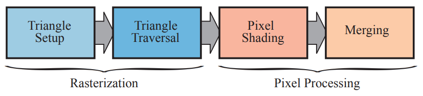

**图2.8**左：光栅化分为两个功能阶段，称为三角形设置和三角形遍历。右：像素处理分为两个功能阶段，即像素处理和合并。

!> “Direct3D”是DirectX的三维图形API组件。DirectX包括其他API元素，例如输入和音频控制。我们不区分在指定特定版本时编写“DirectX”和在讨论此特定API时编写“Direct3D”，而是遵循常见用法，在整个文中都使用“DirectX”。

## 2.5 像素处理

此时，所有被认为在三角形或其他基元内的像素都已经通过前面阶段的组合找到了。像素处理阶段分为像素着色和合并两个部分，如图2.8右侧所示。像素处理是对位于基元内的每个像素或采样执行逐像素或逐采样计算和操作的阶段。

### 2.5.1 像素着色

在这里执行任何像素着色计算，使用插值的着色数据作为输入。最终结果是一个或多个颜色传递到下一阶段。与通常由专用硬件电路执行的三角形设置和遍历阶段不同，像素着色阶段由可编程GPU核心执行。为此，程序员提供了一个像素着色器程序（在OpenGL中称为片元着色器），其中可以包含任何所需的计算。这里可以采用各种技术，其中最重要的技术之一是纹理映射。有关纹理映射的详细信息请参见第6章。简单地说，对对象进行纹理映射意味着将一个或多个图像“贴”到该对象上，以实现各种目的。该过程的简单示例如图2.9所示。图像可以是一维、二维或三维的，其中二维图像最常见。在其最简单形式下，结束产品是每个片段的颜色值，并将它们传递给下一个子阶段。

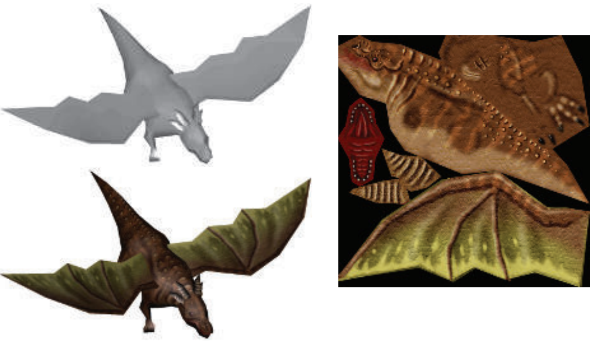

**图2.9** 左上方显示了一个没有纹理的龙模型。图像纹理中的碎片被“粘贴”到龙身上，结果显示在左下方。

每个像素的信息存储在颜色缓冲区中，它是一个矩形数组，包含每种颜色的红、绿和蓝三个分量。合并阶段负责将由像素着色阶段产生的片元颜色与当前存储在缓冲区中的颜色组合起来。这个阶段也被称为ROP（光栅操作管道）或“渲染输出单元”，具体取决于询问者。与着色阶段不同，执行此阶段的GPU子单元通常不是完全可编程的。但是，它高度可配置，可以实现各种效果。

这个阶段还负责解决可见性问题。这意味着当整个场景被渲染后，颜色缓冲区应该包含从相机视角可见的场景中基元的颜色。对于大多数或甚至所有图形硬件来说，这是通过z-buffer（也称为深度缓冲区）算法[238]完成的。z-buffer与颜色缓冲区具有相同的大小和形状，并且对于每个像素，它存储当前最接近基元的z值。这意味着在将一个基元渲染到特定像素时，在该像素上计算并比较了该基元上的z值与z-buffer内容相同位置处的值。如果新计算出来的z值小于z-buffer中的z值，则正在渲染更靠近摄像机而不是之前最接近摄像机在那个像素处所拥有基元。因此，使用正在绘制图形所带来z值和颜色更新该点上原本存在z值和颜色信息。如果计算出来的z值大于z-buffer中的z值，则保持颜色缓冲区和Z-buffer不变。Z-buffer算法简单，收敛速度是O(n)（其中n是要渲染的基元数），并且适用于任何绘图基元，只要可以为每个（相关）像素计算出z值。还请注意，该算法允许大多数基元以任意顺序呈现，这是其受欢迎的另一个原因。但是，z-buffer仅在屏幕上的每个点存储单个深度值，因此无法用于部分透明的基元。必须在所有不透明的基元之后按照从后到前的顺序或使用单独的无序算法（第5.5节）渲染它们。透明度是基本z-buffer的主要弱点之一。

我们已经提到颜色缓冲区用于存储颜色，而z-buffer则为每个像素存储z值。然而，还有其他通道和缓冲区可用于过滤和捕获片段信息。Alpha通道与颜色缓冲相关联，并为每个像素存储相关的不透明度值（第5.5节）。在旧的API中，Alpha通道也被用于通过alpha测试功能选择性地丢弃像素。现在可以将丢弃操作插入到像素着色器程序中，并使用任何类型的计算来触发丢弃。这种类型的测试可用于确保完全透明的片段不会影响z-buffer（第6.6节）。

模板缓冲区是一种离屏缓冲区，用于记录渲染图元的位置。通常每个像素包含8位。可以使用各种函数将基元渲染到模板缓冲区中，然后可以使用缓冲区的内容来控制对颜色缓冲区和z-buffer的渲染。例如，假设已经在模板缓冲区中绘制了一个填充圆形，则可以与允许仅在圆形存在时将后续基元呈现到颜色缓冲器中的运算符相结合。 模板缓存可以成为生成一些特殊效果的强大工具。管道末端所有这些功能称为栅格操作（ROP）或混合操作。 可以将当前颜色与正在处理三角形内部像素的颜色混合，从而实现透明度或颜色样本积累等效果。如前所述，混合通常可通过API进行配置，并非完全可编程化。但是，一些API支持栅格顺序视图（也称为像素着色器排序），从而实现可编程混合能力。

帧缓冲区通常由系统上的所有缓冲区组成。

当基元到达并通过光栅化阶段时，从相机视角可见的那些将显示在屏幕上。屏幕显示颜色缓冲区的内容。为了避免让人类观察者看到正在进行光栅化和发送到屏幕上的基元，使用双重缓冲技术。这意味着场景渲染发生在后台缓冲区中，而不是直接在屏幕上进行渲染。一旦场景已经被渲染到后台缓存中，就会将后台缓存的内容与之前显示在屏幕上的前置缓存交换位置。交换通常发生在垂直回扫期间，在此期间可以安全地执行该操作。
有关不同类型和方法的高速缓存，请参见第5.4.2节、23.6节和23.7节。

## 2.6 管线整体

点、线和三角形是构建模型或对象的渲染基元。想象一下，应用程序是一个交互式计算机辅助设计（CAD）应用程序，用户正在检查华夫饼干制造商的设计。在这里，我们将跟随这个模型通过整个图形渲染管道，包括四个主要阶段：应用程序、几何体、光栅化和像素处理。场景以透视方式呈现到屏幕上的窗口中。在这个简单的例子中，华夫饼干制造商模型包括线条（显示零件的边缘）和三角形（显示表面）。华夫饼干制造商有一个可以打开的盖子。其中一些三角形由带有制造商标志的二维图像进行纹理处理。对于这个例子，在几何阶段完全计算表面着色，除了纹理应用发生在光栅化阶段之外。

**应用程序**

CAD 应用程序允许用户选择和移动模型的部分。例如，用户可能会选择盖子，然后移动鼠标以打开它。应用阶段必须将鼠标移动转换为相应的旋转矩阵，然后确保在呈现时正确地将此矩阵应用于盖子。另一个例子：播放一个动画，沿着预定义的路径移动摄像机以显示华夫饼干机从不同视角看到的情况。然后，依赖于时间，应用程序必须更新摄像机参数（如位置和视图方向）。要呈现每个帧，在管道中下一个主要阶段——几何体阶段中提供了模型的摄像机位置、照明和基元。

**几何处理**

对于透视视图，我们假设应用程序已经提供了投影矩阵。此外，对于每个对象，应用程序都计算了一个描述视图变换以及对象本身位置和方向的矩阵。在我们的示例中，华夫饼机的底部将有一个矩阵，盖子则有另一个矩阵。在几何处理阶段中，使用该矩阵转换对象的顶点和法线，并将其放置到视图空间中。然后可以在顶点处进行着色或其他计算，并使用材料和光源属性。然后使用单独提供的用户投影矩阵执行投影操作，将物体转换为表示眼睛所看到内容的单位立方体空间内。所有位于立方体之外的基元都被丢弃。与该单位立方体相交的所有基元都会被剪切并裁剪至完全位于该单位立方体内部以获得一组完全位于其中的基元集合。然后将这些顶点映射到屏幕上窗口中显示出来，在完成所有三角形和每个顶点操作之后，则传递结果数据给栅格化处理阶段。

**光栅化**

在前一阶段经过剪裁后仍然存在的所有基元都会被光栅化，这意味着找到了所有位于基元内部的像素，并将其发送到下一个像素处理阶段。

**像素处理**

该阶段的目标是计算每个可见基元的每个像素的颜色。那些与任何纹理（图像）相关联的三角形将以所需方式渲染这些图像应用于它们上面。通过z缓冲算法解决可见性问题，同时进行可选丢弃和模板测试。每个对象依次处理，最终图像随即显示在屏幕上。

## 结论

这个渲染管线是几十年来API和图形硬件演变的结果，针对实时渲染应用程序。需要注意的是，这不是唯一可能的渲染管线；离线渲染管线经历了不同的演化路径。电影制作中的渲染通常使用微多边形管道[289, 1734]，但最近光线追踪和路径追踪已经取代了它们。在第11.2.2节中介绍的这些技术也可以用于建筑和设计预可视化。

多年来，应用程序开发人员使用此处描述过程的唯一方法是通过所使用图形API定义的固定功能管道。 固定功能管道之所以被称为如此，是因为实现它的图形硬件由无法以灵活方式编程的元素组成。 最后一个主要固定功能机器示例是任天堂于2006年推出的Wii。 另一方面，可编程GPU使得可以确定在整个流水线中各个子阶段应用哪些操作。 对于本书第四版，我们假设所有开发都使用可编程GPU。

## 进一步阅读和资源
Blinn的书《A Trip Down the Graphics Pipeline》[165]是一本关于从头开始编写软件渲染器的旧书。它是学习实现渲染管道中的一些微妙之处，解释关键算法如剪裁和透视插值的好资源。备受推崇（但经常更新）的OpenGL编程指南（也称为“红皮书”）[885]提供了有关图形管道及其使用相关算法的详细描述。我们这本书网站realtimerendering.com提供了各种管道图表、渲染引擎实现等链接。

# 3. 图形处理器

> “The display is the computer.” —黄仁勋

历史上，图形加速始于在每个像素扫描线上插值颜色并重叠三角形然后显示这些值。包括访问图像数据允许将纹理应用于表面。添加硬件以进行深度测试和插值提供了内置的可见性检查。由于它们的频繁使用，这些过程被专门的硬件所承诺，以增加性能。随着时间推移，渲染管道的更多部分以及更多功能被添加到其中每个部分中，并且在连续几代中不断发展壮大。专用图形硬件与 CPU 相比唯一的计算优势是速度，但速度至关重要。

在过去二十年中，图形硬件经历了令人难以置信的变革。第一个包含硬件顶点处理器（NVIDIA 的 GeForce256）的消费级别显卡于 1999 年发布。NVIDIA 发明了术语“图形处理单元”（GPU），以区别于之前可用的仅栅格化芯片，并得到广泛应用。接下来几年里，GPU 从复杂固定功能流水线的可配置实现演变为高度可编程空白板，在其中开发人员可以实现自己的算法。可编程着色器是控制 GPU 的主要手段。为了提高效率，管道的某些部分仍然是可配置的而不是可编程的，但趋势是向可编程和灵活性发展 [175]。

GPU 通过专注于一组高度并行化的狭窄任务来获得其巨大速度。它们具有用于实现 z 缓冲区、快速访问纹理图像和其他缓冲区以及查找哪些像素被三角形覆盖等功能的定制硅片。这些元素如何执行其功能在第 23 章中进行了介绍。早期了解 GPU 如何为其可编程着色器实现并行处理更加重要。

第3.3节解释了着色器的功能。现在，你需要知道的是，着色器核心是一个小型处理器，执行一些相对独立的任务，例如将顶点从其在世界中的位置转换为屏幕坐标或计算由三角形覆盖的像素颜色。每秒钟会有数十亿次着色器调用（即运行着色器程序的单独实例），因为每帧都会向屏幕发送成千上万个三角形。

首先要考虑延迟问题，这是所有处理器面临的问题。访问数据需要一定时间。关于延迟更详细内容请参见第23.3节。存储在内存芯片中的信息将比本地寄存器中的信息访问时间长，请参见第18.4.1节以深入探讨内存访问问题。关键点是等待检索数据意味着处理器被停滞了，这降低了性能。

## 3.1 数据并行体系结构

不同的处理器架构使用各种策略来避免停顿。CPU被优化为处理各种数据结构和大型代码库。CPU可以拥有多个处理器，但每个处理器以主要串行方式运行代码，只有少量SIMD向量处理是例外。为了最小化延迟的影响，CPU芯片的大部分由快速本地缓存组成，这些缓存填充着可能需要下一个数据的数据。 CPU还通过使用聪明技术（如分支预测、指令重排序、寄存器重命名和高速缓存预取）来避免停顿[715]。

GPU采用不同的方法。 GPU芯片区域中很大一部分专门用于一组称为**着色器核心（shader cores）**的处理器，通常数量达数千个。GPU是流式处理器，在其中类似数据集按顺序依次进行处理。由于这种相似性 - 例如一组顶点或像素 - GPU可以以极其并行化的方式对这些数据进行处理。另一个重要因素是这些调用尽可能独立，它们不需要邻近调用提供信息，并且不共享可写内存位置。虽然偶尔会打破此规则以实现新功能和有用功能，但这样的例外会付出潜在延迟的代价，因为一个处理器可能需要等待另一个处理器完成其工作。

GPU被优化为吞吐量，即可以处理数据的最大速率。然而，这种快速处理是有代价的。由于芯片面积用于缓存内存和控制逻辑较少，每个着色器核心的延迟通常比CPU处理器遇到的要高得多[462]。

假设一个网格被光栅化，并且有两千个像素需要进行片段处理；将调用一次像素着色器程序两千次。想象一下只有一个着色器处理器，它是全球最弱的GPU。它开始执行前两千个片段中第一个片段的着色器程序。着色器处理器对寄存器中的值执行了几个算术运算操作。寄存器是本地且快速访问，因此不会发生停顿。然后，该着色器处理器来到诸如纹理访问之类的指令；例如，在给定表面位置上程序需要知道应用于网格上图像的像素颜色。纹理是完全独立资源，并非像素程序本地内存部分，并且纹理访问可能相当复杂。在此期间内存获取可能需要数百至数千个时钟周期，在此期间GPU处理器无所作为并处于等待状态。在这一点上，该着色器处理器将停顿，等待返回纹理的颜色值。

为了将这个糟糕的GPU变成更好的东西，给每个片段一点存储空间来存储它们的本地寄存器。现在，着色器处理器可以在纹理获取时切换并执行另一个片段，比如第二个片段中的两千个之一。这种切换非常快速，在第一个或第二个片段中没有任何影响，除了注意正在执行第一个指令。现在执行第二个片段。与第一个相同，进行几次算术运算后再次遇到纹理获取。着色器核心现在切换到另一个片段，即编号为三号的那个。最终以这种方式处理所有两千多个碎片。此时着色器处理器返回到编号为1号的碎片上。此时颜色已被提取并可供使用，因此着色程序可以继续执行。处理器按同样方式进行直到遇到另一个已知会停止执行的指令或程序完成为止. 单个碎片需要更长时间才能执行完毕, 但整体而言, 碎片总体上所需时间大大缩短。

在这种架构中，通过将GPU切换到另一个片段来隐藏延迟。 GPU通过将指令执行逻辑与数据分离来进一步发展此设计。称为单指令多数据（SIMD），该安排在固定数量的着色器程序上锁定地执行相同的命令。 SIMD的优点是需要专门用于处理数据和切换的硅（和功率）要比使用单个逻辑和调度单元运行每个程序少得多。将我们的两千个片段示例转化为现代GPU术语，每个像素着色器调用都被称为线程。这种类型的线程不像CPU线程那样简单，它包括一些内存以存储着色器输入值以及任何所需寄存器空间以进行着色器执行。使用相同着色器程序的线程被捆绑成组，由NVIDIA称为warp，由AMD称为wavefronts.  warp / wavefront由某些数量GPU shader核心调度执行，在8到64之间使用SIMD处理技术. 每个线程映射到一个SIMD lane。

假设我们有两千个线程需要执行。NVIDIA GPU上的warp包含32个线程。这意味着62.5个warp，即分配了63个warp，其中一个warp是半空的。Warp的执行类似于我们单GPU处理器示例中的执行方式。着色器程序在所有32个处理器上同步执行。当遇到内存获取时，所有线程同时遇到它，因为相同指令对所有线程都会被执行。获取信号表示该线程组将停顿，并等待其（不同）结果。而不是停顿，该Warp被替换为另一个由32个线程组成的Warp进行执行，并由32核心来完成操作。与我们单处理器系统一样快速地进行交换，因为在交换Warp时没有触及每个线程内部数据。每个线程都有自己的寄存器，并且每个Warp跟踪其正在执行哪条指令。切换新Warps只涉及将一组核心指向要执行的不同一组Threads；没有其他开销发生。Warps 执行或者交换直至全部完成, 如图3.1所示。

在我们简单示例中纹理内存提取引起延迟可能导致Waprs 交换出去，在现实情况下可以更短时间地进行wapr 交换, 因此wap-swapping 是所有GPU使用的主要延迟隐藏机制，还有其他几种优化执行的技术[945]。如何有效地进行此过程涉及到几个因素。例如，如果线程很少，则可以创建较少的Warp，使得延迟隐藏变得困难。

着色器程序的结构是影响效率的重要特征之一。一个主要因素是每个线程所使用的寄存器数量。在我们的例子中，假设两千个线程可以同时驻留在GPU上。与每个线程相关联的着色器程序需要更多寄存器，那么就会有较少的线程和较少的warp可以驻留在GPU上。缺乏warp可能意味着无法通过交换来减轻停顿。正在运行的warp被称为“in flight”，这个数字称为占用率。高占用率意味着有许多可用于处理任务的warp，从而使空闲处理器不太可能出现；低占用率通常会导致性能下降。内存获取频率也会影响需要隐藏多少延迟时间。Lauritzen [993]概述了寄存器数目和shader使用共享内存如何影响占用率；Wronski [1911, 1914]则讨论了理想占用比例如何因shader执行操作类型而异。

另一个影响整体效率的因素是动态分支，由“if”语句和循环引起。“if”语句出现在shader程序中时，如果所有线程都评估并采取相同分支，则该warp可以继续进行而不必考虑其他分支。然而，如果一些线程甚至一个线程采取了另一条路径，则该warp必须执行两个分支，丢弃每个特定线程不需要的结果[530, 945]。这个问题被称为线程分歧，其中少数线程可能需要执行循环迭代或执行其他warp中没有的“if”路径，在此期间使它们处于空闲状态。

所有GPU都实现了这些架构思想，从而产生具有严格限制但大量计算能力的系统。理解这个系统如何运作将帮助您作为程序员更有效地利用其提供的功能。在接下来的章节中，我们将讨论GPU如何实现渲染管道、可编程着色器是如何操作以及每个GPU阶段的演变和功能。

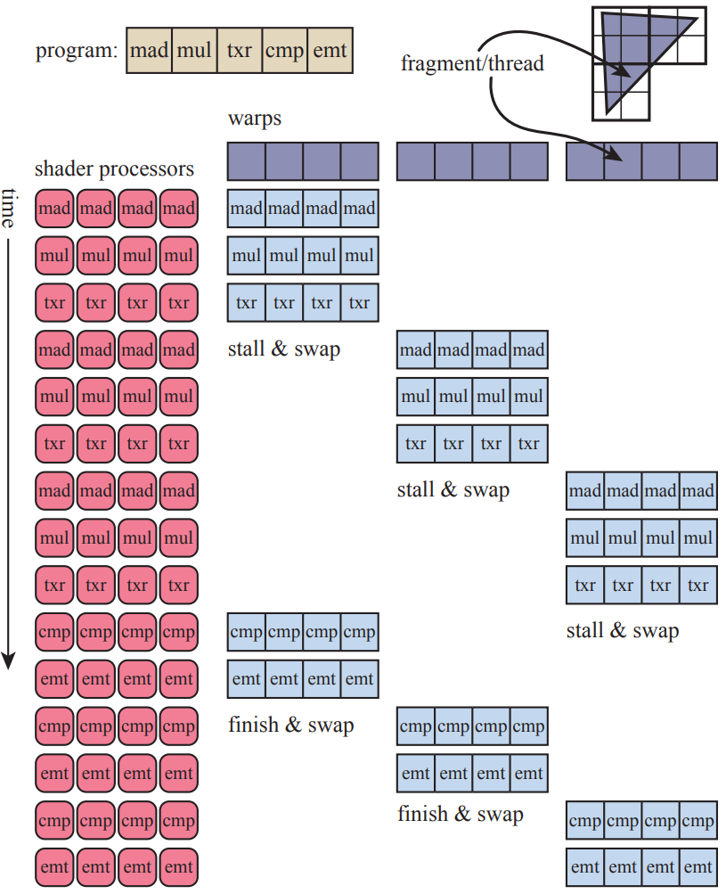

**图3.1**。简化的着色器执行示例。一个三角形的片段，称为线程，被收集到warp中。每个warp显示为四个线程，但实际上有32个线程。要执行的着色器程序包含五条指令。一组四个GPU着色器处理器对第一个warp执行这些指令，直到“txr”命令检测到停顿条件（需要时间来获取其数据）。然后切换第二个warp，并将着色器程序的前三条指令应用于它，直到再次检测到停顿状态。在第三个warp被切换并停滞之后，通过切换回第一个warp并继续执行来继续执行。如果此时尚未返回其“txr”命令的数据，则真正地暂停执行直至这些数据可用为止。每个WARP依次完成。

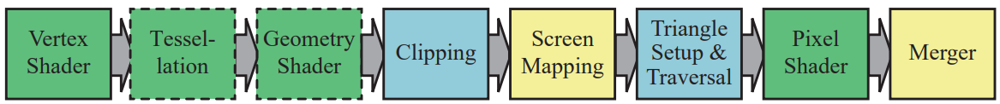

**图3.2** 渲染管线的GPU实现。各个阶段根据用户对其操作程度进行了颜色编码。绿色阶段是完全可编程的。虚线表示可选阶段。黄色阶段可以配置但不可编程，例如合并阶段可以设置各种混合模式。蓝色阶段在功能上完全固定。
## 3.2 GPU管线概述

GPU实现了第二章描述的概念几何处理、光栅化和像素处理管线阶段。这些被分成多个硬件阶段，具有不同程度的可配置性或可编程性。图3.2显示了各种颜色编码的阶段，根据它们的可编程或可配置性而定。请注意，这些物理阶段与第二章介绍的功能阶段略有不同。

我们在此描述GPU的逻辑模型，即由API向程序员公开的模型。正如第18章和23章所讨论的那样，该逻辑管道的实现（物理模型）取决于硬件供应商。在逻辑模型中固定功能的一个级别可以通过向相邻可编程级别添加命令来在GPU上执行。流水线中单个程序可以拆分为由单独子单元执行或完全由单独传递执行。逻辑模型可以帮助您思考影响性能因素，但不应将其误认为是GPU实际实现管道方式。

顶点着色器是一个完全可编程级别，用于实现几何处理级别。几何着色器是一个完全可编程级别，**在原始数据（点、线或三角形）上操作顶点。**它可用于执行每个原始数据的着色操作，销毁原始数据或创建新的原始数据。曲面细分阶段和几何着色器都是可选的，并非所有GPU都支持它们，特别是在移动设备上。

剪裁、三角形设置和三角形遍历阶段由固定功能硬件实现。屏幕映射受窗口和视口设置影响，内部形成简单比例缩放和重新定位。像素着色器级别是完全可编程的。虽然合并级别不可编程，但高度可配置，并且可以设置为执行各种操作。它实现了“合并”功能级别，负责修改颜色、z-buffer、混合、模板以及任何其他输出相关缓冲区。像素着色器执行与合并阶段一起构成第二章介绍的概念像素处理阶段。

随着时间推移，GPU管线从硬编码操作向越来越灵活和控制方向发展。引入可编程着色器级别是这一演变中最重要的步骤。下一节描述了各种可编程级别共有的特性。

## 3.3 可编程着色器阶段

现代着色器程序采用统一的着色器设计。**这意味着顶点、像素、几何和曲面细分相关的着色器共享一个通用的编程模型**。在内部，它们具有相同的指令集架构（ISA）。实现此模型的处理器在DirectX中被称为通用着色器核心，具有这些核心的GPU被称为统一着色器体系结构。这种体系结构背后的思想是，着色器处理器可用于各种角色，并且GPU可以根据需要分配它们。例如，由许多小三角形组成的网格集将需要更多顶点着色器处理能力，而由两个三角形组成的大正方形则不然。拥有单独池子包含顶点和像素渲染核心 GPU 意味著理想工作分配以保持所有核心忙碌已经预先确定了下来。使用统一渲染核心，则 GPU 可以决定如何平衡负载。

描述整个着色器编程模型已经超出了本书的范围，已经有许多文件、书籍和网站对此进行了详细介绍。着色器使用类似于 C 的着色语言编写，例如 DirectX 的高级着色语言（HLSL）和 OpenGL 着色语言（GLSL）。DirectX 的 HLSL 可以编译为虚拟机字节码，也称为中间语言（IL 或 DXIL），以提供硬件独立性。中间表示还可以使着色器程序离线编译和存储。该中间语言由驱动程序转换为特定 GPU 的 ISA。控制台编程通常避免使用中间语言步骤，因为系统只有一个 ISA。

基本数据类型是 32 位单精度浮点标量和向量，尽管向量仅在着色代码的一部分，并且不像上面所述那样得到硬件支持。在现代 GPU 上还原生支持 32 位整数和 64 位浮点数。浮点向量通常包含位置 (xyzw)、法线、矩阵行、颜色 (rgba) 或纹理坐标 (uvwq) 等数据。整数最常用于表示计数器、索引或位掩码等内容。还支持聚合数据类型，如结构体、数组和矩阵。

**绘制调用（draw call）**会调用图形API来绘制一组基元，从而导致图形管道执行并运行其着色器。每个可编程着色器阶段都有两种输入类型：统一输入，其值在绘制调用期间保持恒定（但可以在绘制调用之间更改），以及变化的输入，这些数据来自三角形的顶点或光栅化过程。例如，像素着色器可能将光源的颜色作为统一值提供，并且三角形表面的位置每个像素都会发生变化，因此是变化的。纹理是一种特殊类型的统一输入，在过去总是被应用于表面上的彩色图像，但现在可以被认为是任何大型数据数组。

底层虚拟机为不同类型的输入和输出提供了特殊寄存器。用于统一变量的可用常数寄存器数量比用于各个顶点或像素的可变输入或输出寄存器要多得多。这是因为需要单独为每个顶点或像素存储可变输入和输出，所以有一个自然限制，即需要多少个。统一输入只需在绘制调用中存储一次并重复使用所有顶点或像素上。虚拟机还具有通用临时寄存器，用于临时空间。所有类型的寄存器都可以使用临时寄存器中的整数值进行数组索引。着色程序虚拟机的输入和输出如图3.3所示。

在现代GPU上，图形计算中常见的操作可以高效地执行。着色语言通过运算符（如*和+）公开了最常见的这些操作（例如加法和乘法）。其余操作通过内置函数公开，例如atan()、sqrt()、log()等，并针对GPU进行了优化。还存在用于更复杂操作的函数，例如向量归一化和反射、叉积以及矩阵转置和行列式计算。

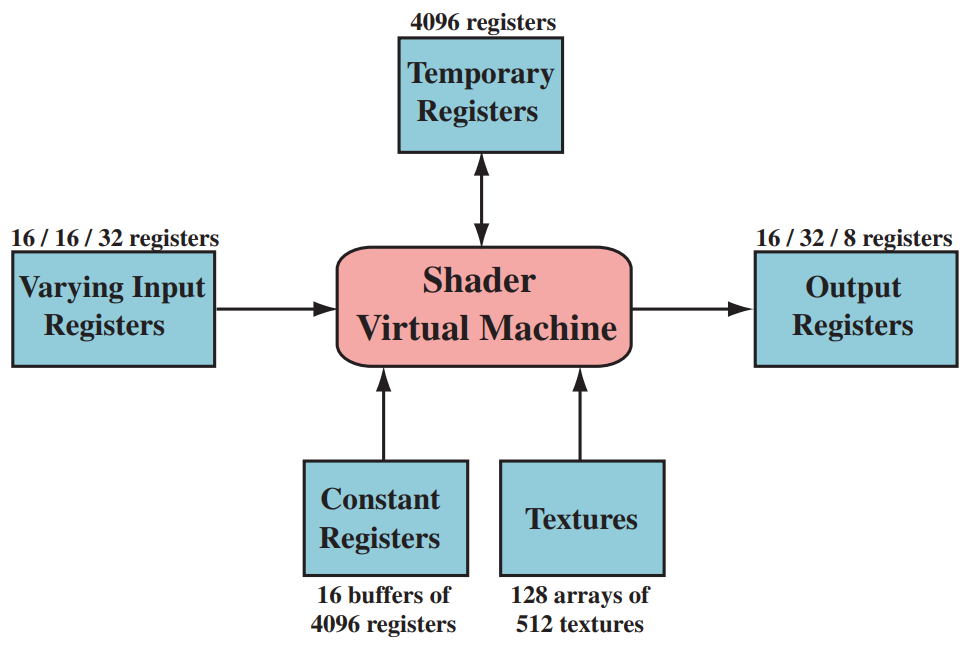

**图3.3** Shader Model 4.0下的统一虚拟机架构和寄存器布局，每个资源旁边标有可用的最大数量。由斜杠分隔的三个数字表示顶点着色器、几何着色器和像素着色器（从左到右）的限制。

术语流程控制是指使用分支指令来改变代码执行的流程。与流程控制相关的指令用于实现高级语言结构，例如“if”和“case”语句以及各种类型的循环。着色器支持两种类型的流程控制。静态流程控制分支基于统一输入值。这意味着代码的流动在绘图调用期间保持不变。静态流程控制的主要优点是允许在各种不同情况下使用相同的着色器（例如，可变数量的灯光）。由于所有调用都采取相同的代码路径，因此没有线程分歧。动态流量控制基于可变输入值，这意味着每个片段可以以不同方式执行代码。这比静态流量控制更强大，但可能会影响性能，特别是如果代码在着色器调用之间发生错误更改时。

## 3.4 可编程着色和API的演变
可编程着色框架的概念可以追溯到1984年Cook的shade trees [287]。简单的shader及其相应的shade tree如图3.4所示。RenderMan Shading Language [63, 1804]是在1980年代末从这个想法中开发出来的，它仍然被用于电影制作渲染，以及其他不断发展的规范，例如Open Shading Language (OSL)项目[608]。

消费级图形硬件最初是由3dfx Interactive于1996年10月1日成功推出的。请参见图3.5，了解从这一年开始的时间线。他们的Voodoo显卡能够以高质量和性能渲染游戏Quake，因此迅速被采用。该硬件在整个过程中实现了固定功能管道。在GPU本地支持可编程着色器之前，有几次尝试通过多个渲染通道实时实现可编程着色操作。 Quake III: Arena脚本语言是1999年首个在这一领域取得广泛商业成功的例子。正如本章开头所提到的那样，NVIDIA的GeForce256是第一个被称为GPU的硬件，但它不具备可编程性。然而，它是可配置的。

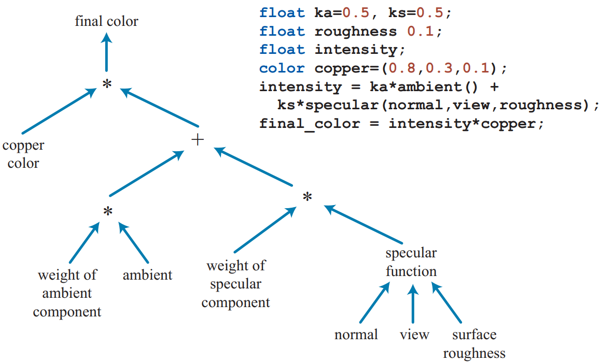

**图3.4** 用于简单铜着色器的遮蔽树及其相应的着色器语言程序。（引自Cook [287]）。

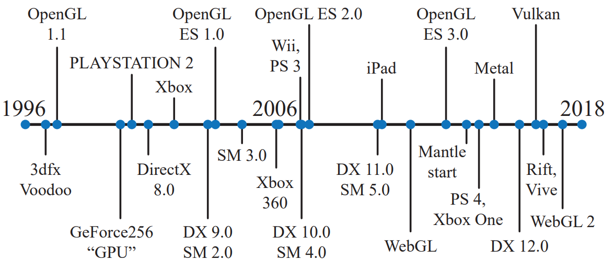

**图3.5** 一些API和图形硬件发布的时间线。

早在2001年，NVIDIA的GeForce 3就成为了第一款支持可编程顶点着色器的GPU [1049]，通过DirectX 8.0和OpenGL扩展进行公开。这些着色器是用类似汇编语言的语言编写的，并由驱动程序即时转换为微码。像素着色器也包含在DirectX 8.0中，但像素着色器缺乏实际可编程性——受限制的“程序”由驱动程序转换为纹理混合状态，然后将硬件“寄存器组合器”连接起来。这些“程序”不仅长度有限（12条指令或更少），而且缺乏重要功能。Peercy等人从RenderMan研究中确定依赖纹理读取和浮点数据对于真正可编程性至关重要[1363]。

当时的着色器不允许流程控制（分支），因此条件语句必须通过计算两个术语并在结果之间选择或插值来模拟。DirectX定义了一个着色器模型（SM）的概念，以区分具有不同着色器功能的硬件。2002年发布了DirectX 9.0，其中包括Shader Model 2.0，它具有真正可编程的顶点和像素着色器。类似的功能也可以使用各种扩展在OpenGL下公开。增加了对任意依赖纹理读取和存储16位浮点值的支持，最终完成了由Peercy等人确定的要求集合。指令、纹理和寄存器等着色器资源限制得到提高，因此着色器能够产生更复杂的效果。还添加了对流程控制的支持。越来越长和复杂化的着色器使汇编程序设计模型变得越来越繁琐。幸运地是，DirectX 9.0还包括HLSL这种渲染语言，并与NVIDIA合作开发而成。同时期左右，OpenGL ARB（架构审查委员会）发布了GLSL，在OpenGL中也是一种相当类似于HLSL 的语言[885] 。这些语言受到C编程语言的语法和设计哲学的很大影响，并包括了RenderMan着色器语言的元素。

Shader Model 3.0于2004年推出，增加了动态流控制功能，使着色器变得更加强大。它还将可选功能转化为必需品，进一步增加了资源限制，并在顶点着色器中添加了有限的纹理读取支持。当新一代游戏机在2005年末（微软的Xbox 360）和2006年末（索尼电脑娱乐公司的PLAYSTATION 3系统）推出时，它们配备了Shader Model 3.0级别的GPU。任天堂Wii游戏机是最后一个值得注意的固定功能GPU之一，最初于2006年底发货。纯粹的固定功能管道已经消失不见。着色器语言已经发展到一个使用各种工具来创建和管理它们的地步。其中一种工具使用Cook's shade tree概念，在图3.6中显示屏幕截图。

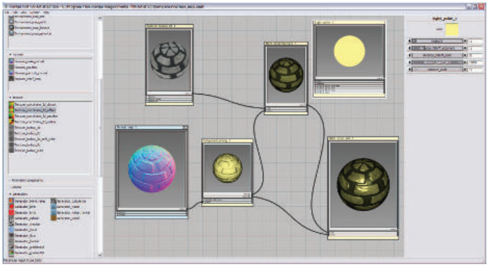

**图3.6 **用于着色器设计的可视化着色器图系统。各种操作被封装在函数框中，可以在左侧进行选择。当选定时，每个函数框都有可调参数，在右侧显示。每个函数框的输入和输出相互链接以形成最终结果，显示在中心帧的右下方。（来自“mental mill”，mental images inc. 的屏幕截图）。

编程可编性的下一个重大进步也在2006年末出现。Shader Model 4.0是DirectX 10.0 [175]中包含的，引入了几个主要功能，例如几何着色器和流输出。Shader Model 4.0为所有着色器（顶点、像素和几何）提供了统一的编程模型，即前面所述的统一着色器设计。资源限制进一步增加，并添加了对整数数据类型（包括位运算）的支持。OpenGL 3.3中GLSL 3.30的引入提供了类似的着色器模型。

2009年，DirectX 11和Shader Model 5.0发布，增加了曲面细分着色器和计算着色器（也称为DirectCompute）。该版本还专注于更有效地支持CPU多处理，这是第18.5节讨论的主题。OpenGL在4.0版中添加了细分和4.3版中的计算着色器。 DirectX和OpenGL发展方式不同。两者都设置了特定版本发布所需的一定级别的硬件支持。微软控制DirectX API，并直接与独立硬件供应商（IHV）如AMD、NVIDIA和英特尔以及游戏开发人员和计算机辅助设计软件公司合作，确定要公开哪些功能。 OpenGL由硬件和软件供应商联合开发，由非营利组织Khronos Group管理。由于涉及到众多公司，API功能通常会在DirectX引入后一段时间内出现在OpenGL版本中。但是，OpenGL允许扩展使用最新GPU函数，在正式发布之前进行厂商特定或更普遍的支持。

API的下一个重大变革是由AMD在2013年推出Mantle API所引领。与视频游戏开发商DICE合作开发，Mantle的想法是剥离掉许多图形驱动程序的开销，并将此控制直接交给开发人员。除此之外，还有更有效的CPU多处理器支持。这个新类别的API旨在极大地减少CPU在驱动程序中花费的时间，以及提供更高效率的CPU多处理器支持（第18章）。 Mantle中首创的思路被微软采纳并于2015年发布为DirectX 12。请注意，DirectX 12不专注于公开新GPU功能——DirectX 11.3公开了相同硬件特性。两种API都可用于向虚拟现实系统（如Oculus Rift和HTC Vive）发送图形数据。但是，DirectX 12是API 的彻底重新设计，它更好地映射到现代GPU体系结构上。低延迟驱动程序对于那些CPU驱动成本导致瓶颈或使用更多CPU处理器来进行图形操作可以提高性能等应用非常有用[946] 。从早期版本移植可能会很困难，并且简单实现可能会导致较低性能[249,699,1438]。

苹果于2014年发布了自己的低开销API，称为Metal。 Metal首先在移动设备上可用，例如iPhone 5S和iPad Air，在一年后通过OS X El Capitan提供给更新的Macintosh使用。除了效率之外，减少CPU使用可以节省电力，在移动设备上是一个重要因素。这个API有它自己的着色语言，旨在用于图形和GPU计算程序。

AMD将其Mantle工作捐赠给了Khronos Group，后者在2016年初发布了自己的新API，称为Vulkan。与OpenGL一样，Vulkan适用于多个操作系统。 Vulkan使用一种名为SPIRV的新高级中间语言，该语言用于着色器表示和通用GPU计算。预编译的着色器是可移植的，因此可以在支持所需功能的任何GPU上使用[885]。 Vulkan也可以用于非图形GPU计算，因为它不需要显示窗口[946]。 Vulkan与其他低开销驱动程序最显著的区别之一是它旨在适用于从工作站到移动设备等各种系统。

在移动设备上，使用OpenGL ES是一种常见的做法。“ES”代表嵌入式系统，因为该API是针对移动设备开发的。当时标准的OpenGL结构比较笨重且某些调用结构速度较慢，并且需要支持很少使用的功能。2003年发布了OpenGL ES 1.0版本，它是OpenGL 1.3版本的简化版，描述了一个固定函数管道。虽然DirectX的发布时间与支持其硬件显卡时间相同步，但移动设备图形支持并没有以同样方式进行开发。例如，在2010年首次推出iPad时实现了OpenGL ES 1.1版本。2007年发布了OpenGL ES 2.0规范，提供可编程着色器功能。它基于OpenGL 2.0但不包括固定函数组件，因此与OpenGL ES 1.1不兼容。2012年发布了OpenGL ES 3.0版本，提供多个渲染目标、纹理压缩、变换反馈、实例化和更广泛范围内纹理格式和模式等功能，并改进着色器语言等方面。 OpenGL ES 3.1添加计算着色器功能, 而3.2则增加几何和镶嵌着色器等其他特性 。第23章详细讨论了移动设备架构。

OpenGL ES的一个分支是基于浏览器的API WebGL，通过JavaScript调用。该API的第一个版本发布于2011年，可在大多数移动设备上使用，因为其功能相当于OpenGL ES 2.0。与OpenGL一样，扩展提供了对更高级GPU功能的访问。WebGL 2假定支持OpenGL ES 3.0。

WebGL特别适合用于尝试新功能或在课堂中使用：

- 它是跨平台的，可以在所有个人电脑和几乎所有移动设备上运行。
- 驱动程序批准由浏览器处理。即使一个浏览器不支持特定的GPU或扩展，通常另一个浏览器也会支持。
- 代码是解释性的，而不是编译性的，并且只需要文本编辑器进行开发。
- 大多数浏览器都内置了调试器，并且可以检查任何网站上运行的代码。
- 程序可以通过将它们上传到网站或Github来部署。

更高级的场景图和特效库，如three.js [218]，提供了易于访问的代码，用于各种更复杂的效果，例如阴影算法、后处理效果、物理基础着色和延迟渲染。

## 3.5 顶点着色器
顶点着色器是图3.2中所示的功能管线中的第一个阶段。虽然这是程序员直接控制的第一阶段，但值得注意的是，在此阶段之前会发生一些数据操作。在DirectX称为输入装配器[175、530、1208]中，可以将多个数据流编织在一起形成要发送到管道下面的顶点和基元集合。例如，一个对象可以由一个位置数组和一个颜色数组表示。输入装配器将通过创建具有位置和颜色的顶点来创建该对象的三角形（或线条或点）。第二个对象可以使用相同的位置数组（以及不同的模型变换矩阵）和不同颜色数组来表示它自己。数据表示详细讨论见16.4.5节。输入装配器还支持执行实例化操作，这允许使用单个绘制调用多次绘制带有某些可变数据实例化参数设置好几次重复出现地物体。如何使用实例化请参考18.4.2节。

三角形网格由一组顶点表示，**每个顶点与模型表面上的特定位置相关联。除了位置之外，每个顶点还可以关联其他可选属性，例如颜色或纹理坐标**。**在网格顶点处定义了表面法线**，这可能看起来很奇怪。从数学上讲，每个三角形都有一个明确定义的表面法线，并且直接使用三角形的法线进行着色似乎更合理。然而，在渲染时，三角形网格通常用于表示潜在的曲面，并且使用顶点法线来表示该曲面的方向，而不是三角形网格本身的方向。第16.3.4节将讨论计算顶点法线的方法。图3.7显示了代表曲面的两个三角形网格侧视图，一个平滑、一个具有锐利折痕。

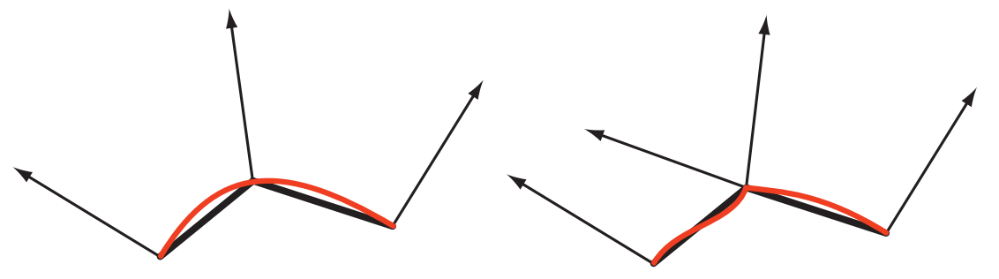

**图3.7** 侧面视图显示了三角网格（黑色，带有顶点法线）表示的曲面（红色）。左边使用平滑的顶点法线来表示光滑的表面。右边中间的顶点被复制并赋予两个法线，表示一个折痕。

顶点着色器是处理三角网格的第一个阶段。描述形成三角形的数据对于顶点着色器不可用。正如其名称所示，它仅处理传入的顶点。顶点着色器提供了一种修改、创建或忽略与每个三角形顶点相关联的值（例如颜色、法线、纹理坐标和位置）的方法。通常情况下，顶点着色器程序将从模型空间转换为齐次剪辑空间（第4.7节）。至少，一个顶点着色器必须始终输出此位置。

一个顶点着色器与前面描述过的统一渲染管线非常相似。每个传入的顶点都会被经过该程序进行处理，并输出许多在三角形或直线上插值得到的值。 由于不能创建或销毁任何定位，并且由一个定位生成结果无法传递给另一个定位，因此每个定位都是独立处理的，GPU上可以并行应用任意数量 的片元处理单元来接收输入流中。

输入组装通常被呈现为在执行“vertex shader”之前发生的过程。这是物理模型经常与逻辑不同之处之一。“Vertex Shader”可能会获取数据以创建“vertex”，驱动程序将自动添加适当的指令，对程序员不可见。

接下来的章节将解释几种顶点着色器效果，例如用于动画关节的顶点混合和轮廓线渲染。 顶点着色器的其他用途包括：-

- 对象生成，通过创建一个网格并由顶点着色器进行变形。
- 使用蒙皮和变形技术对角色的身体和面部进行动画处理。
- 过程性变形，例如旗帜、布料或水的移动[802, 943]。
- 粒子创建，通过将退化（无区域）网格发送到管道中，并根据需要赋予其区域来实现。
- 透镜畸变、热气腾腾、水波纹、页面卷曲等效果，通过使用整个帧缓冲区内容作为屏幕对齐网格上的纹理进行过程性变形来实现。
- 应用地形高度场，使用顶点纹理提取[40,1227]。

图3.8展示了使用顶点着色器进行的一些变形。

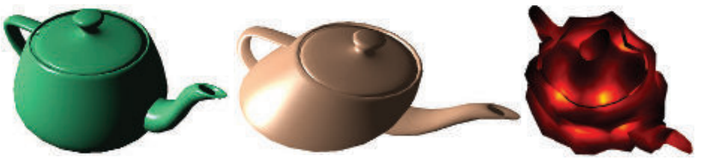

**图3.8** 左侧是一个普通的茶壶。由顶点着色器程序执行的简单剪切操作产生了中间的图像。右侧，噪声函数创建了一个扭曲模型的场。（图片由NVIDIA公司提供的FX Composer 2生成。）

顶点着色器的输出可以以多种不同的方式被消耗。通常路径是为每个实例生成和光栅化其基元，例如三角形，并将产生的单个像素片段发送到像素着色器程序进行持续处理。在某些GPU上，数据也可以被发送到镶嵌阶段或几何着色器中，或者存储在内存中。这些可选阶段将在以下章节中讨论。

## 3.6 曲面细分阶段
曲面细分阶段允许我们渲染曲面。GPU 的任务是将**每个表面描述转换为一组代表性的三角形**。这个阶段是一个**可选**的 GPU 特性，最早在 DirectX 11 中推出（并且被要求使用）。它也支持 OpenGL 4.0 和 OpenGL ES 3.2。

使用曲面细分阶段有几个优点。曲面描述通常比提供相应的三角形更紧凑。除了节省内存外，此功能**还可以通过生成适当数量的三角形来有效地呈现表面以避免 CPU 和 GPU 之间成为动画人物或对象每帧变化时瓶颈问题。**对于给定视图，可以高效地呈现这些表面，并生成适当数量的三角形。例如，**如果球远离摄像机，则只需要少量三角形即可**；近距离观察时，则可能需要数千个三角形才能获得最佳效果。控制详细级别的能力还可以使应用程序控制其性能，例如，在较弱的 GPU 上使用较低质量网格以保持帧速率稳定等等。

通常由平坦表面表示的模型可以转换为精细网格中包含大量三角形，然后根据需要进行变形 [1493]，或者可以细分以便更少地执行昂贵的着色计算[225]。

曲面细分阶段始终由三个元素组成。使用 DirectX 的术语，这些是外壳着色器、细分器和域着色器。在 OpenGL 中，外壳着色器是曲面控制着色器（Tessellation Control Shader），而域着色器则是曲面评估着色器（Tessellation Evaluation Shader），它们更具描述性但冗长。OpenGL 中的固定功能细分程序称为原始生成程序，并且正如将要看到的那样。

如何指定和细分曲线和曲面在第17章中详细讨论。这里我们简要概述每个细分阶段的目的。首先，外壳着色器的输入是一个特殊的补丁基元。它由几个控制点组成，定义了一个细分表面、Bézier补丁或其他类型的曲线元素。外壳着色器有两个功能。首先，它告诉镶嵌程序应该生成多少三角形以及以什么配置生成三角形。其次，它对每个控制点进行处理，并可选择性地修改传入的补丁描述，根据需要添加或删除控制点。外壳着色器将其一组控制点连同镶嵌控制数据输出到域着色器中，请参见图3.9。

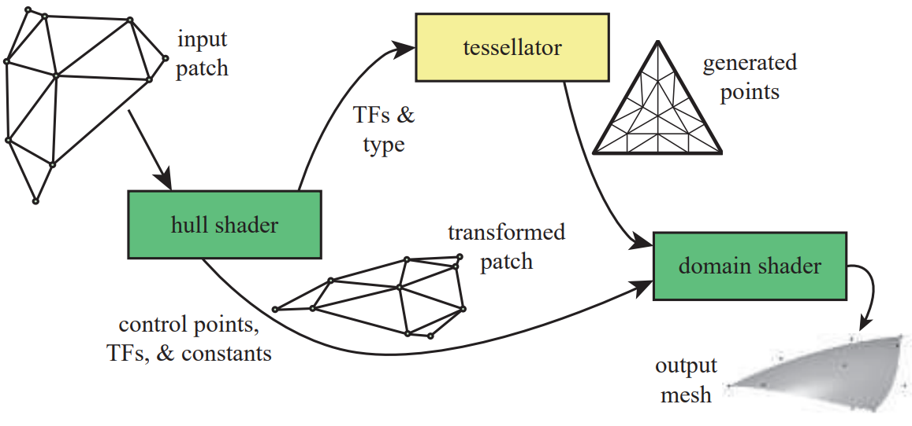

**图3.9** 曲面细分阶段。外壳着色器接收由控制点定义的补丁。它将细分因子（TF）和类型发送到固定功能细分器。控制点集按照外壳着色器所需进行变换，并随相关补丁常量一起发送到域着色器中。细分器创建了一组顶点及其重心坐标，然后由域着色器处理这些顶点，生成三角形网格（为参考显示控制点）。

曲面细分器是管线中的固定功能阶段，仅与细分着色器一起使用。它的任务是为域着色器添加多个新顶点以进行处理。外壳着色器向曲面细分器发送有关所需细分曲面类型的信息：三角形、四边形或等值线。等值线是一组线条，有时用于头发渲染[1954]。外壳着色器发送的另一个重要值是细分因子（OpenGL 中的细分级别）。这些因子有两种类型：内部和外部边缘。两个内部因子确定三角形或四边形内部发生了多少次细分。外部因素决定每个外部边缘被拆分了多少次（第 17.6 节）。图 3.10 显示了增加细分因子的示例。通过允许单独控制，我们可以使相邻曲面之间匹配在细分方面匹配，而不管内部如何被细分。匹配边缘避免补丁接触处出现裂纹或其他阴影伪像问题。顶点被赋予重心坐标（第 22.8 节），这些坐标指定所需表面上每个点的相对位置。

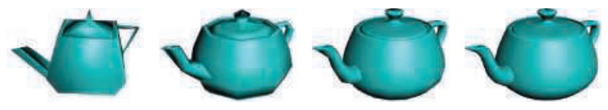

**图3.10** 改变镶嵌因子的效果。犹他茶壶由32个补丁组成。从左到右，内部和外部细分因子分别为1、2、4和8。（图片由Rideout和Van Gelder [1493]的演示生成。）

外壳着色器始终输出一个补丁，即一组控制点位置。然而，它可以通过向细分器发出零或小于零（或非数字NaN）的外部细分级别来表示要丢弃一个补丁。否则，曲面细分器将生成网格并将其发送到域着色器。外壳着色器中用于曲面的控制点由每个域着色器调用使用以计算每个顶点的输出值。域着色器具有类似于顶点着色器的数据流模式，其中来自细分处理单元的每个输入顶点都会被处理并生成相应的输出顶点。形成的三角形随后传递到下游管线。

虽然这个系统听起来很复杂，但它的结构是为了效率而设计的，每个着色器都可以相对简单。传递到外壳着色器中的补丁通常不会经历太多或没有修改。该着色器也可以使用补丁的估计距离或屏幕大小即时计算细分因子，例如地形渲染[466]。另外，外壳着色器可能只是将应用程序计算和提供的一组固定值传递给所有补丁。细分处理器执行一个涉及但具有固定功能过程来生成顶点、确定其位置以及指定它们形成哪些三角形或线条等数据扩展步骤在着色器之外进行以实现计算效率[530]。域着色器获取为每个点生成的重心坐标，并将其用于补丁评估方程式中以生成所需的位置、法线、纹理坐标和其他顶点信息，请参见图3.11作为示例。

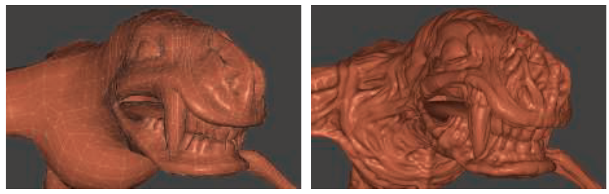

**图3.11** 左侧是大约6000个三角形的基础网格。右侧，每个三角形都使用PN三角剖分进行细分和位移。（来自NVIDIA SDK 11 [1301]样本，由NVIDIA Corporation提供，模型来自4A Games的《地铁2033》。）

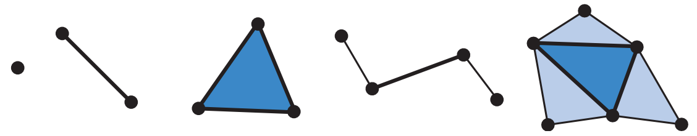

**图3.12** 几何着色器程序的输入是某种单一类型：点、线段或三角形。最右边的两个基元包括与线和三角形对象相邻的顶点。更复杂的补丁类型也是可能的。

## 3.7 几何着色器
几何着色器可以将图元转换为其他图元，这是曲面细分阶段无法实现的。例如，三角形网格可以通过每个三角形创建线边缘来转换为线框视图。或者，这些线条可以被面向观察者的四边形所取代，从而制作具有更粗边缘的线框渲染[1492]。几何着色器于2006年底随DirectX 10发布而添加到硬件加速的图形管道中。它位于管道中曲面细分着色器之后，并且其使用是可选的。虽然Shader Model 4.0 的必需部分，但在早期版本的shader model 中并未使用。OpenGL 3.2 和 OpenGL ES 3.2 同样支持此类型的着色器。

几何着色器的输入是单个对象及其关联顶点。该对象通常由带状三角形、线段或仅一个点组成。扩展基元可以由几何着色器定义和处理。特别地，在三角形外传递了另外三个顶点，并且多段线上相邻两个顶点也可用于处理（见图3.12）。使用DirectX 11和Shader Model 5.0 ，您还可以传入更复杂的补丁，最多可达32个控制点。尽管如此，曲面细分阶段对于补丁生成更有效率[175]。

几何着色器处理该基元并输出零个或多个顶点，这些顶点被视为点、折线或三角形条带。请注意，几何着色器可能不会生成任何输出。通过这种方式，可以通过编辑顶点、添加新的基元和删除其他基元来有选择地修改网格。

几何着色器旨在修改传入数据或制作有限数量的副本。例如，一种用途是生成六个经过变换的数据副本以同时渲染立方体贴图的六个面；参见第10.4.3节。它还可用于高质量阴影生成中有效地创建级联阴影映射。利用几何着色器的其他算法包括从点数据创建可变大小粒子、沿毛发轮廓挤出鳍片进行毛皮渲染以及为阴影算法查找物体边缘。更多示例请参见图3.13。这些和其他用途将在本书其余部分讨论。

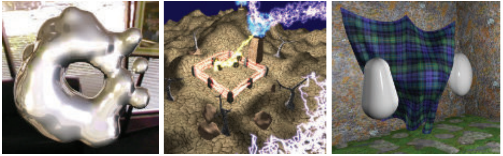

**图3.13** 几何着色器（GS）的一些用途。左侧使用GS实时执行元球等值面镶嵌。中间，使用GS和流输出进行线段的分形细分，并通过GS生成广告牌以显示闪电效果。右侧，使用顶点和几何着色器与流输出执行布料模拟。（图片来自NVIDIA SDK 10 [1300]样本，由NVIDIA Corporation提供。）

DirectX 11增加了几何着色器使用实例化的功能，其中几何着色器可以在任何给定基元上运行一组次数[530,1971]。在OpenGL 4.0中，这是通过调用计数指定的。几何着色器还可以输出多达四个流。一个流可以发送到渲染管道下面进行进一步处理。所有这些流都可以选择性地发送到流输出渲染目标。

保证几何着色器按照输入顺序从原语中输出结果。这会影响性能，因为如果有多个着色器核并行运行，则必须保存和排序结果。这和其他因素使得不建议使用几何着色器来复制或创建大量的几何体。

发出绘制调用后，在GPU上只有三个位置可以创建工作：光栅化、镶嵌阶段和几何着色器。其中，考虑资源和内存需求时，几何着色器的行为最不可预测，因为它是完全可编程的。实际上，由于其与GPU强项之间存在差异，在实践中很少使用几何着色器。在某些移动设备上它是以软件形式实现的，并且积极反对其使用[69]。

### 3.7.1 流输出
GPU管道的标准用法是将数据通过顶点着色器发送，然后光栅化生成三角形并在像素着色器中处理这些三角形。过去，数据总是通过管道传递，并且无法访问中间结果。流输出的概念是在Shader Model 4.0中引入的。**在顶点着色器（以及可选的曲面细分和几何着色器）处理完顶点之后，可以将其作为有序数组输出到流中**，除了被发送到光栅化阶段外。实际上，可以完全关闭光栅化，并仅使用管道作为非图形流处理器。以这种方式处理的数据可以通过管道返回，从而允许迭代处理。如第13.8节所述，在模拟流动水或其他粒子效果方面可能会很有用。它还可以用于对模型进行蒙皮操作，并使这些顶点可供重复使用（第4.4节）。

流输出仅以浮点数形式返回数据，因此它可能具有明显的内存成本。流输出仅适用于基元而不直接适用于顶点。如果网格被送入管道，则每个三角形都会生成自己独立的三个输出顶点集合；原始网格中的任何顶点共享都将丢失。因此，更典型的用法是仅将顶点作为点集基元通过管道发送。在OpenGL中，流输出阶段称为变换反馈（transform feedback），因为其大部分使用重点是转换顶点并将它们返回以进行进一步处理。保证按照输入时的顺序将基元发送到流输出目标，这意味着顶点顺序将得到维护[530]。

## 3.8 像素着色器
在顶点、曲面细分和几何着色器执行其操作后，原始图元被剪裁并设置为光栅化，如前一章节所述。该管道的这个部分在其处理步骤上相对固定，即不可编程但有些可配置。每个三角形都会被遍历以确定它覆盖了哪些像素。光栅化器还可以粗略地计算三角形覆盖每个像素单元面积的程度（第5.4.2节）。这个三角形片段部分或完全重叠于像素的区域称为片元。

包括z-buffer中使用的z值在内的三角形顶点处的值将被插值到每个像素上。这些值将传递给像素着色器进行处理。在OpenGL中，像素着色器称为片段着色器，这可能是一个更好的名称。我们在本书中始终使用“pixel shader”以保持一致性。发送到管道下游的点和线图元也会为所涵盖的像素创建片元。

三角形之间执行的插值类型由像素着色器程序指定。通常我们使用透视校正插值，使得随着物体远离观察者，像素表面位置之间的世界空间距离增加。例如，在渲染延伸到地平线的铁路轨道时，铁路枕木在轨道更远处更密集，因为每个接近地平线的连续像素需要行进更长的距离。还有其他可用的插值选项，如屏幕空间插值，在其中不考虑透视投影。DirectX 11可以进一步控制何时以及如何执行插值[530]。

从编程角度来看，顶点着色器程序输出在三角形（或线）上进行了插值后有效地成为像素着色器程序输入。随着GPU技术的发展，其他输入也被暴露出来。例如，在Shader Model 3.0及以上版本中片段的屏幕位置可供像素着色器使用。此外哪个侧面是可见三角形是一个输入标志位, 这对于单次渲染前后各自采用不同材质非常重要.

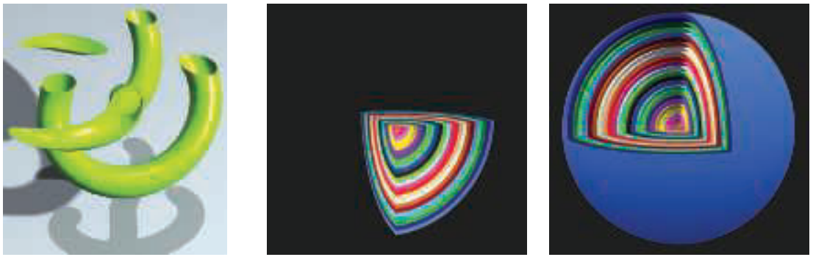

**图3.14** 用户定义的裁剪平面。左侧为单个水平裁剪平面切分对象。中间，嵌套球体被三个平面裁剪。右侧，只有当球体表面在所有三个裁剪平面之外时才进行裁剪。（来自three.js示例webgl clipping和webgl clipping intersection [218]）。

有了输入，通常像素着色器会计算并输出片段的颜色。它还可能产生不透明度值，并可选择性地修改其z深度。在合并期间，这些值用于修改存储在像素中的内容。光栅化阶段生成的深度值也可以由像素着色器进行修改。模板缓冲区值通常是不可修改的，而是通过到合并阶段传递的。DirectX 11.3 允许着色器更改此值。雾计算和 alpha 测试等操作已从合并操作转移到 SM 4.0 中成为像素着色器计算 [175]。

像素着色器还具有丢弃传入片段（即不生成任何输出）的独特能力。图3.14展示了如何使用片段丢弃功能。剪裁平面功能曾经是固定管线中可配置元件，并稍后在顶点着色器中指定。有了片段丢弃功能，该功能就可以以任意所需方式实现在像素着色器中，例如决定是否将剪辑体积 AND 或 OR 在一起。

最初，像素着色器只能输出到合并阶段以供最终显示使用。随时间推移，一个像素着色器可以执行的指令数量大大增加了 。这种增长引发了多重渲染目标（MRT）的想法。不再仅将像素着色器程序的结果发送到颜色和z缓冲区，而是可以为每个片段生成多组值，并保存到不同的缓冲区中，每个称为渲染目标。渲染目标通常具有相同的x和y维度；一些API允许不同大小，但呈现区域将是这些最小值之一。一些架构要求每个渲染目标具有相同的位深度，甚至可能具有相同的数据格式。根据GPU，可用的渲染目标数量为四或八。

即使存在这些限制，MRT功能仍然是执行渲染算法更高效的强大辅助工具。单个渲染通道可以在一个目标中生成彩色图像，在另一个目标中生成对象标识符，并在第三个目标中生成世界空间距离。这种能力也催生了一种不同类型的渲染管线，称为延迟着色，其中可见性和着色分别完成。第一遍存储有关每个像素点处物体位置和材质的数据。随后的遍历可以有效地应用照明和其他效果。这类渲染方法在20.1节中描述。

像素着色器的局限性在于它通常只能将输出写入到其所处理片段位置对应的渲染目标上，并且不能读取相邻像素当前结果。也就是说，当像素着色器程序执行时，它无法直接将其输出发送到相邻像素，也无法访问其他人最近的更改结果。而是计算仅影响自己像素点的结果。但是，此限制并非听起来那么严重。通过一次传递创建的输出图像可以由稍后传递中使用pixel shader访问任何数据信息进行处理相邻象元使用图形处理技术进行处理（12.1节）。

有例外的规则是像素着色器可以立即在梯度或导数信息计算期间间接访问相邻片段的信息。像素着色器提供了任何插值值沿x和y屏幕轴每个像素变化量的数量。这些值对于各种计算和纹理寻址非常有用。这些梯度对于诸如纹理过滤（6.2.2节）之类的操作特别重要，其中我们想知道多少图像覆盖一个像素。所有现代GPU都通过以2×2组处理片段来实现此功能，称为quad。当pixel shader请求渐变值时，返回相邻碎片之间的差异。请参见图3.15。统一核心具有访问相邻数据（保留在同一warp上的不同线程中）并因此可以计算用于pixel shader中使用的渐变所需能力 。该实施方式的一个结果是无法在受动态流控制影响部分访问梯度信息，即，“if”语句或循环与可变迭代次数。必须使用相同指令集处理组中所有碎片，以便四个象元点结果均适用于计算渐变效果 。即使在离线渲染系统[64]中也存在这种基本限制。

DirectX 11引入了一种缓冲类型，允许对任何位置进行写入访问，即无序访问视图（UAV）。最初只针对像素和计算着色器，但在DirectX 11.1中将UAV的访问扩展到所有着色器[146]。OpenGL 4.3称其为着色器存储缓冲对象（SSBO）。两个名称都有自己的描述方式。像素着色器并行运行，在任意顺序下共享此存储缓冲区。

通常需要某些机制来避免数据竞争条件（又称数据危险），其中两个着色器程序“竞赛”影响相同值，可能导致任意结果。例如，如果两次调用像素着色器尝试同时添加到相同检索值，则可能会发生错误。它们都将检索原始值，都会在本地修改它，但是然后写入其结果的调用中最后一个调用将抹掉其他调用的贡献-仅会发生一次加法。 GPU通过具有专用原子单元来避免这个问题 [530] 。然而，原子操作意味着某些着色器可能会停滞不前，并等待另一个着色器正在进行读取/修改/写入内存位置。

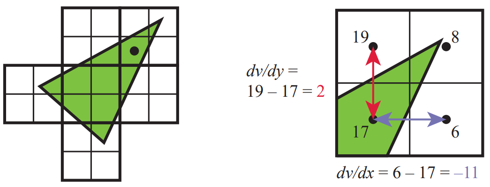

**图3.15** 左侧是一个三角形被光栅化成了四边形，即2×2像素的集合。然后在右侧显示了标有黑点的像素的梯度计算结果。对于该四边形中每个像素位置都显示了v值。请注意，虽然三个像素没有被三角形覆盖，但它们仍然会被GPU处理以找到梯度。通过使用其两个四边形邻居来计算x和y屏幕方向上的梯度，从而为左下角像素计算出梯度。

虽然原子操作可以避免数据冲突，但许多算法需要特定的执行顺序。例如，您可能希望在覆盖红色透明三角形之前绘制更远处的蓝色透明三角形，并将红色混合到蓝色上面。一个像素可能会有两个像素着色器调用，每个像素都为一个三角形执行，在这种情况下，红色三角形的着色器完成后才是蓝色的。在标准管道中，在处理之前片段结果会被排序和合并。DirectX 11.3 引入了栅格化器顺序视图（ROVs）来强制执行一定的执行顺序。它们类似于 UAVs；它们可以以相同方式由着色器读取和写入。关键区别在于 ROV 可以保证按正确顺序访问数据。这大大增加了这些可由着色器访问的缓冲区的实用性[327,328] 。例如，ROVs 使得像素着色器能够编写自己的混合方法，因为它可以直接访问并写入 ROV 中任何位置，因此不需要合并阶段 [176] 。代价是如果检测到无序访问，则像素着色器调用可能会停滞等待早期绘制的三角形被处理。

## 3.9 合并阶段
如第2.5.2节所述，合并阶段是将像素着色器生成的各个片段的深度和颜色与帧缓冲区组合在一起的地方。DirectX称此阶段为输出合并；OpenGL则称其为逐样本操作。在大多数传统管线图（包括我们自己的）中，这个阶段是模板缓冲区和z缓冲区操作发生的地方。如果片段可见，则在此阶段进行另一个操作即颜色混合。对于不透明表面，实际上没有涉及到真正意义上的混合，因为片段颜色只是替换了先前存储的颜色。实际混合片段和存储颜色通常用于透明度和复合操作（第5.5节）。

想象一下，当通过像素化生成的片段在应用深度缓冲区时被发现被之前渲染的某个片段隐藏了。那么，在像素着色器中进行的所有处理都是不必要的。为避免这种浪费，许多GPU在执行像素着色器之前执行一些合并测试[530]。使用片段的z-depth（以及其他正在使用的内容，例如模板缓冲或剪切）来测试可见性。如果隐藏，则删除该片段。此功能称为early-z [1220, 1542] 。像素着色器具有更改片段z-depth或完全丢弃该片段的能力。如果在像素着色器程序中发现任何类型操作，则通常无法使用early-z，并且会关闭它，从而使管道效率降低。

DirectX 11和OpenGL 4.2允许像素着色器强制启用early-z测试，但存在许多限制[530] 。请参阅第23.7节以获取有关early-z和其他z-buffer优化的更多信息。有效地使用early-z可以对性能产生很大影响，详细介绍请参见第18.4.5节。

合并阶段处于固定功能阶段（例如三角形设置）和完全可编程shader阶段之间占据中间地带。虽然它不是可编程的，但其操作高度可配置。特别是颜色混合可以设置为执行许多不同的操作。最常见的是涉及颜色和alpha值的乘法、加法和减法组合，但其他操作也可能包括最小值和最大值以及位逻辑运算。DirectX 10添加了从像素着色器中混合两种颜色与帧缓冲区颜色的能力。此功能称为双源颜色混合，并且不能与多个渲染目标一起使用。MRT否则支持混合，并且DirectX 10.1引入了在每个单独缓冲区上执行不同混合操作的功能。

正如前一节末尾所提到的，DirectX 11.3通过ROVs提供了一种使混合可编程化的方法，但代价是性能下降。 ROV和融合阶段都保证绘制顺序（即输出不变性）。无论生成像素着色器结果时采用何种顺序，API要求按输入对象和三角形顺序对结果进行排序并发送到融合阶段。

## 3.10 计算着色器
GPU 可用于实现传统图形管线以外的更多功能。在估算股票期权价值和训练深度学习神经网络等各种领域中，都有很多非图形化应用。这种使用硬件的方式被称为 GPU 计算。像 CUDA 和 OpenCL 这样的平台被用来控制 GPU 作为一个大规模并行处理器，没有真正需要或者可以访问到特定于图形的功能。这些框架通常使用 C 或 C++ 等带扩展名的语言，并配合针对 GPU 的库。

在DirectX 11中引入的计算着色器是一种GPU计算形式，它不会被锁定在图形管道中的某个位置。它与渲染过程密切相关，由图形API调用。它与顶点、像素和其他着色器一起使用，并利用了与管道中使用的统一着色器处理器相同的资源池。就像其他着色器一样，它具有某些输入数据集，并且可以访问缓冲区（例如纹理）进行输入和输出。线程组和线程在计算着色器中更加可见。例如，每个调用都会获得一个线程索引来访问它。还有一个线程组概念，在DirectX 11中由x、y和z坐标指定，主要为了简化着色器代码的使用。每个线程组都有少量内存可供所有线程共享，在DirectX 11中为32 kB 。计算着色器按照线程组执行，以便保证组内所有线程同时运行[1971]。

计算着色器的一个重要优势是可以访问GPU生成的数据。从GPU发送数据到CPU会产生延迟，因此如果处理和结果可以保留在GPU上，则性能可以提高[1403] 。后期处理，在其中对呈现出来的图像进行修改是计算着色器的常见用途。共享内存意味着可以将从采样图像像素生成的中间结果与相邻线程共享。例如，使用计算着色器确定图像的分布或平均亮度已被发现比在像素着色器上执行此操作快两倍[530]。

计算着色器也可用于粒子系统、网格处理（例如面部动画[134]、裁剪[1883、1884]、图像过滤[1102、1710]、提高深度精度[991]、阴影[865]、景深[764]等）、以及任何需要利用一组GPU处理器的任务。Wihlidal [1884]论述了如何利用计算着色器比曲面细分控制着色器更高效。其他用途见图3.16。这结束了我们对GPU实现渲染管道的回顾。许多方法可以将GPU函数用于各种渲染相关处理，并结合使用。本书的中心主题是相应的理论和算法，旨在利用这些功能。我们现在的重点转向变换和着色。

## 进一步阅读和资源
Giesen的图形管道指南[530]详细讨论了GPU的许多方面，解释了元素为什么以这种方式工作。 Fatahalian和Bryant的课程[462]在一系列详细的讲座幻灯片集中讨论了GPU并行性。尽管专注于使用CUDA进行GPU计算，但Kirk和Hwa的书籍[903]的介绍部分讨论了GPU的演变和设计哲学。

要学习着色器编程的正式方面需要一些工作。OpenGL超级手册[1606]和OpenGL编程指南[885]等书籍包含了关于着色器编程的材料。旧书《OpenGL着色语言》[1512]没有涵盖更多的着色器阶段，例如几何和曲面细分着色器，但确实专注于着色器相关算法。请参阅本书的网站，realtimerendering.com，获取最新和推荐的书籍。

# 4. 变换

> “如果愤怒的向量绕着你沉睡的脑袋旋转，并聚集起来。不必害怕贫瘠世界抽象风暴的暴力。”  —— 罗伯特·彭恩·沃伦

变换（Transform）是将点、向量、颜色等实体进行某种转换的操作。对于计算机图形学从业者来说，精通变换非常重要，因为借助变换，我们可以对物体、光源和摄像机进行定位、重塑和动画处理，还可以确保所有计算都在相同的坐标系内进行，并且以不同的方式将对象投影到平面上。以上只是变换可以执行的一些操作，但足以展示变换在实时图形或任何其他类型的计算机图形学中的重要作用。

线性变换特指满足保持向量加法和数量乘法的变换。具体地说，
$$
\begin{aligned}
\mathbf{f}(\mathbf{x})+\mathbf{f}(\mathbf{y}) & =\mathbf{f}(\mathbf{x}+\mathbf{y}), \qquad (4.1)\\
k \mathbf{f}(\mathbf{x}) & =\mathbf{f}(k \mathbf{x}) .\qquad(4.2)
\end{aligned}
$$
举个例子，f(x) = 5x 是一个转换，它接受一个向量并将每个元素乘以五。要证明它是线性的，需要满足两个条件（方程4.1和4.2）。第一个条件满足，因为任意两个向量都乘以五然后相加与先相加后乘以五是相同的。标量乘法条件（方程4.2）显然满足。这个函数被称为缩放变换，因为它改变了对象的比例（大小）。旋转变换是另一个线性变换，它将向量绕原点旋转。实际上，所有针对三元素向量的线性变换，包括缩放和旋转变换，都可以用一个3×3的矩阵表示。

然而，这个矩阵的大小通常不够大。对于三元素向量x的函数f(x) = x + (7, 3, 2)不是线性的。对两个分别的向量执行此函数将会将每个(7, 3, 2)的值相加两次以形成结果。将一个固定向量加到另一个向量上执行平移，例如，它将所有位置移动相同的量。这是一种有用的变换类型，我们希望组合各种变换，例如将对象缩小一半，然后将其移到另一个位置。将函数保持为迄今为止使用的简单形式使得难以轻松地将它们组合起来。

## 4.1 基础变换

将线性变换和平移组合可以使用仿射变换来完成，通常以4×4矩阵形式存储。仿射变换执行线性变换，然后执行平移。为了表示四维向量，我们使用齐次坐标表示法，以相同的方式表示点和方向（使用粗体小写字母）。方向向量表示为v =（vx，vy，vz，0）T，点表示为v =（vx，vy，vz，1）T。在本章中，我们将广泛使用可下载的线性代数附录中解释的术语和运算，该附录可在realtimerendering.com上找到。

所有平移、旋转、缩放、反射和剪切矩阵都是仿射矩阵。仿射矩阵的主要特征是保持线的平行性，但不一定保持长度和角度。仿射变换也可能是任意个体仿射变换的串联。

本章将从最基本和最基本的仿射变换开始。本节可以看作是简单变换的“参考手册”。然后描述更专业的矩阵，接着讨论和描述四元数，这是一种强大的变换工具。然后是顶点混合和变形，这是表示网格动画的两种简单有效的方法。最后，描述投影矩阵。这些变换，它们的符号、函数和性质在表4.1中总结，其中正交矩阵是其逆的转置。变换是操纵几何图形的基本工具。大多数图形应用程序编程接口允许用户设置任意矩阵，有时也可以使用库和矩阵操作来实现本章讨论的许多变换。然而，了解函数调用背后的真实矩阵和它们的相互作用仍然是值得的。知道函数调用后矩阵所做的事情是一种开始，但是理解矩阵本身的性质将推动您更进一步。例如，这样的理解使您能够区分正交矩阵，其逆矩阵是其转置矩阵，从而实现更快的矩阵求逆。类似的知识可以导致加速代码的实现。

### 4.1.1 平移变换

### 4.1.2 旋转变换

### 4.1.3 缩放变换

### 4.1.4 剪切变化

### 4.1.5 变换组合

### 4.1.6 刚体变换

### 4.1.7 法线变换

### 4.1.8 逆变换计算

## 4.2 特殊矩阵变换和操作

### 4.2.1 欧拉变换

### 4.2.2 从欧拉变换中提取参数

### 4.2.3 矩阵分解

### 4.2.4 围绕任意轴旋转

## 4.3 四元数

### 4.3.1 数学背景

### 4.3.2 四元数变换

## 4.4 顶点混合

## 4.5 形变

## 4.6 几何缓存回放

## 4.7 投影

### 4.7.1 正交投影

### 4.7.2 透视投影

## 进一步阅读和资源

。。。

# 5. 渲染基础

>  “一幅好画等同于一次善行。”——文森特·梵高

## 5.1 渲染模型

## 5.2 光源

### 5.2.1 定向光源

### 5.2.2 点光源

### 5.2.3 其他类型的光源

## 5.3 实现渲染模型

### 5.3.1 评估频率

### 5.3.2 实现示例

### 5.3.3 材料系统

## 5.4 锯齿和反锯齿

### 5.4.1 采样和滤波理论

### 5.4.2 基于屏幕的反锯齿技术

## 5.5 透明度，Alpha 和合成

### 5.5.1 混合顺序

### 5.5.2 无序透明度

### 5.5.3 预乘 Alpha 和合成

## 5.6 显示编码

## 进一步阅读和资源

...

