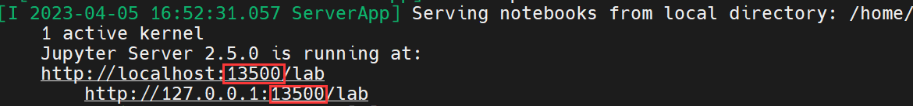
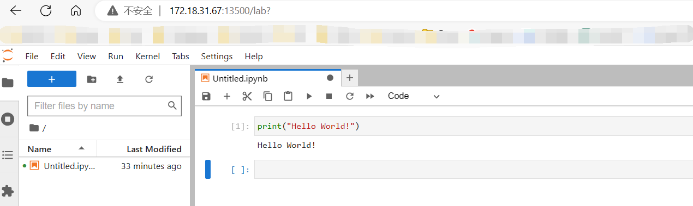

# 使用课题组服务器进行计算的若干问题

?> 这个页面整理了一些服务器使用攻略，以及课题组同学在使用服务器时候的一些常见问题。

**该页面会不定时更新。推荐使用PC访问。[可以在这里留言其他问题](https://github.com/PerhapsChen/perhapschen.github.io/issues/11)**

- 2023年4月8日：新增VSCode的配置及使用方式说明，`top`命令说明

## **服务器篇**

### 什么是服务器？

服务器本质和个人电脑一致，但是性能更稳定，通常用户为多名，多用户涉及权限管理。且操作系统通常为Linux（Ubuntu, Centos 等）。像[南科大的超算](https://hpc.sustech.edu.cn/)也是一种服务器。

### 课题组的服务器怎么样？

目前课题组有两台服务器，配置都还不错。目前我们学科最关心的性能一般是内存和CPU。他们分别**192GB**内存和**1024GB**内存。而个人PC一般是8GB和16GB。由于学科特性，科研通常涉及到大量数据，大内存允许我们一次性读取大量数据进行计算。

### 使用服务器计算有什么好处？

目前主要有这些好处：

- 服务器上已经有前人下载好的大量数据，我们可以直接使用
- 不占用我们个人电脑性能和网络，更稳定。
- 更大的内存，支持我们进行更大规模的科研计算

不好的地方：

- 更高的学习成本。可能需要学一些Linux的命令行知识。B站搜Linux教程

### 一定要使用服务器计算吗？

不一定，如果你的课题数据量较少，且不需要大量计算，在个人PC上完成效率更高。

---

## **Linux篇**

### 什么是Linux？

**Linux** 和 **Windows**  **MacOS** **Android**等一样是一种操作系统，通常用在个人电脑和服务器上。方面我们与计算机进行交互

### 为什么进去是黑框框？

**Linux通常使用命令行（command line）与计算机进行交互**，课题组服务器和超算一般不自带图形界面。

**参考windows理解**：windows则相反，windows通常使用图形界面（我们开机就进入了图像界面），但是也可以使用命令行（powershell, cmd等）。

我们在黑框框（命令行界面）通常需要使用linux命令来与服务器交互，常见命令包括新建文件夹、复制文件、删除文件、显示当前目录下所有文件等。[Linux 命令大全](https://www.runoob.com/linux/linux-command-manual.html)

### 如何登陆课题组的服务器？

通常我们在本地机（我们自己的电脑）登陆服务器。

- Windows下推荐使用MobaXterm[MobaXterm连接服务器-CSDN博客](https://blog.csdn.net/qq_37665301/article/details/116031615)
- MacOS 使用自带的Terminal [在 Mac 上的“终端”中连接到服务器 - 官方 Apple 支持 (中国)](https://support.apple.com/zh-cn/guide/terminal/trml1018/mac)

登录到服务器后，在服务器上的任何操作产生的后果几乎与本地机无关，类似我们在远程操控一台电脑。

?> **一些可能需要你填写的名词的解释**：**地址**（通常为IP，例如其中一台是172.18.31.67），**用户名**（例如huang-h），**SSH**（用来连接服务器的协议），**端口号**（SSH协议默认使用22端口），

### 本地机和服务器之间传输数据？

- Windows下推荐使用MobaXterm软件的SFTP协议，[用MobaXterm上传文件到远程Linux系统 - 简书 (jianshu.com)](https://www.jianshu.com/p/6e5f0602037d)
- MacOS （不太懂，可能有更好的选择） [mac下使用sftp上传下载文件 - 简书 (jianshu.com)](https://www.jianshu.com/p/f875343cb664)

传输数据需要占用本地机和服务器的上传或下载的网速。

---


## **环境配置篇**

### 一些概念之间的关系？

Linux是操作系统。

Anaconda是一种包管理的软件，通常我们会使用python很多的第三方库，且会搭建不同的python环境（[为什么](https://blog.csdn.net/qq_42573052/article/details/113770662)）。

Jupyter是一种集成开发环境（[IDE](https://www.redhat.com/zh/topics/middleware/what-is-ide)）或编辑器，方便我们编写Python代码。同时Jupyter也是Anaconda所管理的一种第三方库。

（我们编写的代码本质上就是一些文本，但是Jupyter可以提供一些更好的功能，例如代码高亮，代码补全等。）

### 怎么配置服务器编程环境？

**目前推荐使用两种方式使用服务器编程：[VSCode Remote-SSH](###配置vscode-remote-ssh) 和 [JupyterLab的网页端](###配置jupyterlab网页)**

下面列举了两种方法的优缺点

#### 1 使用VSCode和Remote-SSH插件 

VSCode是微软旗下一款强大的编辑器，通过各种插件使得其几乎拥有所有的功能。

**优点**：

- 初阶的配置比较简单，点点鼠标就可以；
- 基于文件系统和终端，方便切换Python环境，VSCode需要你更加了解Linux。
- VSCode插件众多，有效提高编程体验。

**缺点**：

- 不太稳定，经常遇到某个简单的cell跑很久；
- 需要手动保存；
- 关闭VSCode客户端会终止运行的程序。
- 过于自由

!> VSCode的痛点通常有解决方案，但是需要花很多时间精力来解决

#### 2 使用服务器挂起的JupyterLab

基于Web(浏览器访问)的代码编辑器。

**优点**：

- 即开即用，使用浏览器就可以编程；

**缺点**：

- 初次使用前配置较为复杂。
- 不方便切换环境，因为Jupyter通常独立与Python环境

---


### 配置VSCode Remote-SSH

1 [下载VSCode](https://code.visualstudio.com/)并安装，所有选项都勾选。

2 【可选的】点击左侧扩展选项，搜索Chinese，找到简体中文安装汉化。

2 点击左侧**扩展**选项，搜索并安装Remote - SSH 

3 Ctrl+Shift+P 打开命令面板，输入找到`remote ssh add new SSH host`回车

4 输入你登录服务器的ssh命令，例如 `ssh xx-x@172.18.31.xx` 然后回车命令直到面板消失

5 再次Ctrl+Shift+P 打开命令面板，输入找到 `remote ssh connect to host` 回车（或者点击VSCode左下角）

6 选择刚add的IP回车，会出现新的窗口，让你输入密码。输入密码

7 点击左侧的资源管理器（一般在最上面），然后选择打开文件夹，选择你的工作文件夹。

8 再次输入密码。第一次进入该文件夹会让你选择信任

9 打开扩展，搜索`Python Extension Pack`,

10 点击资源管理器，新建代码文件。例如 `.ipynb` 文件，然后打开

11 点击右侧的选择内核，选择Python环境，新建环境（conda）或打开已有的环境即可。

### 配置JupyterLab网页

?> 整体的逻辑是在**远端服务器中挂起一个JupyterLab的服务**，我们在**服务器所在局域网内（对我们来说就是校园网）**就可以直接登录网站进行编程。且程序和数据都是存储在服务器中，只要服务器的Jupyter服务不中断，那么我们随时都可以打开网站编程。

!> 注意以下步骤只是第一次使用前需要做的操作，不需要重复做。**你只需要执行代码框中的代码**，**注意代码执行的位置**是命令行还是python中。如果你之前配置过，仍然可以根据这套流程重新配置。

**1. 首先我们进入服务器后需要执行以下命令，其中 `xx-x`换成自己用户名。**

```bash
conda config --add pkgs_dirs /home/xx-x/.conda/pkgs
```

- 这行**命令行**代码的意思是让conda添加一个目录来存储我们自己的包和环境。这是因为Linux是多用户操作系统，在自己的目录下面没有权限问题


**2. 然后使用下面的命令，创建自己的环境，其中`ENV_NAME`可以自己起一个环境的名字，不要使用空格。3.8可以换成希望使用的python版本，推荐3.8, 3.9, 3.10, 3.11**

```bash
conda create -n ENV_NAME python=3.8
```

- 这行**命令行**代码的意思的让conda创建一个环境，通过-n指定名字，后面是指定python的版本。
- 输入后，会让选择`y`还是`n`，输入`y`回车确认。


**3. 创建完环境后，需要我们激活环境。`ENV_NAME`为你刚才起的名字。**

```bash
conda activate ENV_NAME
```

- 这行代码的意思是让conda帮我们激活名为`ENV_NAME`的环境。
- 激活环境后，我们发现命令行用户名前面由 `base` 变成了 新的环境名字。


**4. 激活环境后，我们需要在这个环境里安装`jupyterlab`，使用下面的命令安装`jupyterlab`**

```bash
pip install jupyterlab
```

- 这行**命令行**代码的意思是使用`pip`帮助我们名为`jupyterlab`的第三方库，如果`pip`没反应，可以考虑使用`conda`替换上面的`pip`


**5. 安装完毕后，执行命令进入`ipython`**

```bash
ipython
```

- 这行**命令行**代码的意思是让操作系统启动`ipython`（可交互的python）这个软件，方便我们进行密码的设置。


**6. 在IPython中分别执行下面两行代码并分别回车**

```python
from notebook.auth import passwd

passwd()
```

- 这两行**python**代码的目的是设置密码并返回密钥，**记下你设置的密码和这串密钥，下图蓝色线的内容**。
- **注意，设置密码的时候不会显示任何东西，并不是你卡了。**


**7.  输入quit()退出，返回到命令行**

```python
quit()
```

- 这行**python**代码的意思是退出 ipython


**8. 输入下面的命令**

```bash
jupyter-notebook --generate-config
```

- 这行**命令行**代码的意思是使用jupyter-notebook生成配置文件。


**9. 复制下面的命令，注意将`XXXXXXXX`替换你上面得到的秘钥，`8888`替换为的自定义的端口号，推荐选择使用`13500~20000`中间的某个数字。然后执行**

```bash
echo -e "c.NotebookApp.ip = '*'\nc.NotebookApp.password='XXXXXXXX'\nc.NotebookApp.open_browser = False\nc.NotebookApp.port = 8888\nc.NotebookApp.allow_remote_access = True" >> ~/.jupyter/jupyter_notebook_config.py
```

- 这行**命令行**代码的意思是将引号中的内容追加的刚生成的配置文件中。


**10 输入下面的命令启动jupyterlab**

```bash
jupyter-lab
```

- 这行**命令行**代码的意思是启动jupyterlab，留意之后的输出，**如果红框内的内容不是你刚选择的端口号，说明该端口号被占用，系统给你顺延分配了别的端口号，那么后面登录网页的时候使用红框中显示的端口号**。




**11 在本地机打开浏览器，输入网址和端口号，进入Jupyter 网页端。注意最后的13500需要替换为你选择端口号（或者上一步系统给你顺延分配的）**。

```http
http://172.18.31.67:13500/
```

- 这行**浏览器地址**的意思是使用服务器的ip加上端口号访问我们上一步启动的服务器的Jupyter服务。
- 第一次进去会让你输入密码，密码为第6步中你设置的密码。
- 如果进不去，可能与你正在使用的VPN有关，禁用全局代理或关闭VPN后重试可以解决。
- 如果需要关闭，可以在命令行中 ctrl+C 然后确认 即可关闭jupyter服务

!> **！！！**这种方式当你断开与服务器的联系后，JupyterLab服务也会断开，然后就无法访问网址了。你可以参考[有没有更方便的日常使用方法](###把jupyter挂到服务器后台)



### Jupyter网页日常怎么使用？

!> 如果你还没有配置，请参考[配置JupyterLab网页](###配置jupyterlab网页)。

#### **如果你【没有】使用[JupyterLab挂到后台](###把jupyter挂到服务器后台)这种方式**：

那么后续使用我们只需要做的是登录服务器，激活环境，启动jupyter，然后打开本地浏览器访问**（即上面的第3, 10, 11步）**即可。

**注意这种方式不能断开与服务器的连接**，例如关闭类似MobaXterm这样的软件。

**1 登陆服务器并激活环境**

```bash
conda activate ENV_NAME
```

**2 启动jupyterlab**

```bash
jupyter-lab
```

**3 打开浏览器登陆网页Jupyterlab**

```http
http://172.18.31.67:13500/
```

#### **如果你使用了[JupyterLab挂到后台](###把jupyter挂到服务器后台)这种方式**

直接登陆网页即可。

### 把Jupyter挂到服务器后台

你可能觉得前面的Jupyterlab方法不是很方便。因为存在一些问题，例如

- 关闭mobaXterm等服务器登录工具后，jupyter服务就关闭了。
- jupyter服务关闭后，我们之前计算的中间变量都丢失了（只剩代码，需要重新跑）。
- 每次登录都要进行三步操作，太繁琐了

为解决这个问题，我们可以编写一个脚本（可以看做多个Linux命令的集合）挂在服务器后台，**以后我们只需要网址访问Jupyter**

```bash
cd ~
if [ "$CONDA_DEFAULT_ENV" != "ENV_NAME" ]; then
	source activate ENV_NAME
fi
jupyter-lab
```

- 这个脚本的意思是：如果 当前的conda环境不是我们名为ENV_NAME的环境，则启动ENV_NAME这个环境，然后启动jupyterlab

!> 注意以下的操作都是一次性的。后续再使用只需要第 3 步操作，即打开浏览器。

**1. 你可以复制并执行下面的命令生成该脚本。注意把两个`ENV_NAME`替换为你之前起的的环境名字。**

```bash
echo -e "cd ~\nif [ \"\$CONDA_DEFAULT_ENV\" != \"ENV_NAME\" ];then\n    source activate ENV_NAME\nfi\njupyter-lab" > ~/START
```

**2. 然后执行下面的命令将该脚本挂到服务器后台**

```bash
nohup bash ~/START &
```

- `bash ~/START` 的意思是使用服务器内置程序bash执行名为START的脚本 
- `nohup`的意思将`bash ~/START`这个任务放在后台处理。

**3. 然后打开浏览器登录11步中的地址开始编程。**

这样做的好处

- 比较方便，脚本挂到后台后，你都可以在任何机器上直接登录网址开始编程
- 本地机关机也不用担心程序中断。因为计算的结果是在服务器上的。

需要注意的：

- 如果在登不上去，可能有以下几个原因，按照可能性从大到小排列为
  - 你的Jupyter服务没启动成功，建议先不用脚本测试一下能否启动。参考**[配置完毕后日常怎么使用？]**
  - 本地网络问题，例如VPN的问题，还有可能是没在南科大的内网。
  - 浏览器问题，换个浏览器试试
  - 服务器因为某种奇怪的原因重启了。可以通过登录服务器重新执行`nohup bash ~/START &`
- 在命令行界面，如果你没地方可以输入命令，可以使用尝试ctrl+C来退出当前界面。
- 你可以学习linux的`top`命令查看自己的jupyter或者脚本进程是否在运行，也可以查看当前的内存使用情况。


## **日常编程篇**

### 为什么使用Python？

只是推荐使用`Python`，当然也可以使用`R`，`MATLAB`等。

`Python`的开源导致其生态极其丰富且非常简单易学，且目前做机器学习和深度学习`Python`几乎是唯一的选择。例如以下Python的第三方库。**（对熟悉`MATLAB`的人非常友好）。**

- `numpy` 强大的矩阵计算库，常见的数学上的计算操作都可以找到。[NumPy v1.24 Manual](https://numpy.org/doc/stable/user/basics.html)
- `pandas` 强大的表格处理库，方便我们处理表格数据，例如csv, xls, xlsx, txt等等 [Getting started — pandas](https://pandas.pydata.org/docs/getting_started/index.html)
- `matplotlib` 强大的科研绘图库，方便我们绘制高度自定的图，[Tutorials — Matplotlib](https://matplotlib.org/stable/tutorials/index.html)
- `xarray` 方便处理带有坐标系（时间，经度，维度）的数据。例如`NC`文件。[Xarray documentation](https://docs.xarray.dev/en/stable/)
- `cartopy`方便进行地图的绘制。[cartopy](https://scitools.org.uk/cartopy/docs/latest/getting_started/index.html)
- `scikit-learn`强大的机器学习库 [scikit-learn use guide](https://scikit-learn.org/stable/user_guide.html)
- `pytorch` 强大的深度学习库 https://pytorch.org/get-started/locally/

一般情况下，这些库的安装十分方便，参考下方[怎么安装第三方库](###怎么安装第三方库？)。

这些库的使用推荐直接在我附带的链接里面跟着教程敲一遍知道有这回事就行，下次需要用的时候能想起来。

### 怎么安装第三方库？

目前推荐使用三种方式来安装，选择那种都可以，本质上是一样的。

!> 方法1 和 2 一定要注意安装的时候你是否是在指定的环境，最简单的方法是查看命令行自己用户名前面括号中的内容。

**1 登录服务器后，在命令行激活你需要安装第三方库的环境，执行下面的命令**。PKG_NAME替换为你要安装的第三方库。

```bash
conda install PKG_NAME
```

- 如果安装不了，尝试使用`pip`替换`conda`
- 通常你代码报错类似 “ no mudule named xxx” 那么你就安装xxx就行了。

**2 在jupyter界面打开terminal，操作同上，激活环境，然后安装。**


**3 在jupyter的代码中，执行类似下面的命令**

```python
!conda install PKG_NAME
# 或者
!pip install PKG_NAME
```

!> 其他：装不上某个库很正常，conda可以尝试添加`-c conda-forge` 参数，还不行可以去网上搜索如何装某某库。

### 代码和数据存在哪儿？

#### **Where to save?**

当我们进入JupyterLab时，一般情况下，你JupyterLab可访问的顶级目录是你在服务器中执行`jupyter-lab`命令所在的目录。一般为`/home/xx-x`。

通常情况下，我们可以把我们的**代码文件**存放在该目录下。例如`/home/huang-h/scripts/`。当然较小的数据文件也可以存在这里。

但是对于较大的**数据文件**（累计达到GB级别），对于172.18.31.67服务器，一定存到`/portal1/dell/xx-x/`目录下（对于69服务器，存到`/data/xx-x/`下）。我们无法直接从jupyterlab中找到该目录，但是可以在命令行界面使用以下命令创建一个`/home/xx-x`到达`/portal1/dell/xx-x/`的快捷方式。

```bash
ln -s /portal1/dell/xx-x /home/xx-x/main
```

这样，我们在jupyterlab网页界面左侧的**根目录**下就可以看到`main`这个文件夹。它就是`/portal1/dell/xx-x/`的快捷方式

#### **How to save?**

在python代码里面，我们经常会涉及到数据的读取和存储。你可能需要先了解**相对路径**和**绝对路径**的概念。

例如我们现在有一个jupyter 笔记本`.ipynb`代码文件，在该代码文件里有这样一行代码

```python
df.to_csv('foo/bar.csv') # 使用相对路径，将数据df导出到foo文件夹中(foo已经存在)，命名为bar.csv
```

这里我们使用了相对路径，相对指的是相对该`.ipynb`文件的路径。假如`.ipynb`文件在`/home/xx-x`目录下，则上面的代码等价于

```python
df.to_csv('/home/xx-x/foo/bar.csv') # 使用绝对路径
```


## **其他**

### Python环境、环境变量？

**编程环境**是比较泛化的概念，就是指我们编程使用的操作系统等，不用过于在意这个概念。

**Python环境**是因为对于不同的任务，我们可能希望使用某个库的不同版本，甚至某些库可能不兼容。我们需要虚拟出不同的python环境来支持我们不同的工作。例如某个任务需要python3.8， 某个需要3.10，这样我们可以在不卸载python的基础上，使用conda activate来激活不同的环境。你可以通过查看命令行用户名前面括号中的内容，或者在命令行中执行`conda info -e` 来查看当前激活的环境。

**环境变量**是比较进阶的概念。为方便理解的一个例子是，当你在命令行执行python命令时，你的操作系统里面可能有多个python，操作系统是根据当前环境变量中python代表的实际路径来选择执行哪个python。你可以执行`which python`来查看操作系统到底使用了哪个python。（环境变量的这个解释并不十分正确，但是方便理解）

### 服务器上有哪些数据？

可以前往`/portal3`目录查找其他人下载的数据。

?> **如果你想添加新的供大家使用的数据集合**，可能没有办法直接下载到该目录，但是可以先下载到自己的数据目录，然后联系管理员帮你转移到该目录。

### 如何使用`sanctuary`？

`sanctuary`是Advisor冒之前写的一组易用的函数。你可以在`/portal1/dell/GitHub/sanctuary`里面找到源代码。

为使用这些函数， 你需要在你的jupyter的python代码里添加这样几行代码。这可以让`sanctuary`添加到环境变量里面，这样python才能找到他们。

```python
import sys
sys.path.append('/portal1/dell/GitHub/sanctuary')
```

这些代码依赖一些第三方库，在你自己的环境中，你可能需要安装这些库。有些库不是很好装。公共的sanctuary环境已经安装好了这些库，你可以在sanctuary环境中直接调用它们。

### 怎么使用`top`命令查看进程？

如果希望查看自己的进程是否正常运行，以及进程的资源占用情况。可以在命令行运行`top`并回车。

在`top`界面常用的命令：

- Shift + M 按照内存使用情况排序进程
- 连续按M可以修改可视化内存使用情况
- Shift + U 然后输入自己的用户名可以查看自己的进程
- 按 K, 然后输入进程对应PID可以kill掉进程（只能kill自己的）
- Ctrl + C 退出`top`界面
