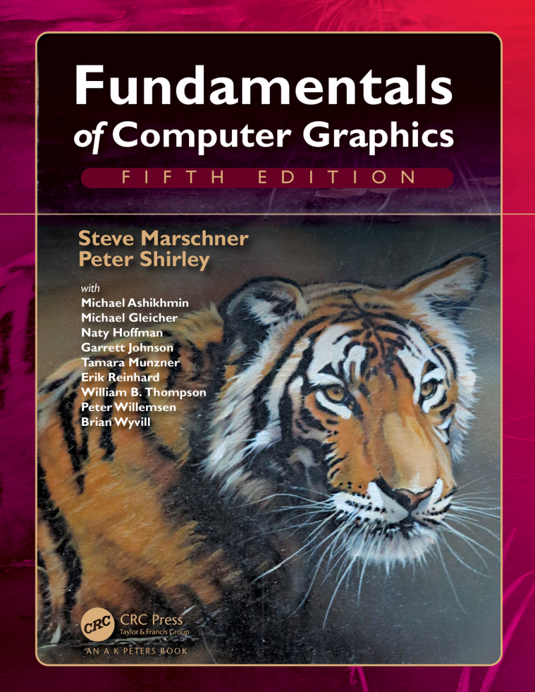

# 计算机图形学基础

?> 使用ChatGPT翻译并简单校对虎书：**Fundamentals of Computer Graphics (5th Edition)**  ——Steve Marschner & Peter Shirley



# 目录 

!> [跳转至正文](#前言)

#### 1. 介绍

- 1.1 图形领域
- 1.2 主要应用
- 1.3 图形APIs
- 1.4 图形管线
- 1.5 数值问题
- 1.6 效率
- 1.7 图形程序的设计与编程

#### 2. 数学杂项

- 2.1 集合和映射
- 2.2 解一元二次方程
- 2.3 三角函数
- 2.4 Vectors 矢量
- 2.5 曲线和曲面
- 2.6 线性插值
- 2.7 三角形

#### 3. 光栅图形

- 3.1 光栅设备
- 3.2 图像、像素、几何
- 3.3 RGB颜色
- 3.4 Alpha合成
  

#### 4. 光线追踪

- 4.1 基础光线追踪算法
- 4.2 透视
- 4.3 计算视线射线
- 4.4 光线和物体求交
- 4.5 着色
- 4.6 一个光线追踪程序
- 4.7 阴影
- 4.8 理想镜面反射
- 4.9 历史注释

#### 5. 线性代数

- 5.1 行列式
- 5.2 矩阵
- 5.3 矩阵和行列式的计算
- 5.4 特征值和矩阵对角化

#### 6. 变换矩阵

- 6.1 2D线性变换
- 6.2 3D线性变换
- 6.3 平移和仿射变换
- 6.4 变换矩阵的逆
- 6.5 坐标转换

#### 7. 视图

- 7.1 视图变换
- 7.2 投影变换
- 7.3 透视投影
- 7.4 透视变换的属性
- 7.5 FOV 视野

#### 8. 图形管线

- 8.1 光栅化
- 8.2 光栅化前后的操作
- 8.3 简单抗锯齿技术
- 8.4 为提高效率而剔除图元

#### 9. 信号处理

- 9.1 数字音频：一维采样
- 9.2 卷积
- 9.3 卷积滤波器
- 9.4 图像信号处理
- 9.5 采样理论

#### 10. 表面着色

- 10.1 漫反射着色
- 10.2 Phong着色
- 10.3 风格化着色

#### 11. 纹理映射

- 11.1 查找纹理值
- 11.2 纹理坐标函数
- 11.3 抗锯齿纹理查找
- 11.4 纹理映射的应用
- 11.5 程序化3D纹理

#### 12. 图形数据结构

- 12.1 三角网格
- 12.2 场景图
- 12.3 空间数据结构
- 12.4 BSP树可见性
- 12.5 多维数组平铺

#### 13. 光线追踪进阶

- 13.1 透明度和折射
- 13.2 实例化
- 13.3 构造几何实体
- 13.4 分布式光线追踪

#### 14. 采样

- 14.1 积分
- 14.2 连续概率
- 14.3 蒙特卡洛积分
- 14.4 随机点选择

#### 15. 曲线

- 15.1 曲线
- 15.2 曲线属性
- 15.3 多项式片段
- 15.4 拼接多项式片段
- 15.5 立方体
- 15.6 近似曲线
- 15.7 总结

#### 16. 计算机动画

- 16.1 动画原理
- 16.2 关键帧
- 16.3 形变
- 16.4 角色动画
- 16.5 基于物理的动画
- 16.6 程序化技术
- 16.7 对象组合

#### 17. 使用图形硬件

- 17.1 硬件概述
- 17.2 图形硬件是什么
- 17.3 异构多处理器系统
- 17.4 图形硬件编程：缓冲区、状态和着色器
- 17.5 状态机
- 17.6 基本的OpenGL应用程序
- 17.7 几何体
- 17.8 着色器初见
- 17.9 顶点缓冲对象 VBO
- 17.10 顶点数组对象 VAO
- 17.11 变换矩阵
- 17.12 使用顶点属性着色
- 17.13 使用片段处理器着色
- 17.14 网格和实例化
- 17.15 纹理对象
- 17.16 面向对象设计图形硬件编程
- 17.17 持续学习...

#### 18. 光照

- 18.1 Radiometry 辐射度量学
- 18.2 Transport 方程
- 18.3 光子

#### 19. 色彩

- 19.1 Colorimetry 色度学
- 19.2 色彩空间
- 19.3 色适应性
- 19.4 颜色外观

#### 20. 视知觉

- 20.1 视觉科学
- 20.2 视敏度
- 20.3 空间视觉
- 20.4 物体、位置和事件
- 20.5 图像感知

#### 21. 色调重建

- 21.1 分类
- 21.2 动态范围
- 21.3 颜色
- 21.4 图像生成
- 21.5 基于频率的运算符
- 21.6 梯度频域运算符
- 21.7 空间运算符
- 21.8 Division
- 21.9 Sigmoid
- 21.10 其他方法
- 21.11 Night 色调映射
- 21.12 讨论

#### 22. 隐式模型

- 22.1 隐式函数、骨架图元及求和混合
- 22.2 渲染
- 22.3 空间划分
- 22.4 Blending 混合
- 22.5 构造实体节化学 CSG
- 22.6 弯曲变形
- 22.7 精确接触建模
- 22.8 Blob Tree
- 22.9 交互隐式建模系统

#### 23. 全局光照 GI

- 23.1 漫反射场景的粒子追踪
- 23.2 路径追踪
- 23.3 精确直接光照

#### 24. 反射模型

- 24.1 真实世界材质
- 24.2 反射模型实现
- 24.3 镜面反射模型
- 24.4 光滑层次结构模型
- 24.5 粗糙层次结构模型

#### 25. 游戏中的计算机图形学

- 25.1 平台
- 25.2 有限的资源
- 25.3 优化计算
- 25.4  游戏类型
- 25.5 游戏制作流程

#### 26. 可视化

- 26.1 背景
- 26.2 数据类型
- 26.3 以人为本的设计过程
- 26.4 视觉编码原则
- 26.5 交互原则
- 26.6 组合和相邻视图
- 26.7 减少数据
- 26.8 示例

# 前言

《计算机图形学基础》的这个版本在**纹理**和**图形硬件**章节上进行了大量重写，并进行了许多修正。整本书的插图现在都是彩色的。

该书的组织结构与第三版基本相似。我们认为，**第2章 到 第8章 构成了“核心的核心”**，通过光线跟踪和光栅化两种互补方法来深入理解如何将图像呈现在屏幕上所需的内容。首先介绍光线跟踪，因为它是生成3D场景图像最简单的方法，然后介绍必要的数学知识以及管线本身。之后，“外部核心”涵盖其他通常包括在入门课程中的主题，例如采样理论、纹理映射、空间数据结构和样条曲线等。从第15章开始是一些贡献者撰写的专题文章，他们被选中作为作者既具有专业知识又能清晰表达思想。

多年来，在修订此书时，我们努力保留了早期版本所特有非正式、直观风格，并同时提高其一致性、准确性和完整性。我们希望读者会发现结果是一个适用于各种计算机图形学课程的吸引人平台。

## 关于封面

封面图片来自J.W.贝克的《水中的老虎》（丙烯刷和喷笔在画布上，16英寸乘20英寸，www.jwbart.com ）  。

老虎是指阿兰·福尔尼耶（1943-2000）在1998年康奈尔大学的一个研讨会上发表过精彩演讲。他生动地描述了老虎的动作，并总结了他的观点。

- 尽管计算机图形学中的建模和渲染在过去35年里得到了极大的改进，但我们仍然无法自动地以所有细节呈现老虎在河中游泳。所谓自动化是指不需要艺术家/专家进行精细手工调整的方式。

- 坏消息是我们还有很长的路要走。

- 好消息是我们还有很长的路要走。

# 1 引言

计算机图形学是指利用计算机来创建和操作图像的任何应用。本书介绍了可用于创建各种图像（逼真的视觉效果、信息丰富的技术插图或美丽的计算机动画）的算法和数学工具。图形可以是二维或三维； 图像可以完全合成，也可以通过处理照片来生成。本书讲述了基本算法和数学，特别是用于产生三维物体和场景合成图像所使用的。

实际上，进行计算机图形学必须了解特定的硬件、文件格式以及通常一个或两个图形API（参见第1.3节）。计算机图形学是一个快速发展的领域，因此这方面的知识是不断变化的。因此，在本书中，我们尽力避免依赖于任何特定的硬件或API。鼓励读者补充相关文档以适应其软件和硬件环境。幸运的是，计算机图形学文化具有足够标准术语和概念，本书中讨论内容应该能够很好地映射到大多数环境。

本章定义了一些基本术语，并提供了与计算机图形相关的历史背景和信息来源。

## 1.1 图形领域

在任何领域中强加类别都是危险的，但大多数图形从业者会同意计算机图形学的以下主要领域：

- **模型**以一种可以存储在计算机上的方式数学地规定形状和外观属性。例如，一个咖啡杯可以被描述为一组有序的三维点连同某些插值规则来连接这些点和一个反射模型来描述光如何与杯子相互作用。
- **渲染**是从艺术中继承而来的术语，它涉及从3D计算机模型创建阴影图像。
- **动画**是通过图像序列创建运动幻象的技术。动画使用建模和渲染，但增加了关键问题——随时间移动——这通常不在基本建模和渲染中处理。

还有许多其他涉及计算机图形学的领域，它们是否是核心图形学领域则因人而异。这些相关领域都将在本文中至少被提到。这些相关领域包括以下几个方面：

- **用户交互**处理输入设备（如鼠标和平板电脑）、应用程序、反馈给用户的影像以及其他感官反馈之间的接口。历史上，由于图形研究人员最早可以使用现在无处不在的输入/输出设备，所以该领域与图形学密切相关。
- **虚拟现实**试图将用户沉浸到一个三维虚拟世界中。这通常需要至少立体声图形和对头部运动的响应。为了实现真正的虚拟现实，还应该提供声音和力反馈等功能。由于此领域能够利用先进的3D图形技术和高级显示技术，因此通常与计算机图形学紧密关联。
- **可视化**试图通过可视化展示来帮助用户理解复杂信息问题，并经常需要解决一些与计算机制画有关的问题。
- **图像处理**涉及2D图片操作，并广泛应用于计算机制画和视觉等领域。
- **3D扫描**使用测距技术创建测量的三维模型。这些模型对于创建丰富的视觉图像非常有用，处理此类模型通常需要计算机图形学算法。
- **计算摄影**是利用计算机图形学、计算机视觉和图像处理方法，以实现对物体、场景和环境进行新型摄影捕捉的技术。

## 1.2 主要应用

几乎任何事业都可以利用计算机图形学，但是主要的计算机图形技术消费者包括以下行业：

- **电子游戏**越来越多地使用复杂的3D模型和渲染算法。
- **卡通**经常直接从3D模型中呈现。许多传统2D卡通使用从3D模型渲染的背景，这允许连续移动视点而不需要大量艺术家时间。
- **视觉效果**几乎使用所有类型的计算机图形技术。几乎每部现代电影都使用数字合成将背景与单独拍摄的前景叠加在一起。许多电影还使用3D建模和动画来创建合成环境、物体甚至角色，大多数观众永远不会怀疑它们不是真实存在的。
- **动画电影**使用了很多用于视觉效果的相同技术，但并非必须针对看起来真实的图像。
- **CAD/CAM**代表计算机辅助设计和制造。这些领域利用计算机技术在计算机上设计零件和产品，并且然后通过这些虚拟设计指导制造过程。例如，许多机械零件是在3D计算机建模软件中设计的，然后自动在计算机控制的铣削设备上生产。
- **模拟**可以被认为是准确的视频游戏。例如，飞行模拟器使用复杂的3D图形来模拟驾驶飞机的体验。这样的模拟对于安全关键领域（如驾驶）中的初始培训以及针对经验丰富用户（如特定消防情况）进行场景培训非常有用，因为这些情况过于昂贵或危险而无法物理创建。
- **医学影像技术**可以创建扫描患者数据的有意义的图像。例如，计算机断层扫描（CT）数据集由大量三维矩形密度值数组组成。计算机图形学用于创建阴影图像，帮助医生从这些数据中提取最重要的信息。
- **信息可视化**可以创建不一定具有“自然”视觉呈现方式的数据图像。例如，十种不同股票价格的时间趋势没有明显的视觉呈现方式，但巧妙的绘图技术可以帮助人们看到这些数据中的模式。

## 1.3 图形APIs

使用图形库的关键部分是处理图形API。应用程序接口（API）是一组标准函数，用于执行一组相关操作，而图形API则是一组函数，可在屏幕上的窗口中绘制图像和3D表面等基本操作。

每个图形程序都需要能够使用两个相关的API：一个用于视觉输出的图形API和一个用于从用户获取输入的用户界面API。目前有两种主要的图形和用户界面API范例。第一种是集成方法，例如Java，在这种方法中，图形和用户界面工具包被集成为便携式软件包，并作为语言的完全标准化和支持部分提供。第二种由`Direct3D`和`OpenGL`代表，在这里绘画命令是与诸如C++之类语言捆绑在一起的软件库的一部分，并且用户界面软件是独立实体，可能因系统而异。在后者方法中编写可移植代码存在问题，尽管对于简单程序来说可能可以使用便携式库层来封装特定于系统的用户界面代码。

无论您选择哪种API，基本图形调用将大致相同，并且本书所介绍到概念也适用。

## 1.4 渲染管线

现今每台桌面电脑都拥有强大的3D图形管线。这是一个特殊的软件/硬件子系统，能够高效地以透视方式绘制3D基元。通常这些系统被优化为处理具有共享顶点的3D三角形。管线中的基本操作**将3D顶点位置映射到2D屏幕位置**，并对三角形进行着色，使其既看起来逼真又按正确的前后顺序出现。

尽管在计算机图形学中，以有效的反向顺序绘制三角形曾经是最重要的研究问题之一，但现在几乎总是使用z缓冲区来解决这个问题。它使用特殊的内存缓冲区以暴力方式解决该问题。

事实证明，在图形管道中使用的几何操作可以几乎完全在由三个传统几何坐标和第四个齐次坐标组成的4D坐标空间中完成，后者有助于透视查看。这些4D坐标使用4×4矩阵和4向量进行操作。因此，图形管线包含了大量用于高效处理和组合这些矩阵和向量的机器设备。这种4D坐标系统是计算机科学中最微妙、最美丽的构造之一，并且当学习计算机图形学时肯定是最大的智力障碍。每本图形书籍前面很大一部分都涉及到这些坐标。

生成图片速度取决于正在绘制三角形数量。因为交互性对许多应用程序比视觉质量更重要，所以值得将用于表示模型的三角形数量最小化。此外，如果从远处查看模型，则需要较少的三角形，而从较近距离查看模型则需要更多的三角形。这表明使用不同级别的细节（LOD）表示模型是有用的。

## 1.5 数值问题

许多图形程序实际上只是3D数值代码。在这些程序中，数字问题通常至关重要。在“旧日子”里，以鲁棒和可移植的方式处理此类问题非常困难，因为机器对于数字有不同的内部表示，并且更糟糕的是，在不同和不兼容的方式下处理异常情况。幸运的是，几乎所有现代计算机都符合IEEE浮点标准（IEEE Standards Association, 1985）。这使得程序员可以对某些数字条件将如何处理做出许多方便的假设。

虽然IEEE浮点具有许多编码数字算法时有价值的特性，但大多数图形遇到的情况只需要了解其中很少一部分即可。首先并且最重要的是要理解，在IEEE浮点中存在三个实数“特殊”值：

1. 无穷大 (∞)。这是一个有效的数字，它比所有其他有效数字都要大。
2. 负无穷（-∞）。这是一个有效的数字，比所有其他有效数字都要小。
3. 非数字（NaN）。这是一种无效的数字，由于操作具有未定义后果而产生，例如零除以零。

!> IEEE浮点数有两种表示方法来表示0，一种被视为正数，另一种被视为负数。-0和+0之间的区别只有在极少数情况下才会产生影响，但应该记住这些场合。

IEEE浮点数的设计者做出了一些对程序员非常方便的决策。其中许多与处理诸如除以零等异常情况中上述三个特殊值有关。在这些情况下，会记录异常，但在许多情况下，程序员可以忽略它们。具体而言，在任何正实数a的情况下，IEEE浮点数在处理除无穷大值时遵循以下规则：
$$
+a/(+\infty)=+0, \\
-a/(+\infty)=-0, \\
+a/(-\infty)=-0, \\
-a/(-\infty)=+0.
$$
涉及无限值的其他操作表现出人们所期望的行为。再次针对正数a，其行为如下：
$$
\infty+\infty=+\infty, \\
-\infty-\infty=\mathrm{NaN}, \\
\infty\times\infty=+\infty, \\
\infty/\infty=+\infty, \\
\infty/a=\infty, \\
\infty/0=\infty, \\
0/0 = \mathrm{NaN}
$$
涉及无限值的布尔表达式规则如下：
1. 所有有限有效数字都小于+∞。
2. 所有有限有效数字都大于-∞。
3. -∞小于+∞。

涉及NaN值的表达式规则很简单：

1. 包括NaN的任何算术表达式结果为NaN。
2. 任何涉及NaN的布尔表达式均为false。

IEEE浮点数最有用的方面可能是如何处理除以零；对于任何正实数a，涉及除以零值的以下规则成立：
$$
+a/+0=+\infty, \\
-a/+0=-\infty.
$$
如果程序员利用IEEE规则，许多数字计算会变得更简单。例如，考虑以下表达式：
$$
a=\frac{1}{\frac{1}{b}+\frac{1}{c}}
$$
这种表达式常出现在电阻和透镜中。如果除以零导致程序崩溃（在IEEE浮点数之前的许多系统中都是如此），那么需要两个if语句来检查b或c的小值或零值。相反，在IEEE浮点数中，如果b或c为零，则我们将得到所需的a的零值。避免特殊检查的另一种常见技术是利用NaN的布尔属性。考虑以下代码段：

```bash
a = f(x)
if (a > 0) then
	do something
```

在这里，函数f可能会返回“丑陋”的值，如∞或NaN，但if条件仍然是明确定义的：对于$a=NaN$或$a=-∞$为false，而对于$a=+∞$则为true。通过谨慎地决定返回哪些值，通常可以使if做出正确的选择，并且不需要进行特殊检查。这使得程序更小、更健壮、更高效。

## 1.6 效率

没有制定代码更高效的魔法规则。通过仔细权衡来实现效率，而这些权衡对于不同的架构是不同的。然而，在可预见的未来，一个好的启发式方法是程序员应该更加关注内存访问模式而不是操作计数。这与二十年前最佳启发式方法相反。之所以出现了这种转变，是因为**内存速度没有跟上处理器速度**的步伐。由于这一趋势持续存在，有限和连贯内存访问对于优化的重要性只会增加。

使代码快速运行的合理方法是按照以下顺序进行，并仅采取必要步骤：

1. 以最简单的方式编写代码。根据需要即时计算中间结果，而不是将它们存储下来。
2. 在优化模式下进行编译。
3. 使用任何可用的分析工具查找关键瓶颈。
4. 检查数据结构以寻找提高局部性能力的方法。如果可能，请使数据单元大小与目标架构上的缓存/页面大小匹配。
5. 如果分析揭示了数字计算方面的瓶颈，请检查编译器生成的汇编代码是否存在效率问题。重写源代码以解决发现的任何问题。

这些步骤中最重要的是第一步。大多数“优化”会使代码难以阅读，而并没有提高速度。此外，事先花费时间来优化代码通常比纠正错误或添加功能更好。另外，要注意旧文本中的建议；有些经典技巧（如使用整数代替实数）可能不再具有加速作用，因为现代CPU通常可以像执行整数操作一样快地执行浮点运算。在所有情况下，都需要进行分析以确保任何针对特定机器和编译器的优化都是值得的。

## 1.7 设计和编写图形程序
在图形编程中，通常有一些常见的策略是非常有用的。本节提供了一些建议，希望您在实现本书中学习到的方法时会发现这些建议很有帮助。

### 1.7.1 类设计

任何图形程序的关键部分都是拥有良好的几何实体类或例程，例如向量和矩阵，以及图形实体类如RGB颜色和图像。这些例程应尽可能地简洁高效。一个普遍的设计问题是位置和位移是否应该作为不同的类来处理，因为它们具有不同的操作，例如将位置乘以一半没有几何意义，而将位移乘以一半则有（Goldman, 1985; DeRose, 1989）。对于这个问题并没有达成共识，在图形从业者之间可能会引发数小时激烈辩论，但为了举例说明，我们假设我们不会进行区分。

这意味着需要编写一些基本类，包括：

- vector2。一个二维向量类，存储x和y分量。它应该将这些分量存储在长度为2的数组中，以便支持索引运算符。您还应该包括向量加法、向量减法、点积、叉积、标量乘法和标量除法等操作。
- vector3。类似于vector2的三维向量类。
- hvector。具有四个分量的齐次向量（参见第7章）。
- rgb。存储三个分量的RGB颜色。您还应该包括RGB加法、RGB减法、RGB乘法、标数量乘和标数量除等操作。
- transform。用于变换的4×4矩阵。您应该包括一个矩阵乘积和成员函数来应用于位置、方向和表面法线向量上，在第6章中已经展示了它们是不同的。
- image. 具有输出操作的RGB像素二维数组。

此外，您可能会或可能不想添加间隔区域（intervals）、正交规范基（orthonormal bases）和坐标框架（coordinate frames）等其他类。

!> 你可能还需要考虑一下针对单位向量的特殊类，尽管我发现它们带来的麻烦比价值更大。——P.S.

### 1.7.2 Float vs Double

现代架构表明，保持内存使用率低和维护一致的内存访问是提高效率的关键。这意味着使用单精度数据。然而，避免数值问题则建议使用双精度算术。权衡取决于程序，但在类定义中设置默认值很好。

!> 我建议在几何计算中使用双精度浮点数，而在颜色计算中使用单精度浮点数。对于占用大量内存的数据，例如三角形网格，我建议存储单精度浮点数数据，并在通过成员函数访问数据时转换为双精度。——P.S.

!> 我主张在进行所有计算时都使用浮点数，直到你发现代码的特定部分需要双精度为止。——S.M.

### 1.7.3 图形程序Debugging

如果你询问一下，你可能会发现随着程序员经验的增加，他们使用传统的调试器越来越少。其中一个原因是对于复杂的程序而言，使用这样的调试器比简单程序更麻烦。另一个原因是最困难的错误是概念性错误，在实现错误时很容易浪费大量时间逐步查看变量值而未能检测到此类情况。我们发现在图形学中有几种调试策略特别有用。

#### 科学方法

在图形程序中，有一种传统调试的替代方法通常非常有用。它的缺点是与计算机程序员早期职业生涯所教授的内容非常相似，因此如果您这样做可能会感到“不道德”：我们创建一个图像并观察其中存在什么问题。然后，我们提出一个关于问题原因的假设并进行测试。例如，在光线追踪程序中，我们可能会遇到许多看起来有些随意、黑暗像素点。这是大多数人编写光线追踪器时遇到的经典“阴影痤疮”问题。传统调试在这里没有帮助；相反，我们必须意识到阴影射线正在击中被着色表面上。我们可能会注意到黑斑点的颜色是环境颜色，因此直接照明缺失了。可以关闭阴影下的直接照明检查，以便您可以假设这些点被错误地标记为处于阴影之中而实际上却不是如此。要测试该假设，则可以关闭阴影检查并重新编译代码以确定是否存在虚假阴影测试，并继续进行调试工作即可。
使用该方法成为良好实践主要原因是我们无需发现错误值或真正确定概念性错误。相反，我们只需要通过实验逐步缩小问题范围并找到概念性错误。通常只需要进行几次试验即可追踪问题，并且这种调试方式非常有趣。

#### 将图像作为编码调试输出
在许多情况下，从图形程序中获取调试信息的最简单渠道就是输出图像本身。如果您想了解某些变量的值，以便针对每个像素运行的计算部分进行调试，则可以暂时修改程序，直接将该值复制到输出图像中，并跳过通常要执行的其余计算。例如，如果您怀疑表面法线存在问题导致着色出现问题，则可以直接将法向量复制到图像中（x 轴转换为红色、y 轴转换为绿色、z 轴转换为蓝色），从而得到一个彩色编码描绘实际用于计算的向量。或者，如果您怀疑特定值有时超出其有效范围，请让程序在发生这种情况时写入鲜艳的红色像素。其他常见技巧包括使用明显颜色绘制表面背面（当它们不应该可见时）、通过对象 ID 号对图像进行着色或根据计算所需工作量对象来着色。

#### 使用调试器
在某些情况下，特别是当科学方法似乎导致矛盾时，观察正在发生的事情是无可替代的。问题在于，图形程序通常涉及许多相同代码的执行（例如每个像素一次或每个三角形一次），使得从头开始通过调试器逐步执行变得完全不切实际。而且最困难的错误通常只会出现在复杂输入中。

一个有用的方法是为错误设置“陷阱”。首先，请确保您的程序具有确定性-在单个线程中运行它，并确保所有随机数都从固定种子计算。然后，找出哪个像素或三角形展示了该错误，并在您怀疑不正确的代码之前添加一个语句，仅针对嫌疑案例执行。例如，如果您发现像素（126,247）显示了该错误，则添加：

```bash
if x = 126 and y = 247 then
	print "blarg!"
```

如果您在打印语句上设置断点，就可以在计算所需像素之前进入调试器。一些调试器具有“条件断点”功能，可以在不修改代码的情况下实现相同的效果。

对于程序崩溃的情况，传统的调试器非常有用，可以准确定位崩溃位置。然后应该使用assert和重新编译来回溯程序，找出程序出错的地方。这些assert应该留在程序中以备将来可能添加的错误。这意味着避免了传统的逐步过程，因为那样做不能为您的程序添加宝贵的assert。

!> 使用固定的随机数种子的特殊调试模式非常有用。

#### 数据可视化用于调试
通常情况下，很难理解程序在做什么，因为它会计算许多中间结果，最终才出现错误。这种情况类似于进行大量数据测量的科学实验，并且有一个相同的解决方案：为自己制作良好的图表和插图以了解数据含义。

例如，在光线追踪器中，您可以编写代码来可视化射线树，以便查看哪些路径对像素产生了贡献；或者在图像重采样例程中，您可以制作显示从输入获取样本点的所有点的图表。花费时间编写代码来可视化程序内部状态也将回报更好地理解其行为，并优化它时节省时间。

!> 我喜欢将调试的打印语句格式化，以便输出成为Matlab或Gnuplot脚本，从而生成有用的图形。——S.M.

## 注释

软件工程的讨论受到了Effective C++系列(Meyers, 1995, 1997)、极限编程运动(Beck & Andres, 2004)和程序设计实践(Kernighan & Pike, 1999)的影响。关于实验性调试的讨论基于与Steve Parker的交流。**与计算机图形相关的年度会议包括ACM SIGGRAPH和SIGGRAPH Asia、Graphics Interface、游戏开发者大会(GDC)、Eurographics、Pacific Graphics、High Performance Graphics，欧洲计算机图形学研究协会渲染研讨会以及IEEE VisWeek等**。这些可以通过网络搜索轻松找到。


# 2 数学杂项

很多图形学都是将数学直接转化为代码。数学越干净，生成的代码就越干净；因此本书大部分内容都集中在使用恰当的数学知识来完成工作上。本章回顾了高中和大学数学中的各种工具，并旨在作为参考资料而非教程使用。它可能看起来像一堆杂乱无章的主题，确实如此；每个主题之所以被选择，是因为它在“标准”数学课程中有些不寻常，在图形处理方面至关重要或者通常没有从几何角度进行讨论。除了建立本书所用符号的复习外，该章还强调了一些标准本科课程有时会忽略掉的点，例如三角形质心坐标系等。这一章并不打算对材料进行严格处理；相反地，注重直觉和几何解释。线性代数讨论推迟到第5章，在矩阵变换之前进行讨论。鼓励读者浏览本章以熟悉涵盖的主题，并根据需要参考它。该章末尾练习可帮助确定哪些主题需要温习复习。

## 2.1 集合和映射

映射，也称为函数，在数学和编程中都是基础概念。就像程序中的函数一样，数学中的映射接受一个特定类型的参数，并将其映射到（返回）一个特定类型的对象。在程序中我们说“类型”，而在数学中我们会确定集合。当我们有一个属于某个集合的对象时，我们使用∈符号表示。例如：
$$
a\in  \mathbf{S}
$$
”$a$是集合$\mathbf{S}$的成员。”给定任意两个集合$\mathbf{A}$和$\mathbf{B}$，我们可以通过取两个集合的笛卡尔积来创建第三个集合，表示为$\mathbf{A}\times\mathbf{B}$。这个由所有可能的有序对(a, b)组成的集合$\mathbf{A}\times\mathbf{B}$，其中$a\in \mathbf{A}$且$b\in \mathbf{B}$。作为一种简写方式，我们使用符号$\mathbf{A}^2$来表示$\mathbf{A}\times\mathbf{A}$。我们可以将笛卡尔积扩展到从三个集合中获取所有可能的有序三元组等任意长有序元组和任意多个集。

常见的兴趣集包括：

- $\mathbb{R}$ 实数；
- $\mathbb{R}^+$ 非负实数（包括零）；
- $\mathbb{R}^2$ 有序对在真正的二维平面上；
- $\mathbb{R}^n$-n维笛卡尔空间中的点；
- $\mathbb{Z}$-整数；
- $\mathbf{S}^2$-单位球面上的三维点（$\mathbb{R}^3$中的点）。

请注意，虽然$\mathbf{S}^2$由嵌入三维空间中的点组成，但它们位于可以用两个变量参数化的表面上，因此可以将其视为二维集合。映射符号使用箭头和冒号，例如：
$$
f:\mathbb{R}\mapsto\mathbb{Z}
$$
你可以将其理解为“有一个名为f的函数，它接受实数作为输入并将其映射到整数。” 这里，箭头前面的集合被称为函数的定义域，右侧的集合被称为目标值。计算机程序员可能更喜欢以下等价语言：“有一个名为 $f$ 的函数，它具有一个实参并返回一个整数。” 换句话说，上述集合符号与常见编程符号是等价的：
$$
\mathrm{integer}\ f(\mathrm{real}) \leftarrow \mathrm{equivalent}\rightarrow f:\mathbb{R}\mapsto\mathbb{Z}
$$
因此，冒号箭头符号可以被视为一种编程语法。就是这么简单。

点 $f(a)$ 称为 $a$ 的像，集合$A$（定义域的子集）的像是包含所有$A$中点的像所构成的目标集合的子集。整个定义域的像称为函数的值域。

### 2.1.1 逆映射

!> 略，中国学生这应该很熟悉

### 2.1.2 区间

!> 略

### 2.1.3 对数

!> 略

