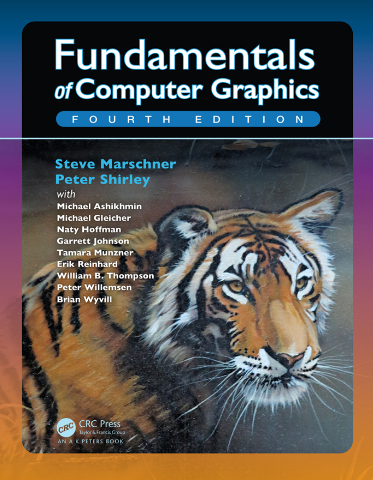

# 计算机图形学基础

?> 使用ChatGPT翻译并简单校对虎书：**Fundamentals of Computer Graphics (4th Edition)**  ——Steve Marschner & Peter Shirley

# 目录 

!> [跳转至正文](#前言)

#### 1. 介绍

- 1.1 图形领域
- 1.2 主要应用
- 1.3 图形APIs
- 1.4 图形管线
- 1.5 数值问题
- 1.6 效率
- 1.7 图形程序的设计与编程

#### 2. 数学杂项

- 2.1 集合和映射
- 2.2 解一元二次方程
- 2.3 三角函数
- 2.4 Vectors 矢量
- 2.5 曲线和曲面
- 2.6 线性插值
- 2.7 三角形

#### 3. 光栅图形

- 3.1 光栅设备
- 3.2 图像、像素、几何
- 3.3 RGB颜色
- 3.4 Alpha合成
  

#### 4. 光线追踪

- 4.1 基础光线追踪算法
- 4.2 透视
- 4.3 计算视线射线
- 4.4 光线和物体求交
- 4.5 着色
- 4.6 一个光线追踪程序
- 4.7 阴影
- 4.8 理想镜面反射
- 4.9 历史注释

#### 5. 线性代数

- 5.1 行列式
- 5.2 矩阵
- 5.3 矩阵和行列式的计算
- 5.4 特征值和矩阵对角化

#### 6. 变换矩阵

- 6.1 2D线性变换
- 6.2 3D线性变换
- 6.3 平移和仿射变换
- 6.4 变换矩阵的逆
- 6.5 坐标转换

#### 7. 视图

- 7.1 视图变换
- 7.2 投影变换
- 7.3 透视投影
- 7.4 透视变换的属性
- 7.5 FOV 视野

#### 8. 图形管线

- 8.1 光栅化
- 8.2 光栅化前后的操作
- 8.3 简单抗锯齿技术
- 8.4 为提高效率而剔除图元

#### 9. 信号处理

- 9.1 数字音频：一维采样
- 9.2 卷积
- 9.3 卷积滤波器
- 9.4 图像信号处理
- 9.5 采样理论

#### 10. 表面着色

- 10.1 漫反射着色
- 10.2 Phong着色
- 10.3 风格化着色

#### 11. 纹理映射

- 11.1 查找纹理值
- 11.2 纹理坐标函数
- 11.3 抗锯齿纹理查找
- 11.4 纹理映射的应用
- 11.5 程序化3D纹理

#### 12. 图形数据结构

- 12.1 三角网格
- 12.2 场景图
- 12.3 空间数据结构
- 12.4 BSP树可见性
- 12.5 多维数组平铺

#### 13. 光线追踪进阶

- 13.1 透明度和折射
- 13.2 实例化
- 13.3 构造几何实体
- 13.4 分布式光线追踪

#### 14. 采样

- 14.1 积分
- 14.2 连续概率
- 14.3 蒙特卡洛积分
- 14.4 随机点选择

#### 15. 曲线

- 15.1 曲线
- 15.2 曲线属性
- 15.3 多项式片段
- 15.4 拼接多项式片段
- 15.5 立方体
- 15.6 近似曲线
- 15.7 总结

#### 16. 计算机动画

- 16.1 动画原理
- 16.2 关键帧
- 16.3 形变
- 16.4 角色动画
- 16.5 基于物理的动画
- 16.6 程序化技术
- 16.7 对象组合

#### 17. 使用图形硬件

- 17.1 硬件概述
- 17.2 图形硬件是什么
- 17.3 异构多处理器系统
- 17.4 图形硬件编程：缓冲区、状态和着色器
- 17.5 状态机
- 17.6 基本的OpenGL应用程序
- 17.7 几何体
- 17.8 着色器初见
- 17.9 顶点缓冲对象 VBO
- 17.10 顶点数组对象 VAO
- 17.11 变换矩阵
- 17.12 使用顶点属性着色
- 17.13 使用片段处理器着色
- 17.14 网格和实例化
- 17.15 纹理对象
- 17.16 面向对象设计图形硬件编程
- 17.17 持续学习...

#### 18. 光照

- 18.1 Radiometry 辐射度量学
- 18.2 Transport 方程
- 18.3 光子

#### 19. 色彩

- 19.1 Colorimetry 色度学
- 19.2 色彩空间
- 19.3 色适应性
- 19.4 颜色外观

#### 20. 视知觉

- 20.1 视觉科学
- 20.2 视敏度
- 20.3 空间视觉
- 20.4 物体、位置和事件
- 20.5 图像感知

#### 21. 色调重建

- 21.1 分类
- 21.2 动态范围
- 21.3 颜色
- 21.4 图像生成
- 21.5 基于频率的运算符
- 21.6 梯度频域运算符
- 21.7 空间运算符
- 21.8 Division
- 21.9 Sigmoid
- 21.10 其他方法
- 21.11 Night 色调映射
- 21.12 讨论

#### 22. 隐式模型

- 22.1 隐式函数、骨架图元及求和混合
- 22.2 渲染
- 22.3 空间划分
- 22.4 Blending 混合
- 22.5 构造实体节化学 CSG
- 22.6 弯曲变形
- 22.7 精确接触建模
- 22.8 Blob Tree
- 22.9 交互隐式建模系统

#### 23. 全局光照 GI

- 23.1 漫反射场景的粒子追踪
- 23.2 路径追踪
- 23.3 精确直接光照

#### 24. 反射模型

- 24.1 真实世界材质
- 24.2 反射模型实现
- 24.3 镜面反射模型
- 24.4 光滑层次结构模型
- 24.5 粗糙层次结构模型

#### 25. 游戏中的计算机图形学

- 25.1 平台
- 25.2 有限的资源
- 25.3 优化计算
- 25.4  游戏类型
- 25.5 游戏制作流程

#### 26. 可视化

- 26.1 背景
- 26.2 数据类型
- 26.3 以人为本的设计过程
- 26.4 视觉编码原则
- 26.5 交互原则
- 26.6 组合和相邻视图
- 26.7 减少数据
- 26.8 示例

# 前言

《计算机图形学基础》的这个版本在**纹理**和**图形硬件**章节上进行了大量重写，并进行了许多修正。整本书的插图现在都是彩色的。

该书的组织结构与第三版基本相似。我们认为，**第2章 到 第8章 构成了“核心的核心”**，通过光线跟踪和光栅化两种互补方法来深入理解如何将图像呈现在屏幕上所需的内容。首先介绍光线跟踪，因为它是生成3D场景图像最简单的方法，然后介绍必要的数学知识以及管线本身。之后，“外部核心”涵盖其他通常包括在入门课程中的主题，例如采样理论、纹理映射、空间数据结构和样条曲线等。从第15章开始是一些贡献者撰写的专题文章，他们被选中作为作者既具有专业知识又能清晰表达思想。

多年来，在修订此书时，我们努力保留了早期版本所特有非正式、直观风格，并同时提高其一致性、准确性和完整性。我们希望读者会发现结果是一个适用于各种计算机图形学课程的吸引人平台。

## 关于封面

封面图片来自J.W.贝克的《水中的老虎》（丙烯刷和喷笔在画布上，16英寸乘20英寸，www.jwbart.com ）  。

老虎是指阿兰·福尔尼耶（1943-2000）在1998年康奈尔大学的一个研讨会上发表过精彩演讲。他生动地描述了老虎的动作，并总结了他的观点。

- 尽管计算机图形学中的建模和渲染在过去35年里得到了极大的改进，但我们仍然无法自动地以所有细节呈现老虎在河中游泳。所谓自动化是指不需要艺术家/专家进行精细手工调整的方式。

- 坏消息是我们还有很长的路要走。

- 好消息是我们还有很长的路要走。

# 1 引言

计算机图形学是指利用计算机来创建和操作图像的任何应用。本书介绍了可用于创建各种图像（逼真的视觉效果、信息丰富的技术插图或美丽的计算机动画）的算法和数学工具。图形可以是二维或三维； 图像可以完全合成，也可以通过处理照片来生成。本书讲述了基本算法和数学，特别是用于产生三维物体和场景合成图像所使用的。

实际上，进行计算机图形学必须了解特定的硬件、文件格式以及通常一个或两个图形API（参见第1.3节）。计算机图形学是一个快速发展的领域，因此这方面的知识是不断变化的。因此，在本书中，我们尽力避免依赖于任何特定的硬件或API。鼓励读者补充相关文档以适应其软件和硬件环境。幸运的是，计算机图形学文化具有足够标准术语和概念，本书中讨论内容应该能够很好地映射到大多数环境。

本章定义了一些基本术语，并提供了与计算机图形相关的历史背景和信息来源。

## 1.1 图形领域

在任何领域中强加类别都是危险的，但大多数图形从业者会同意计算机图形学的以下主要领域：

- **模型**以一种可以存储在计算机上的方式数学地规定形状和外观属性。例如，一个咖啡杯可以被描述为一组有序的三维点连同某些插值规则来连接这些点和一个反射模型来描述光如何与杯子相互作用。
- **渲染**是从艺术中继承而来的术语，它涉及从3D计算机模型创建阴影图像。
- **动画**是通过图像序列创建运动幻象的技术。动画使用建模和渲染，但增加了关键问题——随时间移动——这通常不在基本建模和渲染中处理。

还有许多其他涉及计算机图形学的领域，它们是否是核心图形学领域则因人而异。这些相关领域都将在本文中至少被提到。这些相关领域包括以下几个方面：

- **用户交互**处理输入设备（如鼠标和平板电脑）、应用程序、反馈给用户的影像以及其他感官反馈之间的接口。历史上，由于图形研究人员最早可以使用现在无处不在的输入/输出设备，所以该领域与图形学密切相关。
- **虚拟现实**试图将用户沉浸到一个三维虚拟世界中。这通常需要至少立体声图形和对头部运动的响应。为了实现真正的虚拟现实，还应该提供声音和力反馈等功能。由于此领域能够利用先进的3D图形技术和高级显示技术，因此通常与计算机图形学紧密关联。
- **可视化**试图通过可视化展示来帮助用户理解复杂信息问题，并经常需要解决一些与计算机制画有关的问题。
- **图像处理**涉及2D图片操作，并广泛应用于计算机制画和视觉等领域。
- **3D扫描**使用测距技术创建测量的三维模型。这些模型对于创建丰富的视觉图像非常有用，处理此类模型通常需要计算机图形学算法。
- **计算摄影**是利用计算机图形学、计算机视觉和图像处理方法，以实现对物体、场景和环境进行新型摄影捕捉的技术。

## 1.2 主要应用

几乎任何事业都可以利用计算机图形学，但是主要的计算机图形技术消费者包括以下行业：

- **电子游戏**越来越多地使用复杂的3D模型和渲染算法。
- **卡通**经常直接从3D模型中呈现。许多传统2D卡通使用从3D模型渲染的背景，这允许连续移动视点而不需要大量艺术家时间。
- **视觉效果**几乎使用所有类型的计算机图形技术。几乎每部现代电影都使用数字合成将背景与单独拍摄的前景叠加在一起。许多电影还使用3D建模和动画来创建合成环境、物体甚至角色，大多数观众永远不会怀疑它们不是真实存在的。
- **动画电影**使用了很多用于视觉效果的相同技术，但并非必须针对看起来真实的图像。
- **CAD/CAM**代表计算机辅助设计和制造。这些领域利用计算机技术在计算机上设计零件和产品，并且然后通过这些虚拟设计指导制造过程。例如，许多机械零件是在3D计算机建模软件中设计的，然后自动在计算机控制的铣削设备上生产。
- **模拟**可以被认为是准确的视频游戏。例如，飞行模拟器使用复杂的3D图形来模拟驾驶飞机的体验。这样的模拟对于安全关键领域（如驾驶）中的初始培训以及针对经验丰富用户（如特定消防情况）进行场景培训非常有用，因为这些情况过于昂贵或危险而无法物理创建。
- **医学影像技术**可以创建扫描患者数据的有意义的图像。例如，计算机断层扫描（CT）数据集由大量三维矩形密度值数组组成。计算机图形学用于创建阴影图像，帮助医生从这些数据中提取最重要的信息。
- **信息可视化**可以创建不一定具有“自然”视觉呈现方式的数据图像。例如，十种不同股票价格的时间趋势没有明显的视觉呈现方式，但巧妙的绘图技术可以帮助人们看到这些数据中的模式。

## 1.3 图形APIs

使用图形库的关键部分是处理图形API。应用程序接口（API）是一组标准函数，用于执行一组相关操作，而图形API则是一组函数，可在屏幕上的窗口中绘制图像和3D表面等基本操作。

每个图形程序都需要能够使用两个相关的API：一个用于视觉输出的图形API和一个用于从用户获取输入的用户界面API。目前有两种主要的图形和用户界面API范例。第一种是集成方法，例如Java，在这种方法中，图形和用户界面工具包被集成为便携式软件包，并作为语言的完全标准化和支持部分提供。第二种由Direct3D和OpenGL代表，在这里绘画命令是与诸如C++之类语言捆绑在一起的软件库的一部分，并且用户界面软件是独立实体，可能因系统而异。在后者方法中编写可移植代码存在问题，尽管对于简单程序来说可能可以使用便携式库层来封装特定于系统的用户界面代码。

无论您选择哪种API，基本图形调用将大致相同，并且本书所介绍到概念也适用。
