# 计算机图形学基础

?> 使用ChatGPT翻译并简单校对，以及MathPix输入$\LaTeX$公式的虎书第5版：**Fundamentals of Computer Graphics (5th Edition)**  ——Steve Marschner & Peter Shirley


# 目录 

!> [跳转至正文](#前言)

#### 1. 介绍

- 1.1 图形领域
- 1.2 主要应用
- 1.3 图形APIs
- 1.4 图形管线
- 1.5 数值问题
- 1.6 效率
- 1.7 图形程序的设计与编程

#### 2. 数学杂项

- 2.1 集合和映射
- 2.2 解一元二次方程
- 2.3 三角函数
- 2.4 Vectors 矢量
- 2.5 积分
- 2.6 密度函数
- 2.7 曲线和曲面
- 2.8 线性插值
- 2.9 三角形
- 2.10 离散概率
- 2.11 连续概率
- 2.12 蒙特卡洛积分

#### 3. 光栅图形

- 3.1 光栅设备
- 3.2 图像、像素、几何
- 3.3 RGB颜色
- 3.4 Alpha合成
  

#### 4. 光线追踪

- 4.1 基础光线追踪算法
- 4.2 透视投影
- 4.3 计算观察射线
- 4.4 光线和物体求交
- 4.5 着色
- 4.6 历史注释

#### 5. 表面着色

- 5.1 点光源
- 5.2 基本反射模型
- 5.3 环境照明

#### 6. 线性代数

- 6.1 行列式
- 6.2 矩阵
- 6.3 矩阵和行列式的计算
- 6.4 特征值和矩阵对角化

#### 7. 变换矩阵

- 7.1 2D线性变换
- 7.2 3D线性变换
- 7.3 平移和仿射变换
- 7.4 变换矩阵的逆
- 7.5 坐标转换

#### 8. 视图

- 8.1 视图变换
- 8.2 投影变换
- 8.3 透视投影
- 8.4 透视变换的属性
- 8.5 FOV 视野

#### 9. 图形管线

- 8.1 光栅化
- 8.2 光栅化前后的操作
- 8.3 简单抗锯齿技术
- 8.4 为提高效率而剔除图元

#### 10. 信号处理

- 10.1 数字音频：一维采样
- 10.2 卷积
- 10.3 卷积滤波器
- 10.4 图像信号处理
- 10.5 采样理论

#### 11. 纹理映射

- 11.1 查找纹理值
- 11.2 纹理坐标函数
- 11.3 抗锯齿纹理查找
- 11.4 纹理映射的应用
- 11.5 程序化3D纹理

#### 12. 图形数据结构

- 12.1 三角网格
- 12.2 场景图
- 12.3 空间数据结构
- 12.4 BSP树可见性
- 12.5 多维数组平铺

#### 13. 采样

- 13.1 积分
- 13.2 连续概率
- 13.3 蒙特卡洛积分
- 13.4 随机点选择

#### 14. 基于物理的渲染 PBR

- 14.1 光子
- 14.2 光滑金属
- 14.3 逛花街之
- 14.4 次表面散射介质
- 14.5 暴力光子追踪器
- 14.6 辐射度量学
- 14.7 散射辐射度量学
- 14.8 输运方程
- 14.9 实践中的材质
- 14.10 蒙特卡洛光线追踪

#### 15. 曲线

- 15.1 曲线
- 15.2 曲线属性
- 15.3 多项式片段
- 15.4 拼接多项式片段
- 15.5 立方体
- 15.6 近似曲线
- 15.7 总结

#### 16. 计算机动画

- 16.1 动画原理
- 16.2 关键帧
- 16.3 形变
- 16.4 角色动画
- 16.5 基于物理的动画
- 16.6 程序化技术
- 16.7 对象组合

#### 17. 使用图形硬件

- 17.1 硬件概述
- 17.2 图形硬件是什么
- 17.3 异构多处理器系统
- 17.4 图形硬件编程：缓冲区、状态和着色器
- 17.5 状态机
- 17.6 基本的OpenGL应用程序
- 17.7 几何体
- 17.8 着色器初见
- 17.9 顶点缓冲对象 VBO
- 17.10 顶点数组对象 VAO
- 17.11 变换矩阵
- 17.12 使用顶点属性着色
- 17.13 使用片段处理器着色
- 17.14 网格和实例化
- 17.15 纹理对象
- 17.16 面向对象设计图形硬件编程
- 17.17 持续学习...

#### 18. 色彩

- 18.1 Colorimetry 色度学
- 18.2 色彩空间
- 18.3 色适应性
- 18.4 颜色外观

#### 19. 视知觉

- 19.1 视觉科学
- 19.2 视敏度
- 19.3 空间视觉
- 19.4 物体、位置和事件
- 19.5 图像感知

#### 20. 色调重建

- 20.1 分类
- 20.2 动态范围
- 20.3 颜色
- 20.4 图像生成
- 20.5 基于频率的运算符
- 20.6 梯度频域运算符
- 20.7 空间运算符
- 20.8 Division
- 20.9 Sigmoid
- 20.10 其他方法
- 20.11 Night 色调映射
- 20.12 讨论

#### 21. 隐式模型

- 21.1 隐式函数、骨架图元及求和混合
- 21.2 渲染
- 21.3 空间划分
- 21.4 Blending 混合
- 21.5 构造实体节化学 CSG
- 21.6 弯曲变形
- 21.7 精确接触建模
- 21.8 Blob Tree
- 21.9 交互隐式建模系统

#### 22. 游戏中的计算机图形学

- 22.1 平台
- 22.2 有限的资源
- 22.3 优化计算
- 22.4  游戏类型
- 22.5 游戏制作流程

#### 23. 可视化

- 23.1 背景
- 23.2 数据类型
- 23.3 以人为本的设计过程
- 23.4 视觉编码原则
- 23.5 交互原则
- 23.6 组合和相邻视图
- 23.7 减少数据
- 23.8 示例

# 前言

《计算机图形学基础》这一版本在**着色、光反射和路径追踪**等方面进行了大量重写，并进行了许多修正。现在，本书更好地介绍了以物理为基础的材料和渲染技术，这些技术正在实际应用中变得越来越普遍。此内容现已更好地整合，我们认为本书与目前许多教师组织图形课程的方式相吻合。

本书的组织结构与第四版基本相似。随着多年来对本书的修订，我们努力保留早期版本所具有的非正式、直观风格的表达方式，同时提高其一致性、精度和完整性。我们希望读者能够发现结果是一个适用于各种计算机图形学课程的吸引人平台。

## 关于封面

封面图片来自J.W.贝克的《水中的老虎》（丙烯刷和喷笔在画布上，16英寸乘20英寸，www.jwbart.com ）  。

老虎是指阿兰·福尔尼耶（1943-2000）在1998年康奈尔大学的一个研讨会上发表过精彩演讲。他生动地描述了老虎的动作，并总结了他的观点。

- 尽管计算机图形学中的建模和渲染在过去35年里得到了极大的改进，但我们仍然无法自动地以所有细节呈现老虎在河中游泳。所谓自动化是指不需要艺术家/专家进行精细手工调整的方式。

- 坏消息是我们还有很长的路要走。

- 好消息是我们还有很长的路要走。

## 作者

**Steve Marschner**是康奈尔大学计算机科学教授。他于1993年在布朗大学获得了Sc.B.学位，并于1998年在康奈尔大学获得了博士学位。他曾在微软研究院和斯坦福大学担任研究职务，于2002年加入康奈尔大学。他荣获2015年SIGGRAPH计算机图形成就奖，并与其他人共同获得2003年技术奥斯卡。

**Peter Shirley**是NVIDIA杰出研究科学家。他曾在印第安纳大学、康奈尔大学和犹他州立大学担任教职。1985年，他从里德學院取得物理學文學士學位，在1991年从伊利诺伊州立大學取得計算機科學博士。

# 1 引言

计算机图形学是指使用计算机来创建和操作图像的任何方式。本书介绍了可以用于创建各种类型图像（逼真的视觉效果、信息化技术插图或美丽的计算机动画）的算法和数学工具。图形可以是二维或三维，图片可以完全合成或通过操纵照片产生。本书主要讲解基础算法和数学知识，特别是用于生成三维物体和场景合成图像的知识。

实际进行计算机图形处理需要了解特定硬件、文件格式以及通常需要一个或两个图形API（参见第1.3节）。由于计算机图形学领域正在快速发展，因此这些知识点也在不断变化中。因此，在本书中我们尽力避免依赖任何特定硬件或API，并鼓励读者根据其软件和硬件环境补充相关文档资料。幸运的是，计算机图形领域有足够标准化术语和概念，使得本书内容应该能够很好地映射到大多数环境。

?> API：应用程序接口。

本章定义了一些基本术语，并提供了与计算机图形相关的历史背景和信息来源。

## 1.1 图形领域

在任何领域中强加类别都是危险的，但大多数图形从业者会同意计算机图形学的以下主要领域：

- **模型**以一种可以存储在计算机上的方式数学地规定形状和外观属性。例如，一个咖啡杯可以被描述为一组有序的三维点连同某些插值规则来连接这些点和一个反射模型来描述光如何与杯子相互作用。
- **渲染**是从艺术中继承而来的术语，它涉及从3D计算机模型创建阴影图像。
- **动画**是通过图像序列创建运动幻象的技术。动画使用建模和渲染，但增加了关键问题——随时间移动——这通常不在基本建模和渲染中处理。

还有许多其他涉及计算机图形学的领域，它们是否是核心图形学领域则因人而异。这些相关领域都将在本文中至少被提到。这些相关领域包括以下几个方面：

- **用户交互**处理输入设备（如鼠标和平板电脑）、应用程序、反馈给用户的影像以及其他感官反馈之间的接口。历史上，由于图形研究人员最早可以使用现在无处不在的输入/输出设备，所以该领域与图形学密切相关。
- **虚拟现实**试图将用户沉浸到一个三维虚拟世界中。这通常需要至少立体声图形和对头部运动的响应。为了实现真正的虚拟现实，还应该提供声音和力反馈等功能。由于此领域能够利用先进的3D图形技术和高级显示技术，因此通常与计算机图形学紧密关联。
- **可视化**试图通过可视化展示来帮助用户理解复杂信息问题，并经常需要解决一些与计算机制画有关的问题。
- **图像处理**涉及2D图片操作，并广泛应用于计算机制画和视觉等领域。
- **3D扫描**使用测距技术创建测量的三维模型。这些模型对于创建丰富的视觉图像非常有用，处理此类模型通常需要计算机图形学算法。
- **计算摄影**是利用计算机图形学、计算机视觉和图像处理方法，以实现对物体、场景和环境进行新型摄影捕捉的技术。

## 1.2 主要应用

几乎任何事业都可以利用计算机图形学，但是主要的计算机图形技术消费者包括以下行业：

- **电子游戏**越来越多地使用复杂的3D模型和渲染算法。
- **卡通**经常直接从3D模型中呈现。许多传统2D卡通使用从3D模型渲染的背景，这允许连续移动视点而不需要大量艺术家时间。
- **视觉效果**几乎使用所有类型的计算机图形技术。几乎每部现代电影都使用数字合成将背景与单独拍摄的前景叠加在一起。许多电影还使用3D建模和动画来创建合成环境、物体甚至角色，大多数观众永远不会怀疑它们不是真实存在的。
- **动画电影**使用了很多用于视觉效果的相同技术，但并非必须针对看起来真实的图像。
- **CAD/CAM**代表计算机辅助设计和制造。这些领域利用计算机技术在计算机上设计零件和产品，并且然后通过这些虚拟设计指导制造过程。例如，许多机械零件是在3D计算机建模软件中设计的，然后自动在计算机控制的铣削设备上生产。
- **模拟**可以被认为是准确的视频游戏。例如，飞行模拟器使用复杂的3D图形来模拟驾驶飞机的体验。这样的模拟对于安全关键领域（如驾驶）中的初始培训以及针对经验丰富用户（如特定消防情况）进行场景培训非常有用，因为这些情况过于昂贵或危险而无法物理创建。
- **医学影像技术**可以创建扫描患者数据的有意义的图像。例如，计算机断层扫描（CT）数据集由大量三维矩形密度值数组组成。计算机图形学用于创建阴影图像，帮助医生从这些数据中提取最重要的信息。
- **信息可视化**可以创建不一定具有“自然”视觉呈现方式的数据图像。例如，十种不同股票价格的时间趋势没有明显的视觉呈现方式，但巧妙的绘图技术可以帮助人们看到这些数据中的模式。

## 1.3 图形APIs

使用图形库的关键部分是处理图形API。应用程序接口（API）是一组标准函数，用于执行一组相关操作，而图形API则是一组函数，可在屏幕上的窗口中绘制图像和3D表面等基本操作。

每个图形程序都需要能够使用两个相关的API：一个用于视觉输出的图形API和一个用于从用户获取输入的用户界面API。目前有两种主要的图形和用户界面API范例。第一种是集成方法，例如Java，在这种方法中，图形和用户界面工具包被集成为便携式软件包，并作为语言的完全标准化和支持部分提供。第二种由`Direct3D`和`OpenGL`代表，在这里绘画命令是与诸如C++之类语言捆绑在一起的软件库的一部分，并且用户界面软件是独立实体，可能因系统而异。在后者方法中编写可移植代码存在问题，尽管对于简单程序来说可能可以使用便携式库层来封装特定于系统的用户界面代码。

无论您选择哪种API，基本图形调用将大致相同，并且本书所介绍到概念也适用。

## 1.4 渲染管线

现今每台桌面电脑都拥有强大的3D图形管线。这是一个特殊的软件/硬件子系统，能够高效地以透视方式绘制3D基元。通常这些系统被优化为处理具有共享顶点的3D三角形。**管线中的基本操作将3D顶点位置映射到2D屏幕位置**，并对三角形进行着色，使其既看起来逼真又按正确的前后顺序出现。

尽管在计算机图形学中，以有效的反向顺序绘制三角形曾经是最重要的研究问题之一，但现在几乎总是使用**z缓冲**区来解决这个问题。它使用特殊的内存缓冲区以暴力方式解决该问题。

事实证明，在图形管道中使用的几何操作可以几乎完全在由三个传统几何坐标和第四个齐次坐标组成的4D坐标空间中完成，后者有助于透视查看。这些4D坐标使用4×4矩阵和4向量进行操作。因此，图形管线包含了大量用于高效处理和组合这些矩阵和向量的机器设备。这种4D坐标系统是计算机科学中最微妙、最美丽的构造之一，并且当学习计算机图形学时肯定是最大的智力障碍。每本图形书籍前面很大一部分都涉及到这些坐标。

生成图片速度取决于正在绘制三角形数量。因为交互性对许多应用程序比视觉质量更重要，所以值得将用于表示模型的三角形数量最小化。此外，如果从远处查看模型，则需要较少的三角形，而从较近距离查看模型则需要更多的三角形。这表明使用不同级别的细节（LOD）表示模型是有用的。

## 1.5 数值问题

许多图形程序实际上只是3D数值代码。在这些程序中，数字问题通常至关重要。在“旧日子”里，以鲁棒和可移植的方式处理此类问题非常困难，因为机器对于数字有不同的内部表示，并且更糟糕的是，在不同和不兼容的方式下处理异常情况。幸运的是，几乎所有现代计算机都符合IEEE浮点标准（IEEE Standards Association, 1985）。这使得程序员可以对某些数字条件将如何处理做出许多方便的假设。

虽然IEEE浮点具有许多编码数字算法时有价值的特性，但大多数图形遇到的情况只需要了解其中很少一部分即可。首先并且最重要的是要理解，在IEEE浮点中存在三个实数“特殊”值：

1. 无穷大 (∞)。这是一个有效的数字，它比所有其他有效数字都要大。
2. 负无穷（-∞）。这是一个有效的数字，比所有其他有效数字都要小。
3. 非数字（NaN）。这是一种无效的数字，由于操作具有未定义后果而产生，例如零除以零。

!> IEEE浮点数有两种表示方法来表示0，一种被视为正数，另一种被视为负数。-0和+0之间的区别只有在极少数情况下才会产生影响，但应该记住这些场合。

IEEE浮点数的设计者做出了一些对程序员非常方便的决策。其中许多与处理诸如除以零等异常情况中上述三个特殊值有关。在这些情况下，会记录异常，但在许多情况下，程序员可以忽略它们。具体而言，在任何正实数a的情况下，IEEE浮点数在处理除无穷大值时遵循以下规则：
$$
+a/(+\infty)=+0, \\
-a/(+\infty)=-0, \\
+a/(-\infty)=-0, \\
-a/(-\infty)=+0.
$$
涉及无限值的其他操作表现出人们所期望的行为。再次针对正数a，其行为如下：
$$
\infty+\infty=+\infty, \\
-\infty-\infty=\mathrm{NaN}, \\
\infty\times\infty=+\infty, \\
\infty/\infty=+\infty, \\
\infty/a=\infty, \\
\infty/0=\infty, \\
0/0 = \mathrm{NaN}
$$
涉及无限值的布尔表达式规则如下：
1. 所有有限有效数字都小于+∞。
2. 所有有限有效数字都大于-∞。
3. -∞小于+∞。

涉及NaN值的表达式规则很简单：

1. 包括NaN的任何算术表达式结果为NaN。
2. 任何涉及NaN的布尔表达式均为false。

IEEE浮点数最有用的方面可能是如何处理除以零；对于任何正实数a，涉及除以零值的以下规则成立：
$$
+a/+0=+\infty, \\
-a/+0=-\infty.
$$
如果程序员利用IEEE规则，许多数字计算会变得更简单。例如，考虑以下表达式：
$$
a=\frac{1}{\frac{1}{b}+\frac{1}{c}}
$$
这种表达式常出现在电阻和透镜中。如果除以零导致程序崩溃（在IEEE浮点数之前的许多系统中都是如此），那么需要两个if语句来检查b或c的小值或零值。相反，在IEEE浮点数中，如果b或c为零，则我们将得到所需的a的零值。避免特殊检查的另一种常见技术是利用NaN的布尔属性。考虑以下代码段：

```bash
a = f(x)
if (a > 0) then
	do something
```

在这里，函数f可能会返回“丑陋”的值，如∞或NaN，但if条件仍然是明确定义的：对于$a=NaN$或$a=-∞$为false，而对于$a=+∞$则为true。通过谨慎地决定返回哪些值，通常可以使if做出正确的选择，并且不需要进行特殊检查。这使得程序更小、更健壮、更高效。

## 1.6 效率

没有制定代码更高效的魔法规则。通过仔细权衡来实现效率，而这些权衡对于不同的架构是不同的。然而，在可预见的未来，一个好的启发式方法是程序员应该更加关注内存访问模式而不是操作计数。这与二十年前最佳启发式方法相反。之所以出现了这种转变，是因为**内存速度没有跟上处理器速度**的步伐。由于这一趋势持续存在，有限和连贯内存访问对于优化的重要性只会增加。

使代码快速运行的合理方法是按照以下顺序进行，并仅采取必要步骤：

1. 以最简单的方式编写代码。根据需要即时计算中间结果，而不是将它们存储下来。
2. 在优化模式下进行编译。
3. 使用任何可用的分析工具查找关键瓶颈。
4. 检查数据结构以寻找提高局部性能力的方法。如果可能，请使数据单元大小与目标架构上的缓存/页面大小匹配。
5. 如果分析揭示了数字计算方面的瓶颈，请检查编译器生成的汇编代码是否存在效率问题。重写源代码以解决发现的任何问题。

这些步骤中最重要的是第一步。大多数“优化”会使代码难以阅读，而并没有提高速度。此外，事先花费时间来优化代码通常比纠正错误或添加功能更好。另外，要注意旧文本中的建议；有些经典技巧（如使用整数代替实数）可能不再具有加速作用，因为现代CPU通常可以像执行整数操作一样快地执行浮点运算。在所有情况下，都需要进行分析以确保任何针对特定机器和编译器的优化都是值得的。

## 1.7 设计和编写图形程序
在图形编程中，通常有一些常见的策略是非常有用的。本节提供了一些建议，希望您在实现本书中学习到的方法时会发现这些建议很有帮助。

### 1.7.1 类设计

任何图形程序的关键部分都是拥有良好的几何实体类或例程，例如向量和矩阵，以及图形实体类如RGB颜色和图像。这些例程应尽可能地简洁高效。一个普遍的设计问题是位置和位移是否应该作为不同的类来处理，因为它们具有不同的操作，例如将位置乘以一半没有几何意义，而将位移乘以一半则有（Goldman, 1985; DeRose, 1989）。对于这个问题并没有达成共识，在图形从业者之间可能会引发数小时激烈辩论，但为了举例说明，我们假设我们不会进行区分。

这意味着需要编写一些基本类，包括：

- `vector2`。一个二维向量类，存储x和y分量。它应该将这些分量存储在长度为2的数组中，以便支持索引运算符。您还应该包括向量加法、向量减法、点积、叉积、标量乘法和标量除法等操作。
- `vector3`。类似于vector2的三维向量类。
- `hvector`。具有四个分量的齐次向量（参见第7章）。
- `rgb`。存储三个分量的RGB颜色。您还应该包括RGB加法、RGB减法、RGB乘法、标数量乘和标数量除等操作。
- `transform`。用于变换的4×4矩阵。您应该包括一个矩阵乘积和成员函数来应用于位置、方向和表面法线向量上，在第6章中已经展示了它们是不同的。
- `image`. 具有输出操作的RGB像素二维数组。

此外，您可能会或可能不想添加间隔区域（intervals）、正交规范基（orthonormal bases）和坐标框架（coordinate frames）等其他类。

!> 你可能还需要考虑一下针对单位向量的特殊类，尽管我发现它们带来的麻烦比价值更大。——P.S.

### 1.7.2 Float vs Double

现代架构表明，保持内存使用率低和维护一致的内存访问是提高效率的关键。这意味着使用单精度数据。然而，避免数值问题则建议使用双精度算术。权衡取决于程序，但在类定义中设置默认值很好。

!> 我建议在几何计算中使用双精度浮点数，而在颜色计算中使用单精度浮点数。对于占用大量内存的数据，例如三角形网格，我建议存储单精度浮点数数据，并在通过成员函数访问数据时转换为双精度。——P.S.

!> 我主张在进行所有计算时都使用浮点数，直到你发现代码的特定部分需要双精度为止。——S.M.

### 1.7.3 图形程序Debugging

如果你询问一下，你可能会发现随着程序员经验的增加，他们使用传统的调试器越来越少。其中一个原因是对于复杂的程序而言，使用这样的调试器比简单程序更麻烦。另一个原因是最困难的错误是概念性错误，在实现错误时很容易浪费大量时间逐步查看变量值而未能检测到此类情况。我们发现在图形学中有几种调试策略特别有用。

#### 科学方法

在图形程序中，有一种传统调试的替代方法通常非常有用。它的缺点是与计算机程序员早期职业生涯所教授的内容非常相似，因此如果您这样做可能会感到“不道德”：我们创建一个图像并观察其中存在什么问题。然后，我们提出一个关于问题原因的假设并进行测试。例如，在光线追踪程序中，我们可能会遇到许多看起来有些随意、黑暗像素点。这是大多数人编写光线追踪器时遇到的经典“阴影痤疮”问题。传统调试在这里没有帮助；相反，我们必须意识到阴影射线正在击中被着色表面上。我们可能会注意到黑斑点的颜色是环境颜色，因此直接照明缺失了。可以关闭阴影下的直接照明检查，以便您可以假设这些点被错误地标记为处于阴影之中而实际上却不是如此。要测试该假设，则可以关闭阴影检查并重新编译代码以确定是否存在虚假阴影测试，并继续进行调试工作即可。

使用该方法成为良好实践主要原因是我们无需发现错误值或真正确定概念性错误。相反，我们只需要通过实验逐步缩小问题范围并找到概念性错误。通常只需要进行几次试验即可追踪问题，并且这种调试方式非常有趣。

#### 将图像作为编码调试输出
在许多情况下，从图形程序中获取调试信息的最简单渠道就是输出图像本身。如果您想了解某些变量的值，以便针对每个像素运行的计算部分进行调试，则可以暂时修改程序，直接将该值复制到输出图像中，并跳过通常要执行的其余计算。例如，如果您怀疑表面法线存在问题导致着色出现问题，则可以直接将法向量复制到图像中（x 轴转换为红色、y 轴转换为绿色、z 轴转换为蓝色），从而得到一个彩色编码描绘实际用于计算的向量。或者，如果您怀疑特定值有时超出其有效范围，请让程序在发生这种情况时写入鲜艳的红色像素。其他常见技巧包括使用明显颜色绘制表面背面（当它们不应该可见时）、通过对象 ID 号对图像进行着色或根据计算所需工作量对象来着色。

#### 使用调试器
在某些情况下，特别是当科学方法似乎导致矛盾时，观察正在发生的事情是无可替代的。问题在于，图形程序通常涉及许多相同代码的执行（例如每个像素一次或每个三角形一次），使得从头开始通过调试器逐步执行变得完全不切实际。而且最困难的错误通常只会出现在复杂输入中。

一个有用的方法是为错误设置“陷阱”。首先，请确保您的程序具有确定性-在单个线程中运行它，并确保所有随机数都从固定种子计算。然后，找出哪个像素或三角形展示了该错误，并在您怀疑不正确的代码之前添加一个语句，仅针对嫌疑案例执行。例如，如果您发现像素（126,247）显示了该错误，则添加：

```bash
if x = 126 and y = 247 then
	print "blarg!"
```

如果您在打印语句上设置断点，就可以在计算所需像素之前进入调试器。一些调试器具有“条件断点”功能，可以在不修改代码的情况下实现相同的效果。

对于程序崩溃的情况，传统的调试器非常有用，可以准确定位崩溃位置。然后应该使用assert和重新编译来回溯程序，找出程序出错的地方。这些assert应该留在程序中以备将来可能添加的错误。这意味着避免了传统的逐步过程，因为那样做不能为您的程序添加宝贵的assert。

!> 使用固定的随机数种子的特殊调试模式非常有用。

#### 数据可视化用于调试
通常情况下，很难理解程序在做什么，因为它会计算许多中间结果，最终才出现错误。这种情况类似于进行大量数据测量的科学实验，并且有一个相同的解决方案：为自己制作良好的图表和插图以了解数据含义。

例如，在光线追踪器中，您可以编写代码来可视化射线树，以便查看哪些路径对像素产生了贡献；或者在图像重采样例程中，您可以制作显示从输入获取样本点的所有点的图表。花费时间编写代码来可视化程序内部状态也将回报更好地理解其行为，并优化它时节省时间。

!> 我喜欢将调试的打印语句格式化，以便输出成为Matlab或Gnuplot脚本，从而生成有用的图形。——S.M.

## 注释

软件工程的讨论受到了Effective C++系列（Meyers，1995年，1997年），极限编程运动（Beck＆Andres，2004年）和Programming Practice（Kernighan＆Pike， 1999）的影响。实验性调试的讨论基于与Steve Parker的讨论。

有许多与计算机图形相关的年度会议，包括ACM SIGGRAPH和SIGGRAPH Asia、Graphics Interface、Game Developers Conference (GDC)、Eurographics、Pacific Graphics、High Performance Graphics、Eurographics渲染研讨会以及IEEE VisWeek等。这些可以通过网络搜索轻松找到。


# 2 数学杂项

很多图形学都是将数学直接转化为代码。数学越干净，生成的代码就越干净；因此本书大部分内容都集中在使用恰当的数学知识来完成工作上。本章回顾了高中和大学数学中的各种工具，并旨在作为参考资料而非教程使用。它可能看起来像一堆杂乱无章的主题，确实如此；每个主题之所以被选择，是因为它在“标准”数学课程中有些不寻常，在图形处理方面至关重要或者通常没有从几何角度进行讨论。除了建立本书所用符号的复习外，该章还强调了一些标准本科课程有时会忽略掉的点，例如三角形质心坐标系等。这一章并不打算对材料进行严格处理；相反地，注重直觉和几何解释。线性代数讨论推迟到第5章，在矩阵变换之前进行讨论。鼓励读者浏览本章以熟悉涵盖的主题，并根据需要参考它。该章末尾练习可帮助确定哪些主题需要温习复习。

## 2.1 集合和映射

映射，也称为函数，在数学和编程中都是基础概念。就像程序中的函数一样，数学中的映射接受一个特定类型的参数，并将其映射到（返回）一个特定类型的对象。在程序中我们说“类型”，而在数学中我们会确定集合。当我们有一个属于某个集合的对象时，我们使用∈符号表示。例如：
$$
a\in  \mathbf{S}
$$
”$a$是集合$\mathbf{S}$的成员。”给定任意两个集合$\mathbf{A}$和$\mathbf{B}$，我们可以通过取两个集合的笛卡尔积来创建第三个集合，表示为$\mathbf{A}\times\mathbf{B}$。这个由所有可能的有序对(a, b)组成的集合$\mathbf{A}\times\mathbf{B}$，其中$a\in \mathbf{A}$且$b\in \mathbf{B}$。作为一种简写方式，我们使用符号$\mathbf{A}^2$来表示$\mathbf{A}\times\mathbf{A}$。我们可以将笛卡尔积扩展到从三个集合中获取所有可能的有序三元组等任意长有序元组和任意多个集。

常见的兴趣集包括：

- $\mathbb{R}$ 实数；
- $\mathbb{R}^+$ 非负实数（包括零）；
- $\mathbb{R}^2$ 有序对在真正的二维平面上；
- $\mathbb{R}^n$-n维笛卡尔空间中的点；
- $\mathbb{Z}$-整数；
- $\mathbf{S}^2$-单位球面上的三维点（$\mathbb{R}^3$中的点）。

请注意，虽然$\mathbf{S}^2$由嵌入三维空间中的点组成，但它们位于可以用两个变量参数化的表面上，因此可以将其视为二维集合。映射符号使用箭头和冒号，例如：
$$
f:\mathbb{R}\mapsto\mathbb{Z}
$$
你可以将其理解为“有一个名为f的函数，它接受实数作为输入并将其映射到整数。” 这里，箭头前面的集合被称为函数的定义域，右侧的集合被称为目标值。计算机程序员可能更喜欢以下等价语言：“有一个名为 $f$ 的函数，它具有一个实参并返回一个整数。” 换句话说，上述集合符号与常见编程符号是等价的：
$$
\mathrm{integer}\ f(\mathrm{real}) \leftarrow \mathrm{equivalent}\rightarrow f:\mathbb{R}\mapsto\mathbb{Z}
$$
因此，冒号箭头符号可以被视为一种编程语法。就是这么简单。

点 $f(a)$ 称为 $a$ 的像，集合$A$（定义域的子集）的像是包含所有$A$中点的像所构成的目标集合的子集。整个定义域的像称为函数的值域。

### 2.1.1 逆映射

!> 略

### 2.1.2 区间

!> 略

### 2.1.3 对数

!> 略

## 2.2 解一元二次方程

!> 略

## 2.3 三角函数

!> 略

**正弦定理：**
$$
\frac{\sin A}{a}=\frac{\sin B}{b}=\frac{\sin C}{c}
$$
**余弦定理：**
$$
c^2=a^2+b^2-2ab\cos C
$$
**正切定理：**
$$
\frac{a+b}{a-c}=\frac{\tan\frac{A+B}{2}}{\tan\frac{A-B}{2}}
$$
**三角形面积：**
$$
S=\frac{1}{4}\sqrt{(a+b+c)(-a+b+c)(a-b+c)(a+b-c)}
$$

## 2.4 向量

点积 Dot Product
$$
\mathbf{a}\cdot\mathbf{b}=\left\lVert a\right\rVert \left\lVert b\right\rVert \cos\phi
$$
叉积 Cross Product
$$
\left\lVert a\times b\right\rVert=\left\lVert a\right\rVert \left\lVert b\right\rVert \sin\phi
$$

## 2.5 积分

## 2.6 密度函数

## 2.7 曲线和曲面

## 2.8 线性插值

## 2.9 三角形 ★

在许多图形程序中，无论是2D还是3D三角形都是基本的建模原语。通常，诸如颜色之类的信息被标记到三角形顶点上，并且这些信息会在整个三角形内插值。使得这种插值变得简单直接的坐标系称为重心坐标系；我们将从头开始开发它们。我们还将讨论2D三角形，在绘制它们在2D屏幕上的图片之前必须理解。

### 2.9.1 2D三角形

如果我们有一个由二维点a、b和c定义的二维三角形，我们可以先找到它的面积：
$$
\mathrm{Area}=\frac{1}{2}\begin{vmatrix}
x_b-x_a & x_c-x_a \\
y_b-y_a & y_c-y_a \\
\end{vmatrix}
$$
这个公式的推导可以在第6.3节中找到。如果点a、b和c按逆时针顺序排列，则该区域将具有正号；否则，它将具有负号。

在图形学中，我们经常希望在每个三角形顶点上分配属性（例如颜色），并在整个三角形上平滑地插值该属性的值。有多种方法可以实现这一点，但最简单的方法是使用**重心坐标系**。可以将重心坐标系看作非正交坐标系，如第2.4.2节中简要讨论过的那样。这样的坐标系显示在图2.38中，其中坐标原点为a，从a到b和c的向量是基向量。通过该原点和基向量，任何点p都可以写成
$$
\mathrm{p}=\mathrm{a}+\beta(\mathrm{b-a})+\gamma\mathrm{(c-a)} \qquad \mathrm{(2.28)}
$$
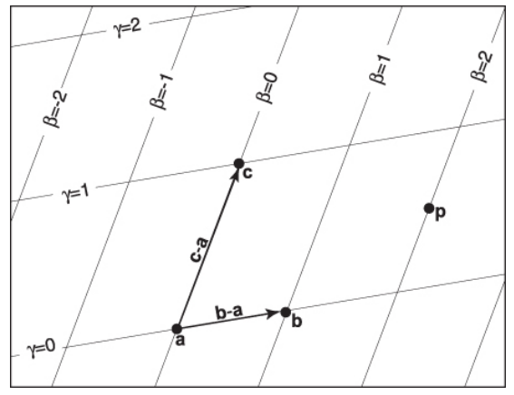

**图2.38** 一个由顶点a、b、c组成的二维三角形可以用来建立一个非正交坐标系，其中原点为a，基向量为(b-a)和(c-a)。一个点可以表示为有序对(β, γ)。例如，点p=(2.0, 0.5)，即p=a+2.0(b-a)+0.5(c-a)。


请注意，我们可以重新排列方程（2.28）中的项，以得到：
$$
\mathrm{p}=(1-\beta-\gamma)\mathrm{a}+\beta\mathrm{b}+\gamma\mathrm{c}
$$
通常人们会定义一个新变量α来改善方程的对称性：
$$
\alpha=1-\beta-\gamma
$$
所以得到
$$
\mathrm{p}(\alpha,\beta,\gamma)=\alpha\mathrm{a}+\beta\mathrm{b}+\gamma\mathrm{c}
$$
在限制条件下:
$$
\alpha+\beta+\gamma=1
$$
重心坐标一开始似乎是一个抽象和不直观的概念，但它们被证明是强大而方便的。你可能会发现，在一个有两组平行街道但这些街道并非成直角的城市中，如何使用街道地址很有用。自然系统本质上就是重心坐标系，你很快就会习惯它们。重心坐标适用于平面上所有点。其中一个特别好的特性是：**当且仅当点p在由a、b和c形成的三角形内部时，它才位于该三角形内部：**
$$
0<\alpha<1,\\
0<\beta<1,\\
0<\gamma<1.
$$
如果其中一个坐标为零，而另外两个坐标在零和一之间，则您位于边缘。如果两个坐标为零，则另一个为一，您就在顶点上。

重心坐标的另一个好处是方程式（2.29）实际上以平滑的方式混合了三个顶点的坐标。相同的混合系数（α、β、γ）可以用于混合其他属性，例如颜色，我们将在下一章中看到。给定一个点p，如何计算其重心坐标？一种方法是将方程式（2.28）写成带有未知数β和γ的线性系统，并解决并设置α = 1-β-γ。该线性系统为
$$
\begin{bmatrix}
x_b-x_a & x_c-x_a \\
y_b-y_a & y_c-y_a \\
\end{bmatrix}
\begin{bmatrix} \beta\\\gamma \end{bmatrix}=
\begin{bmatrix} x_p-x_a\\ y_p-y_a \end{bmatrix}
$$
虽然用代数方法解上面的矩阵方程很简单，但直接计算几何解通常更为有效。

重心坐标的一个几何特性是它们是**三角形边线上点的带符号缩放距离**，如图2.39所示。回想一下第2.7.2节中提到的，对于方程$f(x,y)=0$表示的直线，计算$f(x,y)$在点$(x,y)$处的值可以得到该点到直线的带符号距离。同时也要记住，如果$f(x,y)=0$是某条特定直线的方程，则$kf(x,y)=0$对于任意非零$k$也是这条直线的方程。改变$k$会缩放距离并控制哪一侧具有正带符号距离和哪一侧具有负带符号距离。我们想选择一个k使得例如$kf (x, y) = β$成立。由于只有一个未知数$k$，我们可以通过一个约束条件来强制实现这个目标，在b点处我们知道$β=1$。因此如果$f_{ac}(x,y)=0$表示经过$a$和$c$两个点，则我们可以按以下方式计算出点$（x,y）$ 的$β$：
$$
\beta=\frac{f_{ac}(x,y)}{f_{ac}(x_b,y_b)}
$$
我们可以以类似的方式计算$γ$和$α$。为了提高效率，通常最好直接计算两个重心坐标，并根据三个坐标值和为1计算第三个坐标。

要找到通过$p_0$和$p_1$的线段的“理想”形式，我们可以首先使用顶点隐式线段：
$$
f_{a,b}(x,y)=(y_a-y_b)x+(x_b-x_a)y+x_ay_b-x_by_a=0.
$$
请注意，$f_{a,b}(x_c,y_c)$可能不等于1，因此它可能不是我们寻找的理想形式。通过除以$f_{a,b}(x_c,y_c)$，我们得到
$$
\gamma=\frac{(y_a-y_b)x+(x_b-x_a)y+x_ay_b-x_by_a}{(y_a-y_b)x_c+(x_b-x_a)y_c+x_ay_b-x_by_a}
$$
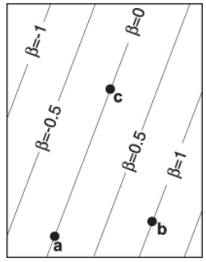

**图2.39**  重心坐标β是点a和c所在直线上的有向距离。


除法的存在可能会让我们担心，因为这会引入除以零的可能性，但是对于面积不接近零的三角形来说，这种情况不会发生。α和β也有类似的公式，但通常只需要一个：
$$
\beta=\frac{(y_a-y_c)x+(x_c-x_a)y+x_ay_c-x_cy_a}{(y_a-y_c)x_c+(x_c-x_a)y_c+x_ay_c-x_cy_a}
$$

$$
\alpha=1-\beta-\gamma
$$

计算重心坐标的另一种方法是计算子三角形的面积$A_a、A_b和A_c$，如图2.40所示。重心坐标遵守以下规则：

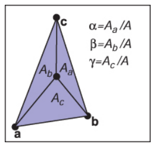

**图2.40** 重心坐标与三个子三角形的面积成比例。
$$
\alpha=\frac{A_a}{A}
$$

$$
\beta=\frac{A_b}{A}
$$

$$
\gamma=\frac{A_c}{A}
$$

其中A是三角形的面积。请注意，$A = A_a + A_b + A_c$，因此可以通过两次加法而不是完整的面积公式来计算。如果允许区域带符号，**则该规则仍适用于三角形外部的点**。其原因如图2.41所示。请注意，这些都是带符号的区域，并且只要对$A$和子三角形$A_a、A_b和A_c$使用相同的带符号区域计算即可正确计算。

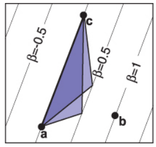

**图2.41** 所示两个三角形的面积均为底边乘以高度的一半，因此与任何一个顶点在$β = 0.5$线上的三角形相同。高度和面积与$β$成比例。

### 2.9.2 3D三角形

重心坐标的一个奇妙之处在于它们几乎可以透明地扩展到三维空间。如果我们假设点a、b和c是三维的，那么我们仍然可以使用这种表示方法。
$$
\mathrm{p}=(1-\beta-\gamma)\alpha+\beta\mathrm{b}+\gamma\mathrm{c}
$$
现在，当我们改变 $β和γ$ 时，相当于扫过一个平面。

三角形的法向量可以通过取三角形所在平面上任意两个向量的叉积来找到。最容易使用其中两条边作为这些向量，例如：
$$
\mathrm{n=(b-a)\times(c-a)}  \qquad\qquad(2.34)
$$
请注意，这个法向量不一定是单位长度的，并且它遵循叉积的右手规则。


**图2.42** 三角形的法向量垂直于三角形所在平面内的所有向量，因此也垂直于三角形的边。

三角形的面积可以通过取叉积长度来计算：
$$
\mathrm{Area=\frac{1}{2}||(b-a)\times(c-a)||}
$$
请注意，这不是一个有符号的面积，因此不能直接用于计算重心坐标。然而，我们可以观察到，“顺时针”顶点顺序的三角形法向量指向与“逆时针”顶点顺序相反方向的同一平面内三角形法向量。回想一下：
$$
\mathrm{a\cdot b=||a||\thinspace||b||\cos\phi}
$$
其中 ϕ 是向量之间的夹角。如果 a 和 b 平行，则 cos ϕ = ±1，这可以测试向量指向相同方向还是相反方向。结合公式 (2.33) - (2.35)，我们得到以下公式：
$$
\alpha=\frac{\mathbf{n}\cdot\mathbf{n}_a}{||\mathbf{n}||^2}
$$

$$
\beta=\frac{\mathbf{n}\cdot\mathbf{n}_b}{||\mathbf{n}||^2}
$$

$$
\gamma=\frac{\mathbf{n}\cdot\mathbf{n}_c}{||\mathbf{n}||^2}
$$

其中 $\mathbf{n}$ 是使用顶点 $a、b和c$ 计算的方程（2.34）；$\mathbf{n}_a$ 是使用顶点 $b、c和p$ 计算的方程（2.34），以此类推。
$$
\mathrm{n_\textit{a}=(c-b)\times(p-b)}
$$

$$
\mathrm{n_\textit{b}=(a-c)\times(p-c)}
$$

$$
\mathrm{n_\textit{c}=(b-a)\times(p-a)}
$$


## 2.10 离散概率

## 2.11 连续概率

## 2.12 蒙特卡罗积分 ★

第2.5节讨论了如何“读取”积分并将其抽象为一个“integrate()”函数。但是我们该如何实际实现这个函数呢？在图形学中，最常见的方法是使用蒙特卡罗积分。蒙特卡罗积分的代数通常很丑陋和令人生畏。但如果我们看一下这个函数：

```c
float shade = average(f(), hemisphere})
```

我们的直觉会找到正确答案。在半球上随机选取一堆点 `vi` 并评估 `f(vi)`，然后求平均值，例如：

```c
float sum = 0.0;
N = 10000; // or some other big number 
for (int i = 1 to N)
    vec3 v = random_point_on_hemisphere()
    sum = sum + f(v)
Average = sum/N
```

就是这么简单！现在你需要一个函数来在单位半球上随机选取点。最简单的方法是使用“拒绝法”，首先通过反复从单位立方体中均匀地选择三个随机数，以此在单位球内选择点：

```c
do
    X = random_from(-1, 1)
    Y = random_from(-1, 1)
    Z = random_from(-1, 1)
while (x*x + y*y + z*z > 1)
```

如果需要在半球中，则翻转Z轴：

```c
if (Z < 0)
    Z = -Z
```

接着，将该点投影到单位半球上：

```c
v = unit_vector(X, Y, Z)
```

这是处理平均值的一种方法。但对于一般积分呢？回想起：

```c
average(f(), domain) = integrate(f(), domain) / integrate(1, domain)
```

So：

```c
integrate(f(), domain()) = average(f(), domain) * integrate(1, domain)
```

对于半球体而言，`integrate(1,domain)`就是该区域的面积，即2π。

因此**蒙特卡罗积分通常是随机点的平均值乘以一个常数**（区域大小-长度、面积等）。 

### 2.12.1 重要性采样

当我们想要对一个具有高低值差异较大的函数进行随机平均时，集中样本在某些区域并使用权重来纠正不均匀性可能会对我们有利。**概率密度函数（PDF）**为此提供了正确的工具：如果我们知道样本的PDF，则可以直接衡量该区域的“过采样”程度。如果使用非均匀采样，则可以得到如下结果。

```c
integrate = average_of_nonuniform_samples(f()/p(), domain)
```

这个公式的一个好处是它也适用于均匀随机样本。在这种情况下，概率密度函数 `p() = 1/integrate(1, domain)`，因此“域”的“大小”被编码在概率密度函数中。

**对于任何给定的蒙特卡罗重要性采样问题，我们都会遵循一种相当公式化的方法：**

1. 确定函数`f()`和积分域（例如，单位球面上的点或三角形上的点）。
2. 选择一种在该域上生成随机样本`xi`的方法，并确保有一种评估每个样本PDF `p(xi)`的方法。
3. 对许多`xi`平均比率`f(xi)/p(xi)`。这是我们对积分的估计。

一个很棒的事情是，任何`p()`都可以使用，并且您将会收敛到正确的答案（但要注意，在`f()`非零的地方，`p()`必须也非零）。您使用哪个`p()`仅影响估计收敛的速度。因此，我们通常从一个恒定的`p()`开始调试我们的代码。

## 常见问题

- **为什么没有向量除法？**

  事实证明，对于向量来说，并不存在“好的”除法类比。然而，通过详细研究这个问题可以激发出四元数（请参阅本章注释中引用的霍夫曼的书）

  

- **是否有像重心坐标那样干净利落的多边形顶点坐标表示方法适用于三角形以外的多边形呢？**

  不幸的是，并没有。即使是凸四边形也要复杂得多。这就是为什么三角形在图形学中如此常见的几何原语之一。

  

- **3D线段有隐式表达方式吗？**

  并没有。但两个3D平面相交所定义出来的便是一个3D线段，因此一个3D线段可以由两个同时满足条件的隐式方程描述。


- **拟蒙特卡罗采样（QMC）或蓝噪声采样与蒙特卡罗采样有何关系？**

  蒙特卡罗核心思想在于你可以对大量“公正”的样本进行平均以估计真实平均值。其中，“公正”可从统计意义上加以解释。但某些样本集合即使不具备随机性也被证明是“公正”的。其中一种是拟蒙特卡罗，它们具有明显的确定性结构而非随机性，但在形式上是均匀的且不涉及统计意义。这些集合通常可以提高收敛速度而无需完全随机化。实际应用中，大多数技术都使用蒙特卡罗形式主义进行开发，因为其数学更易处理；然后，在代码中插入QMC或蓝噪声点，并以经验方式确认仅需要均匀性即可。\


## 注释

向量分析的历史非常有趣。它在19世纪中期主要由格拉斯曼发明，但后来被忽视和重新发明（克罗，1994）。现在，在几何代数领域，一些研究人员正在基于他的思想开发出基于几何代数的图形学（多兰和拉森比，2003）。对于那些想知道为什么特定的标量和向量积在某种意义上是正确的，并且为什么我们没有一个通用的向量除法的读者，在简洁易懂的《关于向量》（霍夫曼，1975）中可以找到答案。另一个重要的几何工具是四元数，在19世纪中期由哈密顿发明。四元数在许多情况下都很有用，尤其是涉及方位时（汉森，2005）。

## 练习题

1. 集合的基数是它包含的元素数量。在IEEE浮点表示（第1.5节）下，浮点数的基数是多少？
2. 是否可能实现一个将32位整数映射到64位整数并具有明确定义逆函数的函数？所有从32位整数到64位整数的函数都有明确定义的逆吗？
3. 用三个区间的笛卡尔积来指定单位立方体（x、y和z坐标都在0和1之间，包括0和1）。
4. 如果您可以访问自然对数函数ln(x)，请说明如何使用它来实现以b为底的log(b, x)函数。负b值应该怎么处理？假设采用IEEE浮点实现。
5. 解二次方程$2x^2+6x+4=0$。
6. 实现一个接受二次方程$Ax^2+Bx+C=0$系数$A、B和C$，并计算两个解答案的函数。使该函数返回有效（非NaN）解答案数量，并填写返回参数，使较小解答案排在前面。
7. 证明第17页上二次公式两种形式等价（假设精确算术），并说明如何选择每个根所需使用哪种形式，以避免减去近似相等而导致精度损失。

8. 举出反例说明对于三维向量 a、b 和 c，不总是成立$\mathrm{a × (b × c) = (a × b) × c} $。
9. 给定非平行的三维向量 a 和 b，计算一个右手正交基使得 u 平行于 a，v 在由 a 和 b 定义的平面内。
10. 求函数$ f(x, y, z) = x² + y - 3z³ $的梯度是多少？
11. 什么是轴对齐二维椭圆的参数形式？
12. 过三个三维点 (1,0,0)，(0,1,0) 和 (0,0,1) 的平面隐式方程是什么？它的参数方程是什么？这个平面的法向量是什么？
13. 给定四个二维点 $a₀、a₁、b₀ 和 b₁$，请设计一个稳健的过程来确定线段 $a₀a₁和 b₀b₁$是否相交。
14. 设计一个稳健的过程来计算与三个二维非共线点相关联的二维点的重心坐标。
15. 计算入门微积分中各种一元积分，并改变样本数量。当样本数量增加时答案收敛速度有多快?

# 3. 光栅图像

> Raster Images

大多数计算机图形图像都是在某种光栅显示器上呈现给用户的。光栅显示器将图像显示为像素的矩形阵列。一个常见的例子是平板电脑显示屏或电视，它具有小型发光像素的矩形阵列，可以单独设置不同颜色以创建任何所需的图像。通过混合红、绿和蓝三种颜色的不同强度来实现不同颜色。大多数打印机（如激光打印机和喷墨打印机）也是光栅设备。它们基于扫描：没有物理网格，但通过在网格上选择点沉积墨水来顺序地放置图像。

!> Pixel is short for “picture element.”

光栅在图像输入设备中也很常见。数码相机包含一个图像传感器，其中包括一组灵敏的像素，每个像素记录落在其上的光线颜色和强度。桌面扫描仪包含一个线性阵列的像素，该阵列横跨正在扫描的页面，每秒进行多次测量以生成一个像素网格。

!> 打印机中的颜色更加复杂，涉及至少四种颜料的混合。

由于光栅在设备中非常普遍，因此光栅图像是存储和处理图像的最常见方式。 光栅图像只是一个二维数组，用于存储每个像素的像素值 - 通常作为三个数字（红色、绿色和蓝色）存储的颜色。 存储在内存中的光栅图像可以通过使用存储图像中的每个像素来控制显示器上一个像素的颜色来显示。

!> 或许是因为光栅图像如此方便，所以光栅设备普及了。

但我们并不总是想以这种方式显示图像。我们可能想改变图像的大小或方向，纠正颜色，甚至在移动的三维表面上展示贴有图像。即使在电视中，显示器的像素数量也很少与正在显示的图像相同。诸如此类的考虑打破了图像像素和显示器像素之间的直接联系。最好将光栅图形视为要显示的理想图形的设备无关描述，并将显示设备视为逼近该理想图形的一种方式。

除了使用数组来描述图片外，还有其他描述图片的方法。矢量图片通过存储形状（由线条或曲线界定）区域的描述来进行描述，并没有参考任何特定象素网格。本质上，这相当于存储用于显示该图片而非需要用于其展示所需象素点信息指令集合。矢量图片主要优势在于它们具有分辨率无关性，并且可以在非常高分辨率设备上良好地展示出来；对应缺点则是必须先进行光栅化才能够被展示出来。通常情况下，在文本、流程图、机械制造等需要清晰度和精确度重要而又不需要摄影效果和复杂阴影的应用中使用矢量图像。

在本章中，我们讨论光栅图像和显示器的基础知识，特别关注标准显示器的非线性。当我们在后面的章节中讨论计算机图像时，了解图像中数字实际意义与像素值之间如何关联到光强度是很重要的。

!> 或者说：你必须知道图像中那些数字实际上代表什么。当我们在后面的章节讨论计算图像时，像素值与光强度相关的重要性需要牢记在心。

## 3.1 光栅设备

在讨论光栅图像的抽象概念之前，看一下使用这些图像的一些具体设备的基本操作是有益的。几个熟悉的光栅设备可以归类为一个简单层次结构：

**输出**

- 显示器

  * 透射式：液晶显示器（LCD）
  * 发射式：发光二极管（LED）显示器
  


**硬拷贝**

* Binary：喷墨打印机

* 连续色调：染料升华打印机

  

**输入** 

- 2D 数组传感器: 数码相机 
- 1D 数组传感器: 扫描仪

### 3.1.1 显示器

当前的显示器，包括电视、数字影院投影仪以及计算机的显示器和投影仪，几乎普遍采用固定像素阵列。它们可以分为发光显示器和透射式显示器两种类型。前者使用能够直接控制光强度的像素来发出光线；后者则是通过调节每个像素所能透过的光线量来实现图像变化。透射式显示器需要一个照明源才能使其工作：在直接观看的情况下，这通常是位于阵列背面的背光源；而在投影仪中，则需要一盏灯泡将经过阵列后产生反射效果的光线投射到屏幕上。而发光型显示器本身就是自己的照明源。

LED（发光二极管）显示屏就是一种发光型显示屏幕。每个像素由一个或多个LED组成，它们都是半导体设备（基于无机或有机半导体），根据通过它们流动电流大小来控制其亮度（见图3.1）。 

彩色显示器中的像素被分成三个独立控制的子像素，每个子像素都有自己的LED，使用不同材料制成，以发出不同颜色的光（图3.2）。当从远处观察显示器时，眼睛无法分离单个子像素，并且感知到的颜色是红色、绿色和蓝色混合而成。

液晶显示器（LCD）是透射型显示器的一个例子。液晶是一种材料，其分子结构使其能够旋转通过它传递的光线偏振度，并且旋转程度可以通过施加电压来调节。 LCD 像素（图3.3）后面有一层偏振膜，因此它受到极化光照明——让我们假设它是水平极化。

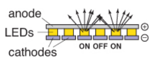

**图3.1** 发光二极管（LED）显示器的操作。

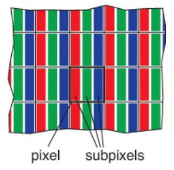

**图3.2** 平板显示器像素中的红色、绿色和蓝色子像素。

在像素前面的第二层偏振膜是定向传输只有垂直极化光。如果应用电压被设置为液晶层之间不改变极化，所有的光都会被阻挡，像素处于“关闭”（最小强度）状态。如果电压被设置为液晶旋转90°的极化，则从像素背面进入的所有光线将逃逸到前面，并且该像素完全“开启”-它具有最大强度。中间电压将部分旋转极化，使得前置偏振器部分阻止光线通过，在最小和最大之间产生亮度（图3.4）。与彩色LED显示器一样，彩色LCD在每个像素内具有红色、绿色和蓝色子像素，这些子像素是三个独立的带有红、绿和蓝色滤镜的像素。

任何具有固定像素网格的显示器或图象技术都基本上具有由网格大小决定的固定分辨率。对于显示器和图象来说，“分辨率”仅意味着像元网格尺寸：如果桌面监视器具有1920×1200个象元点，则表示它拥有2304000个按1920列和1200行排列的象元点。

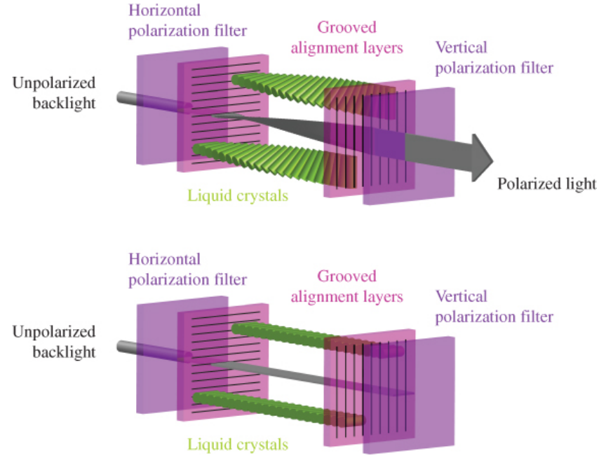

**图3.3** LCD显示器中一个像素的关闭状态（底部），其中前置偏振片阻挡了所有通过后置偏振片的光线，以及开启状态（顶部），其中液晶单元旋转了光线的极化方向，使其能够穿过前置偏振片。图片由Reinhard、Khan、Akyüz和Johnson（2008）提供。

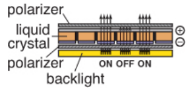

**图3.4** 液晶显示器（LCD）的工作原理。

!> 显示器的分辨率有时被称为“本机分辨率”，因为大多数显示器可以通过内置转换处理其他分辨率的图像。

需要使用第10章的方法，将分辨率不同的图像转换为1920×1200大小以填充屏幕。

### 3.1.2 硬拷贝设备

3.1.2 硬拷贝设备
将图像永久地记录在纸张上的过程与在显示器上短暂显示图像有非常不同的限制。在印刷中，颜料被分布在纸张或其他介质上，以便当光线从纸张反射时形成所需的图像。打印机是类似于显示器的栅格设备，但许多打印机只能打印二进制图像——每个网格位置要么沉积颜料，要么不沉积颜料，没有中间量可用。

喷墨打印机（图3.5）是通过扫描形成栅格图像的设备示例。喷墨头包含携带颜料的液体墨水，可以在电子控制下喷出非常小的滴落物。头部移动到纸张上，并且当它经过应该接收油墨的网格位置时发射滴落物；未发射任何油墨区域则保持空白。每次扫描后稍微推进一下纸张，并且然后放置下一个网格行。使用几个打印头进行彩色打印，每个都使用具有不同颜色颜料的油墨喷雾剂，在每个网格位置上可以接收任何不同颜色滴落物的组合。因为所有滴落物都是相同的，所以喷墨打印机打印二进制图像：在每个栅格点上，有一个滴落或没有滴落；没有中间阴影。

喷墨打印机没有物理像素阵列；分辨率取决于水滴大小和每次扫描后纸张前进的距离。许多喷墨打印机在打印头中有多个喷嘴，可以在一次通过中进行几次扫描，但最终确定行间距的是纸张前进而不是喷嘴间距。

热转印过程是连续色调印刷过程的一个例子，这意味着可以在每个像素上沉积不同数量的染料——与喷墨打印机不同（图3.6）。包含彩色染料的供体带被夹在纸张或染料接收器和一个包含线性加热元件阵列（对应图像中每一列像素）的打印头之间。当纸张和带子经过头部时，加热元件会开关以加热需要染料的区域，在这些区域内导致染料从带子扩散到纸张上。该过程针对数种颜色重复进行。由于更高温度会导致传输更多染料，因此可以控制沉积在每个网格位置处各种颜色染料量，从而产生连续范围内的颜色。打印头中加热元件的数量确定了页面横向上的固定分辨率，但沿页面方向上的分辨率取决于加热和冷却速度与纸张速度之间的比率。

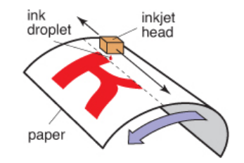

**图3.5** 喷墨打印机的操作。

!> 还有一种连续喷墨打印机，它在围绕旋转滚筒的纸张上以连续螺旋路径进行打印，而不是来回移动打印头。

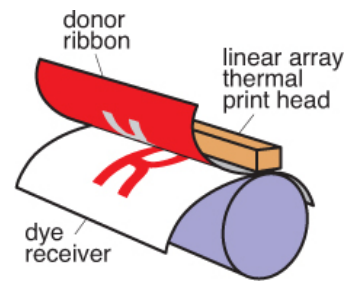

**图3.6** 热转印打印机的操作原理。

与显示器不同，打印机的分辨率是以像素密度而非总像素数来描述的。因此，一个热转印打印机，在其打印头上每英寸间隔300个元件，则横向每英寸有300个像素（ppi）。如果选择沿页面相同的分辨率，则可以简单地说该打印机的分辨率为300 ppi。喷墨打印机将点放置在每英寸1200个网格点组成的网格上，被描述为具有1200 dpi 的分辨率。由于喷墨打印机是二进制设备，它需要更细密的网格至少出于两个原因：一方面黑白之间存在着突然变化的棱角交错现象或者所谓锯齿状效应（见第9.3节），另一方面当连续色调图像被输出时，高精度则需要通过使用称作“线描”的变密度点阵模式进行中间颜色模拟。

!> “dpi”这个术语经常被用来表示“每英寸像素数”，但是应该在二进制设备中使用dpi，在连续色调设备中使用ppi。

### 3.1.3 输入设备

光栅图像必须来自某个地方，而任何不是由某种算法计算出的图像都必须由某种光栅输入设备测量得到，最常见的是相机或扫描仪。即使在渲染3D场景图像时，照片也经常用作纹理映射（参见第11章）。光栅输入设备必须为每个像素进行一次光度测量，并且（与输出设备一样）它们通常基于传感器阵列。

数字相机就是一个二维阵列输入设备的例子。相机中的图像传感器是带有灵敏光电元件网格的半导体装置。镜头将要拍摄的场景投影到传感器上，然后每个像素测量落在其上的能量，最终产生一个进入输出图像中的数字（如图3.7所示）。与彩色显示器使用红、绿和蓝亚像素类似，大多数彩色相机通过使用颜色滤波阵列或马赛克来让每个像素只看到红、绿或蓝色光线，在缺失值填补过程中留给图像处理软件完成这项工作称为去马赛克化（如图3.8所示）。

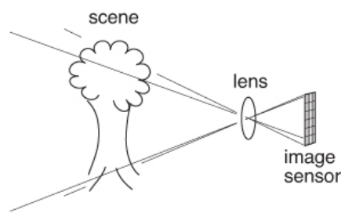

**图3.7** 数码相机的操作。

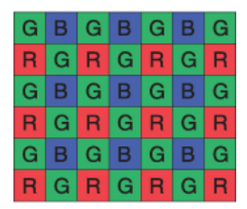

**图3.8 ** 大多数彩色数码相机使用类似于此处所示的Bayer马赛克的彩色滤波阵列。每个像素测量红、绿或蓝光。

其他相机使用三个独立的阵列或者三个独立的层来测量每个像素点的红、绿、蓝值，从而产生一个可用的彩色图像，无需进一步处理。相机的分辨率由阵列中固定数量的像素决定，并且通常使用总像素数进行报价：一个拥有3000列和2000行阵列的相机会产生一个分辨率为3000×2000（即600万像素） 的图像，被称为6百万像素（6MP）相机。需要记住，马赛克传感器不能测量完整彩色图像，因此与具有马赛克传感器但是测量同样数量象素点数目不同并能够进行独立红、绿、蓝颜色值测量记录更多关于图像信息。

!> 买相机的人通常使用`megabytes`表示$10^6$，而不是$2^{20}$

平板扫描仪还会为每个像素网格测量红、绿和蓝色值，但与热转印打印机类似，它使用一个一维阵列在被扫描的页面上进行横向移动，并且每秒进行多次测量（图3.9）。页面上的分辨率由阵列大小确定，而沿着页面的分辨率则取决于测量频率与扫描头移动速度之间的比较。彩色扫描仪具有$3×n_x$数组，其中$n_x$是页面上像素数，三行分别覆盖红、绿和蓝色滤光片。通过适当延迟三种颜色测量时间之间的差异，在每个网格点处可以进行三次独立的颜色测量。与连续调节打印机一样，扫描仪的分辨率以每英寸像素数（ppi）报告。

!> 扫描仪的分辨率有时被称为“光学分辨率”，因为大多数扫描仪可以通过内置转换产生其他分辨率的图像。

有了这些关于我们的图像来自何处以及它们将去哪里的具体信息，现在我们将更抽象地讨论图像，以便在图形算法中使用。

## 3.2 图像、像素和几何
我们知道，光栅图像是一个大的像素数组，每个像素存储有关其网格点处图像颜色的信息。我们已经看到各种输出设备如何处理我们发送给它们的图像以及输入设备如何从物理世界中由光形成的图像中获取它们。但是对于计算机中的计算，我们需要一个方便的抽象，独立于任何设备的具体细节，可以用来推断如何生成或解释存储在图像中的值。

当我们测量或再现图像时，它们采取光能的二维分布形式：显示器上发射的光作为显示面位置的函数；相机图像传感器上落在平面各个位置处的光；纸张表面反射（与吸收相对）的光比例作为其位置函数。因此，在物理世界中，图像是定义在二维区域上的函数——几乎总是矩形。因此，我们可以将一个图像抽象成一个函数。
$$
I(x,y):R\rightarrow V
$$
$R ⊂ ℝ2$ ，是一个矩形区域，$V$ 是可能的像素值集合。最简单的情况是理想化的灰度图像，在这种情况下，矩形中的每个点只有亮度（没有颜色），我们可以说 $V = ℝ+$（非负实数）。理想化的彩色图像在每个像素处具有红、绿和蓝三种颜色值，因此 $V = (ℝ+)3$。我们将在下一节讨论 $V$ 的其他可能性。

!> 有没有非矩形的光栅设备？

光栅图像与连续图像的抽象概念有何关联？具体来看，相机或扫描仪中的像素是对其周围一小区域内图像平均颜色的测量。显示器上的像素由红、绿和蓝三个子像素组成，旨在通过光栅图像中相应的像素值控制该面积内图像的平均颜色。在这两种情况下，像素值都是图像颜色局部平均值，并被称为该图像点采样。换句话说，在一个象元中找到数值x时，它意味着“此网格点附近区域内的图形价值为x”。有关将图片视为函数采样表示进一步探讨，请参阅第10章。

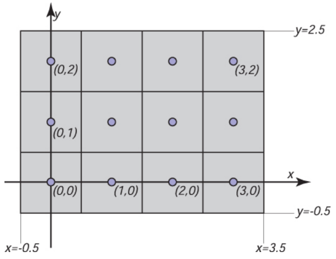

**图3.10** 四像素×三像素屏幕的坐标。请注意，在某些API中，y轴会指向下方。

一个平凡但重要的问题是像素在二维空间中的位置。**这只是一种约定，但建立一致的约定非常重要！**在本书中，光栅图像由表示像素列（i）和行（j）的对(i, j)索引。如果一个图像有nx列和ny行像素，则左下角像素为(0, 0)，右上角为$(n_{x} – 1, n_{y} – 1$)。我们需要2D实屏幕坐标来指定像素位置。我们将把像素采样点放置在整数坐标处，如图3.10所示的4×3屏幕。

!> 在一些API和许多文件格式中，图像的行是从上到下组织的，因此(0, 0)位于左上角。这是出于历史原因：模拟电视传输中的行从顶部开始。

!> 一些系统会将坐标向上或向下移动半个像素，以便将采样点放置在整数之间的中心位置，但是图像的边缘仍然保持在整数处。

图像的矩形区域宽度为$n_x$，高度为$n_y$，并且居中于此网格上，这意味着其每侧都延伸半个像素超出最后一个采样点。因此，一张$n_x×n_y$的图像的矩形区域是：
$$
R-[-0.5, n_x-0.5]\times[0.5, n_y-0.5]
$$
这些坐标只是约定俗成，但在实现相机和视图变换时记住它们将非常重要。

### 3.2.1 像素值
到目前为止，我们已经用实数描述了像素的值，表示图像中某一点的强度（可能分别对应红、绿和蓝色）。这表明图像应该是浮点数数组，每个像素存储一个或三个32位浮点数（用于灰度或黑白图像或RGB彩色图像）。当需要其精度和取值范围时，有时会使用此格式。但由于图片具有大量的像素，并且存储和传输图片所需的内存和带宽通常很少，因此不建议使用。仅一张1000万像素的照片就会消耗约115 MB 的RAM。

!> 为什么是115 MB而不是120 MB？

对于直接显示的图像，需要较小的范围。虽然原则上可能存在无限制的光强度范围，但任何设备都有明显有限的最大强度，在许多情况下，像素具有有界范围通常足以简单地取为[0,1]。例如，在8位图像中可能出现的值是0、1/255、2/255...、254/255和1。存储浮点数值并允许广泛数值范围的图像通常称为高动态范围（HDR）图像，以区别于使用整数存储且具有固定范围或低动态范围（LDR）图像。请参见第20章，深入探讨了高动态范围图像技术和应用。

!> 255的分母比256尴尬，但能够准确表示0和1很重要。

以下是一些常见的像素格式及其应用：

- 1位灰度图像——适用于不需要中间灰度的文本和其他图像（需要高分辨率）；
- 8位RGB固定范围彩色（每个像素总共24位）——适用于网络和电子邮件应用、消费者照片；
- 8或10位固定范围RGB（每个像素24-30位）——数字接口到计算机显示器；
- 12至14位固定范围RGB（每个像素36-42位）——专业摄影的原始相机图像；
- 16位固定范围RGB（每个像素48位）——专业摄影和打印；是处理固定范围图像的中间格式；
- 16  为半精度浮点数RGB —— HDR 图片；实时渲染的中间格式;
- 32  为浮点数 RGB —— 软件渲染和处理HDR图片通用的中间格式。

减少用于存储每个像素的位数会导致图像中出现两种不同类型的人工引入缺陷或瑕疵。首先，使用固定范围值对图像进行编码会在将本应比最大值更亮的像素设置为最大可表示值时产生剪切或裁剪。例如，阳光明媚的场景照片可能包括比白色表面更亮的反射；当将图像转换为固定范围以显示时，这些反射将被裁剪（即使它们是由相机测量得到）。其次，使用有限精度对图像进行编码会导致量化伪影或带状畸变，在需要将像素值四舍五入到最近可表示值时引入可见强度或颜色跳跃。带状畸变在动画和视频中特别隐蔽，在静止图像中可能不太明显，但在前后移动时非常明显。

### 3.2.2 显示器亮度和伽马值
所有现代显示器都采用数字输入来表示像素的“值”，并将其转换为亮度级别。实际上，当显示器关闭时，它们仍会有一些非零的亮度，因为屏幕反射了一些光线。对于我们的目的而言，我们可以认为这是“黑色”的，并且完全打开时是“白色”的。我们假设像素颜色具有从零到一的数值描述。黑色是零，白色是一，在黑与白之间半途而废的灰色是0.5。请注意，“半途”指的是来自像素物理量方面发出光线数量相等，而不是外观上看起来如此。“强度”的人类感知呈非线性状态，并不在本文讨论范围内；更多信息请参见第19章。

要正确地在监视器上生成图像必须理解两个关键问题。首先，监视器对输入信号呈非线性响应特征。例如：如果您给一个显示器三个像素点分别输入 0、0.5 和 1.0，则所显示出来的强度可能分别为 0、0.25 和 1（关闭、四分之一打开和完全打开）。**作为该非线性特征的近似表征，监视器通常由一个γ（“伽马”）值来描述。**该值是公式中的自由度。
$$
\mathrm{display\thinspace intensity}=\mathrm{(maximum\thinspace intensity)}a^{\gamma}
$$
其中a是输入像素值，介于零和一之间。例如，**如果显示器的伽马值为2.0，并且我们输入a = 0.5，则显示的强度将是最大可能强度的四分之一**，因为$0.5^2 = 0.25$。请注意，a = 0映射到零强度，而a = 1则映射到最大强度，无论$γ$ 的值如何。使用$γ$ 描述显示器的非线性仅是一个近似；在估计设备的γ时不需要太高精确度。评估非线性程度的一个好方法是找出哪个a值给出黑色和白色中间亮度的一半。这个a是
$$
0.5=a^{\gamma}
$$
如果我们能找到$a$，那么通过两边取对数，我们就可以推导出$γ$：
$$
\gamma=\frac{\ln 0.5}{\ln{a}}
$$
我们可以通过一种标准技术来找到这个值，即在一个灰色像素的正方形旁边显示黑白相间的棋盘格图案，并输入a（如图3.11所示），然后要求用户调整a（例如使用滑块）直到两侧的平均亮度匹配。当您从远处观察此图像时（或者如果您近视，则不戴眼镜），当a产生介于黑色和白色之间强度的颜色时，图像的两侧看起来大致相同。这是因为模糊的棋盘格混合了偶数个白色和黑色像素，因此总体效果是介于白色和黑色之间一种均匀颜色。一旦我们知道$γ$，就可以对输入进行伽马校正，以使$a = 0.5$ 的值显示出介于黑与白之间强度的颜色。这是通过以下转换完成：
$$
a'=a^{\frac{1}{\gamma}}
$$
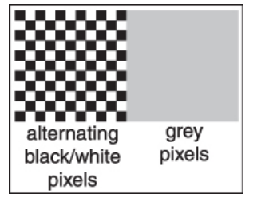

**图3.11** 从远处观察的交替黑白像素位于黑色和白色之间。可以通过找到一个灰度值，其强度与黑白图案相同来推断显示器的伽马值。

!> 对于具有模拟接口的显示器，沿水平方向难以快速改变亮度的情况下，水平黑白条纹比棋盘格更有效。

当这个公式代入方程中时，我们得到
$$
\mathrm{display\thinspace intensity}=(a')^{\gamma}=(a^{\frac{1}{\gamma}})^{\gamma}\mathrm{(maximum\thinspace intensity)}=a\mathrm{(maximum\thinspace intensity)}
$$
真实显示器的另一个重要特征是它们采用量化输入值。因此，虽然我们可以在浮点范围[0, 1]内操作强度，但监视器的详细输入是固定大小的整数。这个整数最常见的范围是0-255，可以保存在8位存储器中。这意味着a的可能值不是[0, 1]中的任何数字，而是
$$
\mathrm{Possible\thinspace values\thinspace for \thinspace \textit a=\{\frac{0}{255},\frac{1}{255},\frac{2}{255},...,\frac{254}{255},\frac{255}{255}\}}
$$
这意味着可能显示的强度值大约为
$$
\{M(\frac{0}{255})^{\gamma},M(\frac{1}{255})^{\gamma},M(\frac{2}{255})^{\gamma},...,M(\frac{254}{255})^{\gamma},M(\frac{255}{255})^{\gamma}\}
$$
其中M是最大强度。在需要精确控制强度的应用中，我们必须实际测量256种可能的强度，而这些强度在屏幕上不同点上可能会有所不同，特别是对于CRT来说。它们也可能随着观看角度而变化。

## 3.3 颜色

大多数计算机图形图像都是以红绿蓝（RGB）颜色定义的。 RGB颜色是一个简单的空间，允许直接转换为大多数计算机屏幕的控制。在本节中，将从用户角度讨论RGB颜色，并以操作便利性为目标。有关颜色的更全面讨论请参见第18章，但是RGB颜色空间的机制将使我们能够编写大多数图形程序。 RGB颜色空间的基本思想是通过混合三种原始光来显示彩色：一种红光、一种绿光和一种蓝光。这些光照以加法方式混合。

!> 在小学时，你可能学过三原色是红、黄和蓝，例如：黄 + 蓝 = 绿。这是**减法混合颜色**，**与显示器中发生的更为熟悉的加法混合根本不同**。

在RGB加色混合中，我们有（图3.12）

红色 + 绿色 = 黄色，
绿色 + 蓝色 = 青色，
蓝色 + 红色 = 洋红，
红色 + 绿色 + 蓝色 = 白色。

“青色”是一种蓝绿色，而“洋红色”则是紫色。

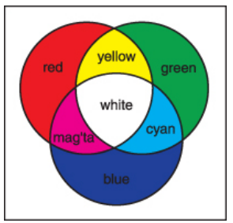

**图3.12** 红/绿/蓝三原色的加法混合规则。

如果我们可以将主要灯光从完全关闭（像素值为0）调暗到完全打开（像素值为1），那么我们就可以创建在RGB显示器上显示的所有颜色。**红、绿和蓝像素值构成了一个三维RGB彩色立方体，具有红、绿和蓝轴。**轴的可接受坐标范围从零到一。该彩色立方体在图3.13中以图形方式显示。

该立方体角落处的颜色是

黑色 = (0, 0, 0),
红色 = (1, 0, 0),
绿色 = (0, 1, 0),
蓝色 = (0, 0, 1),
黄色 = (1, 1, 0),
洋红色 = (1，0，1),
青色 =（0，1，1），
白色=（1，1，1）。

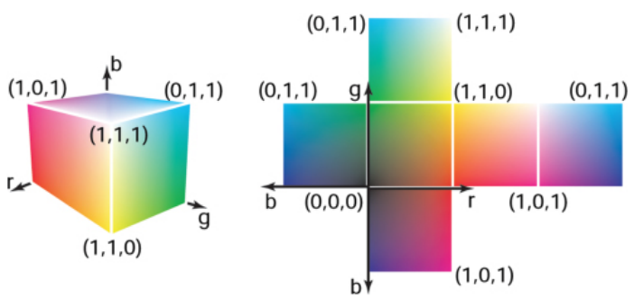

**图3.13** 三维RGB颜色立方体及其展开的面。任何RGB颜色都是该立方体中的一个点。

实际的RGB级别通常以量化形式给出，就像第3.2.2节中讨论的灰度一样。每个分量都用整数指定。这些整数最常见的大小是一个字节，因此三个RGB分量都是介于0和255之间的整数。三个整数加在一起占用了三个字节，即24位。因此，“24位彩色”系统对于每种原色有256种可能级别。第3.2.2节中讨论的伽马校正问题也适用于每个RGB分量。

## 3.4 Alpha合成

通常，我们希望只部分覆盖像素的内容。一个常见的例子是在合成中，我们有一个背景并想要插入前景图像。对于不透明的前景像素，我们只需替换背景像素。对于完全透明的前景像素，则不更改背景像素。对于部分透明的像素，则需要注意一些事项。当前景对象具有部分透明区域（例如玻璃）时，可能会出现部分透明像素。但是，在前景对象仅在某些位置（如边缘或远处树叶之间存在亚像素空洞时），必须混合前景和背景。

将前置物体与后置物体混合最重要的信息是覆盖率(pixel coverage)，它告诉我们由前置层覆盖了多少比例的该点位图元(pixel) 。 我们可以称这个比例为α. 如果我们想将一个半径为cf 的颜色复合到cb 的颜色上，并且被覆盖面积占整个位图元(alpha), 那么就可以使用以下公式：
$$
\mathrm{c}=\alpha \mathrm{c_f}+(1-\alpha)\mathrm{c_b} \qquad \qquad (3.2)
$$
对于不透明的前景层，其解释是前景对象覆盖像素矩形内的α区域，而背景对象则覆盖剩余区域（即1-α）。对于透明层（可以想象成在玻璃或轮廓纸上使用半透明颜料绘制的图像），其解释是前景层阻挡了从背景穿过来的光线中比例为(1-α) 的部分，并贡献出自己颜色的比例 α 来替换被移除掉的部分。方程式 (3.2) 的应用示例如图 3.14 所示。

一张图像中所有像素的α值可以存储在一个单独的灰度图像中，这个图像被称为alpha掩模或透明度掩模。或者信息可以作为RGB图像中的第四个通道存储，此时它被称为**alpha通道**，并且该图像可以被称为**RGBA图像**。对于8位图像，每个像素占用32位，这是许多计算机体系结构中方便大小的块。

!> 由于前景层和背景层的权重加起来为1，如果前景层和背景层颜色相同，则颜色不会改变。

尽管通常使用的是公式（3.2），但在许多情况下，α的使用方式不同（Porter＆Duff，1984年）。

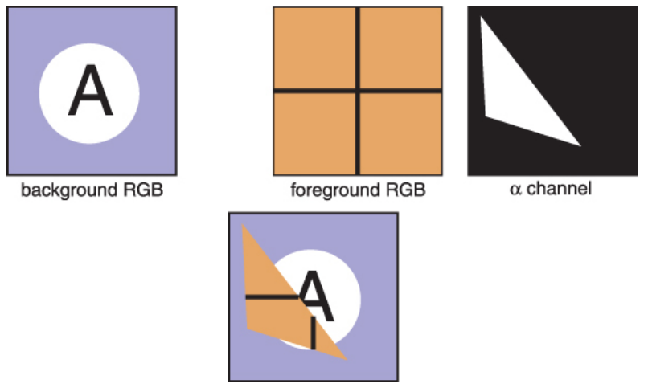

**图3.14** 使用公式（3.2）进行合成的示例。在将前景图像放置在背景图像上方之前，实际上通过α通道对其进行了裁剪。最终的合成结果显示在底部。

### 3.4.1 图像存储

大多数RGB图像格式每个红色、绿色和蓝色通道使用8位。这导致单个百万像素图像的原始信息约为3兆字节。为了减少存储需求，大多数图像格式都允许某种形式的压缩。在高层次上，这种压缩是无损或有损的。无损压缩不会丢失任何信息，而有损系统中会永久性地丢失一些信息。流行的图像存储格式包括：

- **jpeg**. 这种有损格式基于人类视觉系统中的阈值来**压缩图像块**。对自然图片效果很好。
- **tiff**. 这种格式最常用于保存二进制图像或**无损**压缩8位或16位RGB，尽管还存在许多其他选项。
- **ppm**. 这种非常简单的**无损、未经压缩**的格式最常用于8位RGB图像，尽管还存在许多其他选项。
- **png**. 这是一组具有良好开源管理工具集合的**无损格式**。

由于压缩和变体，编写图像的输入/输出例程可能会很复杂。幸运的是，通常可以依靠库例程来读取和写入标准文件格式。对于快速而简单的应用程序，其中简单性高于效率，则可以选择使用原始ppm文件，这些文件通常可以通过将存储在内存中的图像数组转储到文件并添加适当的标题来轻松编写。

## 常见问题

- **为什么他们不直接把显示器做成线性的，避免所有这些伽马问题呢？**

  理想情况下，一个显示器的256个可能强度应该是均匀分布的，而不是在能量上线性分布。因为人类对强度的感知本身就是非线性的，在1.5到3之间选择一个伽马值（取决于观察条件），可以使得强度在主观意义上近似均匀。从这个角度来看，伽马就是一种特征。否则，制造商会让显示器保持线性。

## 练习

1. 模拟从 Bayer 马赛克获取的图像，方法是使用自然图像（最好是扫描照片而不是数字照片，因为数字照片可能已经应用了 Bayer 马赛克）并创建由交错的红/绿/蓝通道组成的灰度图像。这模拟了数码相机的原始输出。现在从该输出创建真正的 RGB 图像，并与原始图像进行比较。

# 4. 光线追踪

计算机图形学的基本任务之一是渲染三维对象：将由许多几何对象组成的场景排列在三维空间中，并计算出一个二维图像，显示从特定视点观察到的对象。这与建筑师和工程师创建图纸以向他人传达设计方案所做的操作相同。

从根本上讲，**渲染是一个将一组物体作为输入并产生一组像素作为输出的过程**。无论如何，渲染都涉及考虑每个物体对每个像素的贡献，并且可以按**两种通用方式**进行组织。

- 在物体顺序渲染中，依次考虑每个物体，并找到并更新它影响到的所有像素。
- 在图像顺序渲染中，则依次考虑每个像素，并找到影响它们的所有物体并计算出该像素值。

您可以通过循环嵌套来思考差异：在图像顺序渲染中，“对于每个像素”的循环位于外部；而在物体顺序渲染中，“对于每个对象”的循环位于外部。

!> 如果输出是矢量图像而不是光栅图像，则渲染过程不必涉及像素，但在本书中我们将假定使用的是光栅图像。

图像顺序渲染器和对象顺序渲染器可以计算完全相同的图像，但它们适用于计算不同类型的效果，并具有非常不同的性能特征。在我们讨论了两种方法之后，我们将在第9章中探讨这些方法的比较优势，但总体而言，图像顺序渲染更容易实现并且可以产生更灵活的效果，并且通常（虽然不总是）需要更多执行时间才能生成可比较的图像。

!> 在光线追踪器中，计算准确的阴影和反射很容易，而在对象顺序框架中则很麻烦。

光线追踪是一种用于制作3D场景渲染的图像排序算法，我们首先考虑它，因为可以在不开发任何用于对象排序渲染的数学机器情况下使光线追踪器工作。

## 4.1 基本的光线追踪算法
光线追踪器通过逐个计算像素来工作，对于每个像素，基本任务是找到在图像中该像素位置可见的物体。每个像素“看”向不同方向，并且任何被一个像素看到的物体必须与视线相交，即从视点沿着该像素所朝向的方向发出的一条直线。我们想要找到特定对象是与最靠近摄影机的视线相交的那一个对象，因为它会挡住其后面所有其他物体。**一旦找到了该对象**，**则使用交点、表面法线和其他信息（取决于所需渲染类型）进行阴影计算以确定像素颜色**。这在图4.1中显示，在此图中射线穿过两个三角形，但只有第一个三角形T2被着色。

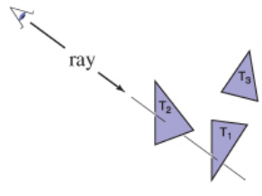

**图4.1** 光线被“追踪”到场景中，第一个被撞击的物体是通过像素看到的物体。在这种情况下，三角形T2会被返回。

**一个基本的光线追踪器通常由三个部分组成：**

1. 光线生成，根据相机几何形状计算每个像素视线射线的起点和方向；
2. 光线交叉，找到与视线射线最近的相交物体；
3. 着色，根据光线交叉结果计算像素颜色。

基本光线追踪程序的结构为：

```c
for each pixel
    do 计算 viewing ray and
    找到第一个碰撞对象的表面 法线 n
    根据碰撞点、光线、 和法线n的计算来 设置像素颜色
```

本章介绍了光线生成、光线相交和着色的基本方法，足以实现简单演示射线追踪器。要实现一个真正有用的系统，需要添加第12章中更高效的光线相交技术，并通过第14章中更先进的渲染技术展现射线追踪器的真正潜力。

## 4.2 透视

在计算机出现之前，艺术家们就已经研究了用二维图画或绘画来表现三维物体或场景的问题。摄影也是用二维图像来表现三维场景的。虽然有许多非传统的制作图像的方法，从立体主义绘画到鱼眼镜头（如图4.2所示）再到周边相机，但无论是艺术、摄影还是计算机图形学都采用线性透视法作为标准方法，在这种方法中，将三维物体投射到一个平面上，使得场景中的直线成为图像中的直线。

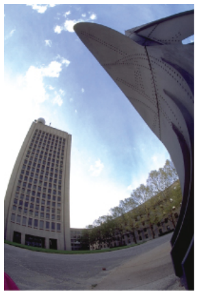

**图4.2** 使用鱼眼镜头拍摄的图像不是线性透视图像。照片由菲利普·格林斯潘提供。

最简单的投影类型是平行投影，其中通过沿着投影方向将3D点移动到它们撞击图像平面（图4.3-4.4），从而将其映射到2D。所产生的视图取决于选择的投影方向和图像平面。如果图像平面垂直于视角方向，则称为正交投影；否则称为斜投影。

!> 有些书籍将“正交投影”保留给与坐标轴平行的投影方向。

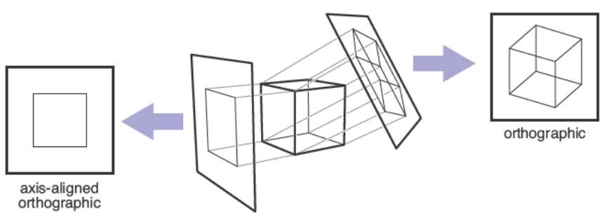

**图4.3** 当投影线平行且垂直于图像平面时，所得到的视图称为正交视图。

平行投影通常用于机械和建筑图纸，因为它们保持平行线的平行性，并保留与图像平面平行的平面对象的大小和形状。

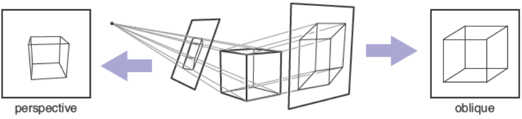

**图4.4** 将图像平面置于投影方向的角度上的平行投影称为斜投影（右）。在透视投影中，所有的投影线都通过视点而不是平行（左）。所示的透视图是非斜率的，因为通过图像中心绘制的投影线垂直于图像平面。

平行投影的优点也是它的局限性。在我们日常经验中（甚至在照片中），随着物体远离视线，它们看起来越来越小，因此，向远处收敛的平行线不会呈现出平行状态。这是因为眼睛和相机不能从单一的观察方向收集光线；它们只能收集通过特定视点穿过的光线。正如文艺复兴时期以来艺术家所认识到的那样，我们可以使用透视投影产生自然而然的景象：我们只需沿着通过单个点（即视点）传递的直线进行投影，而不是沿着平行线进行投影（图4.4）。通过这种方式，更远离视点的物体在被投射时自然变得更小。透视图由选择观察角度（而非投影方向）和图像面确定。与平行视图一样，在透视图中也有斜交和非斜交两种类型；区别基于图片中心处所选取之投影方向。

你可能已经了解到三点透視法等手工构建透視圖形式化方法(Figure 4.5) 。关于透視法令人惊讶地事实是：如果遵循潜在的简单数学规则，即物体直接向眼睛投影，并且它们被绘制在眼前的视平面上相遇处，则所有透視图形式化方法都将自动遵循。

## 4.3 计算视线射线

从前面的部分可以知道，光线生成的基本工具是视点（或平行视图的视线方向）和图像平面。有许多方法可以解决相机几何细节问题；在本节中，我们将介绍一种基于正交基底的方法，支持法线、斜向并行和正交视图。

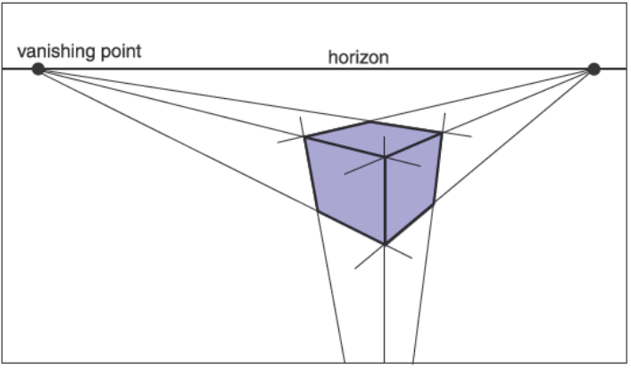

**图4.5** 在三点透视中，艺术家选择“消失点”，使平行线相交。水平的平行线会在地平线上相遇。每组平行线都有自己的消失点。如果我们根据正确的几何原理实现透视，则这些规则将自动遵循。

为了生成光线，我们首先需要一个光线的数学表示。一条光线实际上只有一个起点和传播方向；3D参数化直线非常适合这个目的。正如第2.7.7节所讨论的那样，从眼睛e穿过图像平面上一点s（图4.6）的3D参数化直线可以表示为：
$$
\mathrm{p}(t)=\mathrm{e}+t\mathrm{(s-e)}
$$
这应该被解释为：“我们沿着向量$\mathbf{(s-e)}
$以分数距离$t$从$\mathbf{e}$前进，找到点$\mathbf{p}$。”因此，给定 $t$，我们可以确定一个点$\mathrm{p}$。点$\mathbf{e}$是射线的起点，$\mathbf{(s-e)}
$是射线的方向。

请注意，$\mathrm{(0)= e}$，并且 $\mathrm{p(1)= s}$, 更一般地说，如果$ 0 < t_1 < t_2$，则 $\mathbf{p}(t_1)$比 $\mathbf{p}(t_2)$更靠近眼睛。另外，如果$t<0$，则$p(t)$在“眼睛后面”。当我们搜索不在眼睛后面的射线击中的最近物体时，这些事实将非常有用。

!> 注意：我们正在重载变量 $t$，它是射线参数和图像顶部边缘的v坐标。

光线通常使用某种结构或对象来示其位置和方向。例如，在面向对象的程序中，我们可以编写：

```c++
class Ray:
    Vec3 o | ray origin
    Vec3 d | ray direction
    Vec3 evaluate(real t)
    return o + td
```

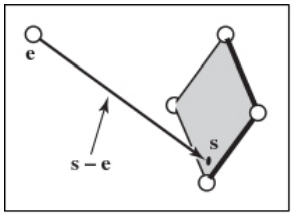

**图4.6** 眼睛到图像平面上一点的光线。

我们假设有一个类Vec3，表示三维向量并支持通常的算术运算。

为了计算视线光线，我们需要知道e（已知）和s。找到s可能看起来很困难，但如果我们在正确的坐标系中看问题，实际上是很简单的。

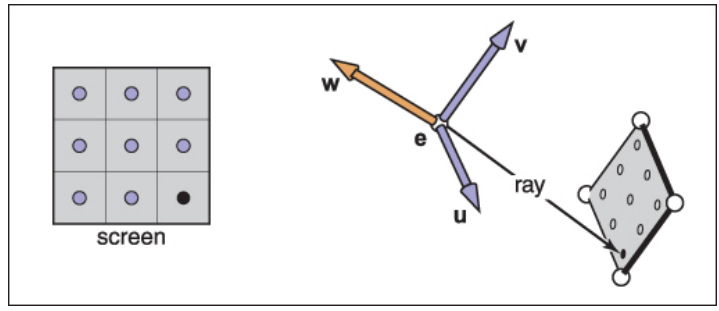

**图4.7** 屏幕上的采样点被映射到3D窗口中的类似数组。每个位置都发送一个视线。

我们所有的光线生成方法都始于一个正交坐标系，称为相**机坐标系**（图4.7），我们用**e**表示眼点或视点，**u、v和w**表示三个基向量，组织方式是**u**指向右侧（从相机的视角看），**v**指向上方，**w**指向后方。因此**{u, v, w}**形成了一个**右手坐标系**。构建相机框架最常见的方法是从视点开始，它变成了e；观察方向是-w；而上矢量则用于构建具有v和w在由观察方向和上方向定义的平面中的基础，并使用2.4.7节描述的从两个矢量构造正交基础过程（图4.8）。

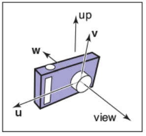

**图4.8** 相机坐标系的向量，包括视线方向和上方向。w 向量与视线相反，v 向量与 w 和上方向共面。

### 4.3.1 正交视图

对于正交视图，所有的光线方向都是-w。虽然平行视图没有固定的观察点，但我们仍然可以使用相机框架的原点来定义光线起始的平面，以便物体可以在相机后面。

观看射线应该从由点e和向量u和v定义的平面开始；唯一需要确定的信息是图像应该位于平面上哪个位置。我们将用四个数字来定义图像尺寸：l和r分别表示从e沿着u方向测量得到的图像左边缘和右边缘位置；b和t分别表示从e沿着v方向测量得到的底部和顶部边缘位置。通常情况下，l < 0 < r且b < 0 < t。（见Figure4.9a）。

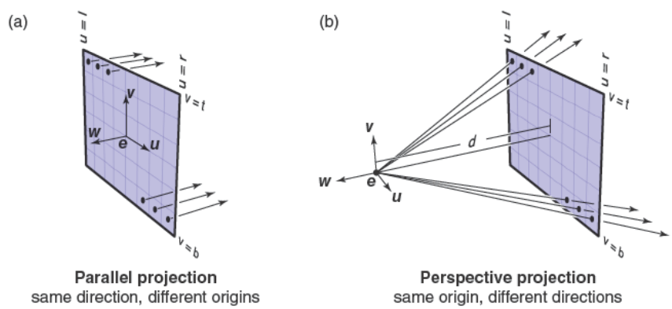

**图4.9** 使用相机框架生成光线。**(a)** 在**正交视图**中，光线从图像平面上的像素位置开始，并且所有光线共享相同方向，即与视角方向相等。**(b)** 在**透视视图**中，光线从观察点开始，每条光线的方向由通过观察点e和图像平面上像素位置的直线定义。

从无限远处开始的正交视图线看起来似乎很合理，但是这样就不可能制作室内物体的正交视图。

在第3.2节中，我们讨论了图像中的像素坐标。为了将一个$n_x×n_y$像素的图像适配到大小为$(r-l)×(t-b)$的矩形中，水平方向上相邻两个像素之间距离为$(r-l)/n_x$，垂直方向上相邻两个像素之间距离为$(t-b)/n_y$，并且在边缘周围留有半个像素空间以使得整个像素网格居中于图像矩形内部。这意味着光栅图象中位置$(i,j)$处的像素具有以下位置：
$$
u=l+(r-l)(i+0.5)/n_x, \\
v=b+(t-b)(j+0.5)/n_y, \\(4.1)
$$
!> 许多系统假设 $l = -r 且 b = -t$，因此只需要宽度和高度。

其中 (u, v) 是像素在图像平面上相对于原点 e 和基向量 {u, v} 的坐标。

!> 当$l和r$ 都被指定时，存在冗余：将视点稍微向右移动并相应地减小 $l和r$ 不会改变视图（在v轴上同样如此）。

在正交视图中，我们可以简单地使用像素的图像平面位置作为射线的起点，并且我们已经知道射线的方向是视线方向。生成正交视图射线的过程如下：

- 使用4.1的公式计算u和v
- 光线原点**ray.o** ：$\mathbf{e}+u\mathbf{u}+v\mathbf{v}$
- 光线方向**ray.d** ：$\mathbf{-w}$

制作斜视图非常简单：只需将图像平面法线w与视角方向d分别指定即可。然后，过程完全相同，但用-d代替d。当然，仍然使用w构造u和v。

### 4.3.2 透视图
对于透视图，所有光线都有相同的起点，在观察点处；每个像素的方向不同。图像平面不再位于 e 处，而是在其前方一定距离 d 处；这个距离被称为图像平面距离，通常松散地称为焦距，因为选择 d 扮演了真实相机中选择焦距的角色。

每条光线的方向由观察点和图像平面上像素的位置定义。该情况如图 4.9 所示，并且得到的过程类似于正交投影：

- 使用4.1的公式计算u和v
- 光线原点**ray.o** ：$\mathbf{e}$
- 光线方向**ray.d** ：$-d\mathbf{w}+u\mathbf{u}+v\mathbf{v}$

与平行投影类似，通过单独指定图像平面法线和投影方向可以实现斜透视视图。

## 4.4 光线与物体的相交
一旦我们生成了光线 e + td，接下来我们需要找到第一个 $t > 0$ 的任何对象的相交点。在实践中，解决一个稍微更一般化的问题会很有用：找到射线和表面之间在区间 $[t_0, t_1]$ 中出现的第一个相交点。基本光线相交是当 $t_0 = 0 $并且 $t_1 = +∞$ 的情况。我们为球体和三角形都解决了这个问题。在下一节中，将讨论多个对象。

### 4.4.1 光线-球体相交
给定一条光线 $\mathbf{p}(t) = \mathbf{e} + t\mathbf{d} $和一个隐式表面 $f(\mathbf{p}) = 0$（参见2.7.3节），我们想知道它们相交的位置。当射线上的点满足隐式方程时，就会出现相交点，因此我们要寻找解方程的 $t$ 值。
$$
f(\mathrm{p}(t))=0 \quad \text { or } \quad f(e+t \mathrm{~d})=0
$$
一个以中心点 $c = (x_c, y_c, z_c)$ 为球心，半径为 $R$ 的球体可以用隐式方程表示。
$$
(x-x_c)^2+(y-y_c)^2+(z-z_c)^2-R^2=0.
$$
我们可以用向量形式写出同样的方程：
$$
\mathrm{(p-c)\cdot(p-c)}-R^2=0
$$
满足此方程的任何点p都在球体上。如果我们将射线p(t) = e + td中的点代入此方程，我们得到一个关于t的方程，该方程由产生落在球体上的点所需的t值满足：
$$
(\mathrm{e}+t \mathrm{~d}-\mathrm{c}) \cdot(\mathrm{e}+t \mathrm{~d}-\mathrm{c})-R^2=0
$$
重新排列项可得
$$
(\mathrm{d} \cdot \mathrm{d}) t^2+2 \mathrm{~d} \cdot(\mathrm{e}-\mathrm{c}) t+(\mathrm{e}-\mathrm{c}) \cdot(\mathrm{e}-\mathrm{c})-R^2=0
$$
在这里，除了参数t之外，一切都是已知的。因此，这是一个经典的二次方程，意味着它具有以下形式：
$$
A t^2 + Bt + C = 0
$$
这个方程的解在第2.2节中讨论。二次方程解中平方根符号下的项$B^2-4AC$被称为判别式，它告诉我们有多少个实数解。如果判别式是负数，则其平方根是虚数，直线和球不相交。如果判别式为正，则有两个解：一个解使光线进入球体，另一个使光线离开球体。如果判别式为零，则射线擦过球面，在恰好一个点处接触它。将实际术语代入球体并消去因子二，我们得到
$$
t=\frac{-\mathrm{d} \cdot(\mathrm{e}-\mathrm{c}) \pm \sqrt{(\mathrm{d} \cdot(\mathrm{e}-\mathrm{c}))^2-(\mathrm{d} \cdot \mathrm{d})\left((\mathrm{e}-\mathrm{c}) \cdot(\mathrm{e}-\mathrm{c})-R^2\right)}}{(\mathrm{d} \cdot \mathrm{d})}
$$
在实际实现中，应该先检查判别式的值再计算其他项。为了正确地找到区间$\left[t_0, t_1\right]$内最近的交点，有三种情况：如果两个解中较小的一个在区间内，则它是第一个命中；否则，如果较大的解在区间内，则它是第一个命中；否则就没有命中。如2.7.4节所讨论的那样，在点p处法向量由梯度$\mathbf{n}=2(\mathbf{p}-\mathbf{c})$给出。单位法向量是$(\mathbf{p}-\mathbf{c}) / R$。

### 4.4.2 光线-三角形求交

计算射线与三角形相交的算法有很多种。我们将介绍使用重心坐标来表示参数化平面的方法，因为它除了三角形的顶点外不需要长期存储（Snyder＆Barr，1987）。

要使射线与参数曲面相交，我们建立一个方程组，在其中笛卡尔坐标全部匹配：
$$
\left.\begin{array}{rl}
x_e+t x_d & =f(u, v) \\
y_e+t y_d & =g(u, v) \\
z_e+t z_d & =h(u, v)
\end{array}\right\} \quad \text { or, } \quad \mathbf{e}+t \mathbf{d}=\mathbf{f}(u, v)
$$
在这里，我们有三个方程和三个未知数$(t, u$, and $v)$。如果表面是参数平面，则参数方程是线性的，并且可以按照第2.9.2节中讨论的向量形式编写。如果三角形的顶点为$\mathbf{a}, \mathbf{b}$, and $\mathbf{c}$，则交点将出现在
$$
\mathrm{e}+t \mathrm{~d}=\mathrm{a}+\beta(\mathrm{b}-\mathrm{a})+\gamma(\mathrm{c}-\mathrm{a}) \qquad (4.2)
$$
对于一些 $t 、 \beta$ 和 $\gamma$ ，解这个方程可以告诉我们交点沿着射线的位置 $t$ ，以及相 对于三角形的交点 $(\beta, \gamma)$ 。如图 4.10 所示，交点 $\mathbf{p}$ 将位于 $\mathbf{e}$处。再次从第 2.9.2 节得知，当且仅当 $\beta>0 、 \gamma>0$ 并且 $\beta+\gamma<1$ 时，交点在三角形内部。 否则，光线击中了三角形外部的平面，则末命中该三角形。如果没有解，则表 示该三角形是退化的或者射线与包含该三角形的平面平行。

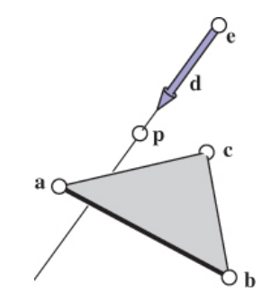

**图4.10** 光线在包含三角形的平面上击中点p。

为了解方程（4.2）中的$t, \beta$, and $\gamma$，我们将其从向量形式展开成三个坐标的三个方程：
$$
\begin{aligned}
x_e+t x_d & =x_a+\beta\left(x_b-x_a\right)+\gamma\left(x_c-x_a\right) \\
y_e+t y_d & =y_a+\beta\left(y_b-y_a\right)+\gamma\left(y_c-y_a\right) \\
z_e+t z_d & =z_a+\beta\left(z_b-z_a\right)+\gamma\left(z_c-z_a\right)
\end{aligned}
$$
这可以被重写为标准线性系统：
$$
\left[\begin{array}{ccc}
x_a-x_b & x_a-x_c & x_d \\
y_a-y_b & y_a-y_c & y_d \\
z_a-z_b & z_a-z_c & z_d
\end{array}\right]\left[\begin{array}{l}
\beta \\
\gamma \\
t
\end{array}\right]=\left[\begin{array}{c}
x_a-x_e \\
y_a-y_e \\
z_a-z_e
\end{array}\right]
$$
解决这个3×3线性方程组的最快经典方法是克莱姆法则。这给出了我们的解：
$$
\begin{aligned}
& \beta=\frac{\left|\begin{array}{ccc}
x_a-x_e & x_a-x_c & x_d \\
y_a-y_e & y_a-y_c & y_d \\
z_a-z_e & z_a-z_c & z_d
\end{array}\right|}{|\mathbf{A}|} \\
& \gamma=\frac{\left|\begin{array}{ccc}
x_a-x_b & x_a-x_e & x_d \\
y_a-y_b & y_a-y_e & y_d \\
z_a-z_b & z_a-z_e & z_d
\end{array}\right|}{|\mathbf{A}|}, \\
& t=\frac{\left|\begin{array}{ccc}
x_a-x_b & x_a-x_c & x_a-x_e \\
y_a-y_b & y_a-y_c & y_a-y_e \\
z_a-z_b & z_a-z_c & z_a-z_e
\end{array}\right|}{|\mathbf{A}|} \\
&
\end{aligned}
$$
其中矩阵$\mathbf{A}$为
$$
\mathbf{A}=\left[\begin{array}{lll}
x_a-x_b & x_a-x_c & x_d \\
y_a-y_b & y_a-y_c & y_d \\
z_a-z_b & z_a-z_c & z_d
\end{array}\right]
$$
其中 $\mathbf{|A|}$ 表示矩阵$\mathbf{A}$  的行列式。3 × 3 行列式具有共同的子项，可以在实现中利用其效率。观察带自由变量的线性系统
$$
\left[\begin{array}{ccc}
a & d & g \\
b & e & h \\
c & f & i
\end{array}\right]\left[\begin{array}{l}
\beta \\
\gamma \\
t
\end{array}\right]=\left[\begin{array}{l}
j \\
k \\
l
\end{array}\right],
$$
根据克莱姆法
$$
\begin{aligned}
& \beta=\frac{j(e i-h f)+k(g f-d i)+l(d h-e g)}{M}, \\
& \gamma=\frac{i(a k-j b)+h(j c-a l)+g(b l-k c)}{M}, \\
& t=-\frac{f(a k-j b)+e(j c-a l)+d(b l-k c)}{M},
\end{aligned}
$$
其中：
$$
M=a(e i-h f)+b(g f-d i)+c(d h-e g)
$$
我们可以通过重复使用“ei-minus-hf”等数字来减少操作次数。

需要线性解决方案的光线-三角形相交算法可能具有一些提前终止的条件。因此，该函数应该类似于：

```cpp
bool raytri(Ray r, vec3 a, vec3 b, vec3 c, interval[t0,t1]):
	compute t
    if(t<t0) or (t>t1)
        return false
        
    compute gamma
    if(gamma<0) or (gammma>1)
        return false
    
    compute beta
    if(beta<0) or (beta>1-gamma)
        return false
    
    return true
```

### 4.4.3 光线表面求交在程序中的实现
在光线追踪程序中，使用一个名为`Surface`的类及其派生类`Triangle`、`Sphere`等具有面向对象设计是个好主意。任何一条射线可以相交的东西，包括表面组或效率结构（第12.3节），都应该是`Surface`的子类。然后，光线跟踪程序将对整个模型只引用一个`Surface`，并且新类型的对象和效率结构可以透明地添加。

`Surface`类的关键接口是一种与射线相交的方法（Kirk＆Arvo，1988）。

```cpp
class Surface
    HitRecor hit(Ray r, real t0, real t1)
```

这里，$(t_0, t_1)$ 是光线上返回交点的区间，`HitRecord` 是一个包含所有与表面相交所需数据的类：

```cpp
class HitRecord
    Surface s | 被击中的表面
    real t | 光线上击中点的坐标
    Vec3 n | 击中点处的表面法线
```

被击中的表面、 $t$ 值和表面法线是必需的最小数据，但也可以存储其他数据， 如纹理坐标或切向量。根据语言不同，命中记录可能不会从函数直接返回，而 是通过引用传递并填充。末命中可以通过具有 $t=\infty$ 的命中来指示。

### 4.4.4 对一组对象进行相交
当然，大多数有趣的场景由不止一个物体组成，当我们用射线与场景相交时，必须找到沿着射线最接近摄像机的最近相交点。实现这个简单的方法是将一组对象视为另一种类型的对象。要与组相交，只需将射线与组中的对象相交，并返回具有最小 t 值的相交点。以下代码测试区间$ t ∈ [t_0, t_1]$ 中是否存在碰撞：

```cpp
class Group, subclass of Surface
    list-of-Surface | 组中的所有对象列表
    HitRecord hit(Ray ray, real t0, real t1)
    	HitRecord closet-hit(inf) | 初始化为表示未命中
    	for surf in surfaces 
            rec = surf.hit(ray, t0, t1)
            if rec.t < inf
                closet-hit = rec
                t1 = t
        return closet-hit
```


请注意，此代码缩小了交集区间$\left[t_0, t_1\right]$，以便对surf.hit的调用仅命中比迄今为止看到的最近表面更接近的表面。一旦射线-场景相交工作正常，我们就可以像图4.11那样渲染图像，但更好的结果取决于包括更多视觉提示，如下所述。


**图4.11** 仅使用光线生成和表面相交渲染的简单场景，但没有着色；每个像素根据其命中的对象设置为固定颜色。

## 4.5 着色

一旦像素的可见表面确定，就可以通过评估着色模型来计算像素值。如何完成这个过程完全取决于应用程序——方法从简单的启发式到复杂的基于物理学模型不等。相同的着色模型可以在光线追踪或对象顺序渲染方法中使用。

第5章介绍了一个适用于基本光线追踪器的简单着色模型，并且我们在本章中使用它来制作渲染图像。为了更加真实，您可以升级到第14章讨论的更符合真实表面物理特性的模型。在这里，我们将讨论光线追踪器如何计算输入以进行着色。

### 4.5.1 光源

为了支持阴影，光线追踪程序总是有一个光源列表。对于第5章的着色模型，我们需要三种类型的灯光：点光源，从空间中某一点发出光线；方向性灯光，从单个方向照亮场景；环境灯光，则提供恒定的照明来填补阴影。在更高级别的系统中，还支持其他类型的灯光，例如区域灯（基本上是场景几何体发射出来的）或环境灯（使用图像表示来自远处源头如天空的光）。

计算点或方向性光源产生的着色需要特定几何信息，在射线跟踪器中，在确定观察射线击中表面后，我们拥有了所有必要确定这四个向量所需信息：

- 阴影点$\mathbf{x}$可以通过在交点处计算视线射线的$t$值来计算。
- 表面法向量$\mathbf{n}$取决于表面类型（球体、三角形等），每个表面都需要能够在光线与其相交的点处计算出其法向量。
- 光照方向$\mathbf{l}$ 是从光源位置或方向中作为着色的一部分进行计算的。
- 观察方向$\mathbf{v}$ 简单地说就是视线射线方向的相反方向$(\mathbf{v}=-\mathbf{d} /\|\mathbf{d}\|)$

来自环境光源的阴影要简单得多：由于光线来自四面八方，因此没有$\mathbf{l}$；阴影不依赖于$\mathbf{v}$；对于第5章中的简单模型，它甚至不依赖于$\mathbf{x }$或$\mathbf{n}$。

在包含几个灯光的场景中计算阴影只是将各个灯光的贡献相加。在基本射线追踪器中，您可以简单地循环遍历所有灯源，从每个灯源计算阴影，并将结果累积到像素颜色中。

### 4.5.2 着色的程序实现

一个光线追踪程序通常包含代表光源和材质的对象。光源可以是 `Light` 类子类的实例，它们必须包含足够的信息来完全描述光源。由于着色还需要描述表面材质的参数，因此另一个有用的类是 `Material`，它封装了评估着色模型所需的一切内容。

不同系统在将着色计算分解为灯光和材质方面采取不同方法。与本章节中介绍相符合的方法是让灯光负责整体照明计算，而让材质负责计算 BRDF 值。使用这种设置时，这些类的接口可能如下所示：

```cpp
class Light
    Color illuminate(Ray ray, HitRecord hrec)

class Material
    Color evaluate(Vec3 l, Vec3 v, Vec3 n)
```

每个表面将存储对其材质的引用，通过这种方式，可以实现**点光源**照明：

```cpp
class PointLight, subclass of Light
    Color I
    Vec3 p
    Color illuminate(Ray ray, HitRecord hrec)
    	Vec3 x = ray.evaluate(hrec.t)
    	real r = p - x
    	Vec3 l = (p - x)/r
    	Vec3 n = hrec.normal
    	Color E = max(0, n*l) I/r^2
    	Color k = hrec.Surface.material.evaluate(l, v, n)
    	
    	return k*E
```

这些计算假设类`Color`携带颜色的RGB分量并支持逐分量乘法。这种安排也适用于将**环境光**视为光源，通过使环境系数成为材质的属性：

```cpp
class AmbientLight, subclass of Light
    Color Ia
    Color illuminate(Ray ray, HitRecord hrec)
    	Color Ka = hrec.surface.material.Ka
    	return Ka*Ia
```

完整的光线遮蔽计算，包括交点和多个光源的处理，可以如下所示：

```cpp
function shade-ray(Ray ray, real t0, real t1)
	HitRecord rec = scene.hit(ray, t0, t1)
    if rec.t < inf
        Color c = 0
        for light in scene.lights
            c = c + light.illuminate(ray, rec)
        return c
    else
        return background-color
```

这种设置使材料和光线相对独立，并且可以透明地添加新的材料和光源。纹理会给光线追踪器的架构增加一些复杂性；请参见第11.2.5节。

单独使用阴影可以使3D物体的图像更加逼真和易于理解，但它不能显示它们与其他物体的交互作用。例如，在图4.12中的球似乎漂浮在它们所在的地板上。

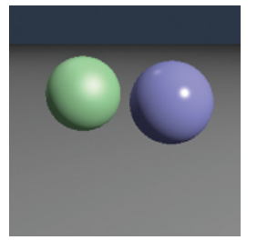

图4.12。使用第5章的着色模型，从两个点光源进行阴影渲染的简单场景。

### 4.5.3 阴影

一旦你的光线追踪器中有了基本的阴影，点光源和方向光源的阴影就可以非常容易地添加进去。如果我们想象自己在被着色的表面上的一个点$\mathbf{x}$处，当我们“看”向光源并且看到一个物体位于我们和光源之间时，则该点处于阴影之中。如果没有任何物体位于两者之间，则该点不会被遮挡。


**图4.13** 点$\mathbf{p}$不在阴影中，而点$\mathbf{q}$在阴影中。

如图4.13所示，光线$\mathrm{x}+t \mathrm{l}$没有击中任何物体，因此点$\mathbf{x}$ 不在阴影中。另一方面，由于光线$\mathbf{x}^{\prime}+t 1^{\prime}$撞到了一个物体，点$\mathbf{x'}$  处于阴影之中。用于确定是否在阴影中的光线被称为阴影射线以区别于视角射线。

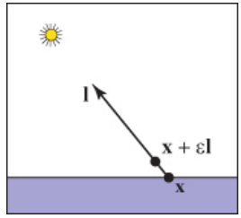

**图4.14** 通过在$\epsilon$ 为起点的区间内进行测试，我们避免了数值不精确导致射线命中$\mathbf{p}$ 所在表面。

为了得到阴影算法，我们需要在代码中添加一个if语句来从光源处添加阴影，并首先确定光线是否被遮挡。在一个朴素的实现中，阴影射线将检查$t \in[0, r]$，但由于数值不精确性，这可能导致与p所在表面的交点。相反，通常的调整方法是测试$t \in[\epsilon, r]$其中是一些小正常数（图4.14）以避免该问题。

可以通过跟踪阴影射线并添加条件来向上述`PointLight.illuminate`方法中添加阴影测试：

```cpp
HitRecord srec = scene.hit(Ray(x,l), epsilon, r)
if srec.t < inf 
    进行正常照明计算
else
    return 0 | 着色为阴影
```

定向光的阴影测试类似，但使用$t_1=\infty$而不是$r$ 。请注意，每个灯光的照明计算都需要单独的阴影射线，并且在计算环境遮蔽时没有阴影测试。

如图4.15所示，阴影在显示附近物体之间的关系方面发挥着重要的视觉作用。

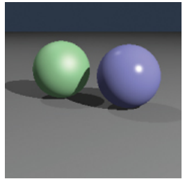

**图4.15** 使用两个点光源进行着色和阴影渲染的相同场景。

### 4.5.4 镜面反射
在光线追踪程序中添加理想的镜面反射非常简单。关键观察结果如图4.16所示，从方向$\mathbf{e}$观看的观察者会将表面上方向r处的物体视为其在$\mathbf{-d}$方向上的映像。矢量$\mathbf{r}$是矢量$\mathbf{-d}$相对于表面法线$\mathbf{n}$的反射，可以使用$\mathbf{d}$在表面法线方向上投影来计算：
$$
\mathrm{r}=\mathrm{d}-2(\mathrm{~d} \cdot \mathrm{n}) \mathrm{n} \qquad (4.3)
$$


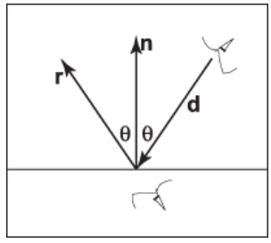

**图4.16** 当观察完美的镜子时，朝向$\mathbf{d}$方向的观察者将看到在表面“下方”朝向$\mathbf{r}$方向的观察者所看到的任何东西。


在现实世界中，当光线从表面反射时会有一些能量损失，而这种损失对不同颜色可能是不同的。例如，金色比蓝色更有效地反射黄色，因此它会改变所反射物体的颜色。可以通过在shade-ray中添加递归调用来实现这一点，在所有灯光计算完毕后再增加一个贡献值：
$$
\text { color } c=c+k_m \text { shade-ray }(\operatorname{Ray}(\mathbf{p}, \mathbf{r}), \epsilon, \infty)
$$
其中$k_m$（代表“镜面反射”）是镜面RGB颜色。我们需要确保传递$t_0=\epsilon$，原因与阴影光线相同；我们不希望反射光线击中生成它的物体。

上述递归调用的问题在于它可能永远不会终止。例如，如果一条光线从房间内开始，则会无限反弹。可以通过添加最大递归深度来解决这个问题。如果km为零，则只有在生成反射光线时才更有效率。

使用恒定的镜面反射系数km可给简单光线跟踪器带来特定外观（图4.17）；而在现实世界中，该系数根据入射角度变化很大。有关更好的模型，请参见第14章。

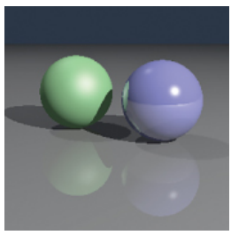

**图4.17**  使用着色、阴影和镜面反射渲染的简单场景。地板和蓝色球体都具有非零的镜面反射系数。

## 4.6 历史注记
光线追踪早在计算机图形学的发展历程中就被开发出来了（Appel，1968），但直到足够的计算能力可用时才得到广泛应用（Kay＆Greenberg，1979；Whitted，1980）。

与基本物体顺序渲染相比，光线追踪具有更低的渐近时间复杂度（Snyder＆Barr，1987；Muuss，1995；Parker等人，1999；Wald、Slusallek、Benthin和Wagner, 2001）。虽然传统上认为它是一种离线方法，但实时光线追踪实现变得越来越普遍。 

## 常见问题

- **为什么光线追踪中没有透视矩阵？**

  在z缓冲区中的透视矩阵存在是为了将透视投影转换成平行投影。但在光线追踪中，我们可以通过从眼睛处扇形发射光线来轻松地进行透视投影。

- **能否使光线追踪变得交互式？**

  对于足够小的模型和图像，任何现代PC都足够强大以实现交互式的光线追踪。实际上，需要多个带有共享帧缓冲区的CPU才能实现全屏幕应用程序。计算机性能增长速度比屏幕分辨率快得多，传统PC很快就可以以屏幕分辨率对复杂场景进行光线跟踪。

- **在硬件图形程序中使用光线追踪是否有用？**

  在拾取方面经常使用光线跟踪技术。当用户单击3D图形程序中的一个像素时，该程序需要确定该像素内可见哪个对象。这时候采用光路跟踪是一种理想方法。

## 练习

1. 射线 $(1, 1, 1) + t(-1, -1, -1)$ 和以原点为中心、半径为 1 的球体的交点的射线参数是什么？注意：这是一个很好的调试案例。
2. 当射线$ (1, 1, 1) + t(-1,- 1,- 1)$ 碰到顶点分别为$(0，0，0)，(0，0，l)，和(0，l，0）$的三角形时，请问它们的重心坐标和射线参数是多少？注意：这也是一个很好的调试案例。
3. 对于“良好”（非对抗性）模型进行光线追踪近似时间复杂度计算。将您的分析拆分成预处理和计算图像两个部分，并预测静态模型下光线追踪多帧行为。

# 5. 表面着色

当我们渲染3D场景的图像时，无论是使用光线追踪还是光栅化，在实时或批处理中，其中一个关键因素对于三维视觉效果的贡献就是着色或基于场景中物体形状和它们与其他物体之间关系来进行表面着色。在现实世界中，我们看到的大部分光都是反射光，并且光反射的物理学受几何形状强烈影响，这产生了各种线索，人类视觉系统非常有效地利用这些线索来理解形状。

在计算机图形学中，着色的目的是为了向视觉系统提供这些线索，虽然目标因应用而异。在计算机辅助设计或科学可视化方面，则侧重于清晰度：着色应该被设计成提供最清晰、最准确的3D形状印象。另一方面，在视觉特效或广告领域，则旨在将渲染结果最大程度地与真实对象外貌相似。在动画、虚拟环境或游戏方面，则目标介于两者之间：着色旨在达到艺术性目标，包括描绘形态和材质，但不一定要真实模拟现实。

用于计算着色的方程称为着色模型，并且已经开发了各种不同的着色模型以适应这些不同的应用。通常，它们都从提供对光反射物理学有用近似值的简单模型开始。从这个起点出发，可以添加其他特征以实现更接近物理学的逼真渲染，或者可以修改或省略某些部分以使其适合更抽象的风格。

一个着色模型与渲染系统中其他部分相当独立，并且相同的模型可在光线追踪和光栅化系统中使用。本章描述了一个基本着色模型，用于由点光源照明下的不透明表面。该模型可能是我们在简单应用程序中所需的全部内容，并且它形成更高级别着色计算（如第14章所讨论） 的起点。
